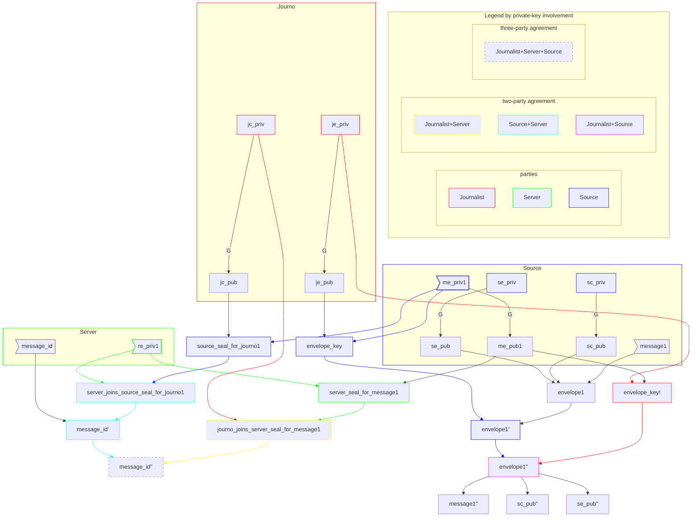

# Asymmetric construction: a visual primer

_Adapted from
<https://gist.github.com/cfm/f27e60fa2f2d2a4db899499fd8d29737#file-2-md>._

This diagram assigns ownership only to keys, not to values encrypted, decrypted,
or otherwise constructed from them. It color-codes values and constructions
according to what private keys they involve.

It's about a/symmetry of construction rather than flow of execution.

## Legend

- Labels from <https://github.com/freedomofpress/securedrop-poc/issues/16#issuecomment-1764436420>.

- Let `envelope1 = CONCAT(message1, sc_pub, se_pub)` for symmetry between the
  "message ID" and "message envelope" plaintexts.

- Let plaintext `X` → ciphertext `X'` → plaintext `X''` or recovered `X!`.

- **FIXME:** Let _seal_ replace "challenges" and "attestations" (which these
  aren't) and shared secrets (which these are; but how are they being _used_?).

---

