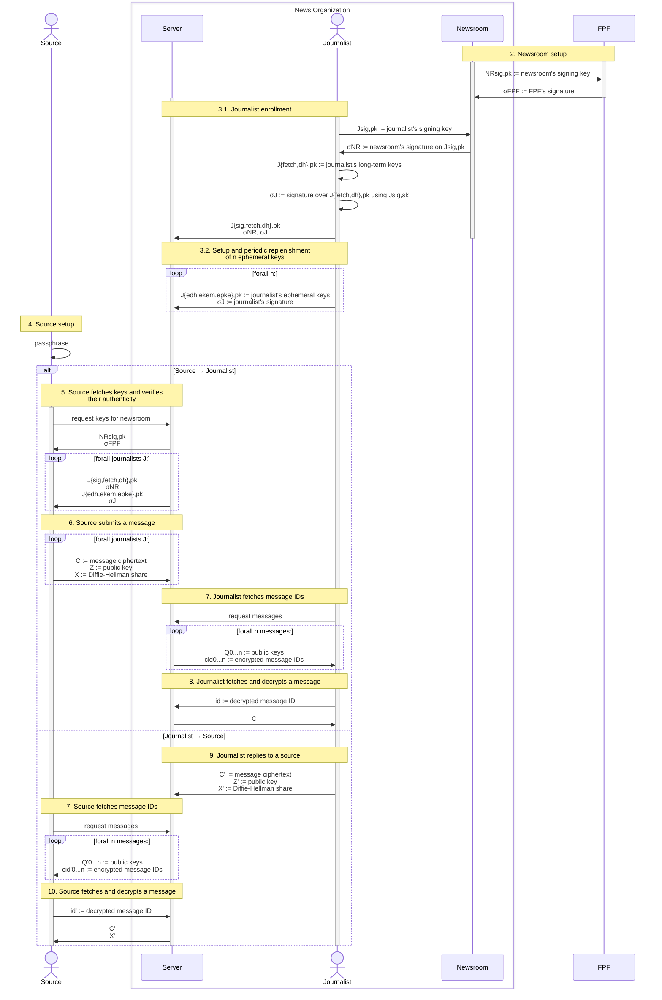

# SecureDrop Protocol specification

| Version |
| ------- |
| 0.3     |

> [!NOTE]
> The key words MUST, MUST NOT, REQUIRED, SHALL, SHALL NOT, SHOULD, SHOULD NOT,
> RECOMMENDED, MAY, and OPTIONAL in this document are to be interpreted as
> described in [RFC 2119].

## Overview

This sequence diagram shows the flow of messages and values in the SecureDrop
Protocol. The yellow boxes correspond to sections in the specification below
that describe how these values are constructed and consumed.

## Keys

In the table below:

> For keys, we use the notation $X_{A,B}$, where $X$ represents the key owner
> ($`X \in \{NR, J, S\}`$ [for newsroom, journalist, and source, respectively]),
> $A$ represents the key's usage ($`A \in \{sig,fetch,pke,pq,md\}`$), and is prefixed
> with an "e" if the key is a one-time key. $B$ indicates whether the component is
> private or public. For Diffie-Hellman keys $x$, the public component is
> represented by the exponentiation $DH(g, x)$.[^3]

| Owner      | Private key or decapsulation | Public key or encapsulation | Purpose                                     | Usage             | Lifetime      | Algorithm                    | Signed by          |
| ---------- | ---------------------------- | --------------------------- | ------------------------------------------- | ----------------- | ------------- | ---------------------------- | ------------------ |
| FPF        | $`FPF_{sig,sk}`$             | $`FPF_{sig,pk}`$            | Signing                                     |                   | Long-term     | ?                            |                    |
| Newsroom   | $`NR_{sig,sk}`$              | $`NR_{sig,pk}`$             | Signing                                     |                   | Long-term     | ?                            | $`FPF_{sig,sk}`$   |
| Journalist | $`J_{sig,sk}`$               | $`J_{sig,pk}`$              | Signing                                     |                   | Long-term     | ?                            | $`NR_{sig,sk}`$    |
| Journalist | $`J_{apke,sk}`$              | $`J_{apke,pk}`$             | Encryption (Outgoing messages)              | SD-APKE (Message) | Long-term     | DH-AKEM(X25519, HKDF-SHA256) | $`J_{sig,sk}`$     |
| Journalist | $`J_{fetch,sk}`$             | $`J_{fetch,pk}`$            | Fetching                                    |                   | **TBD**[^6]   | ristretto255 (Curve25519)    | $`J_{sig,sk}`$[^4] |
| Journalist | $`J_{epq,sk}`$               | $`J_{epq,pk}`$              | Encryption PSK (Incoming messages)          | SD-APKE (Message) | One-time      | ML-KEM-768                   | $`J_{sig,sk}`$     |
| Journalist | $`J_{epke,sk}`$              | $`J_{epke,pk}`$             | Encryption (Incoming messages)              | SD-APKE (Message) | One-time      | DH-AKEM(X25519, HKDF-SHA256) | $`J_{sig,sk}`$     |
| Journalist | $`J_{emd,sk}`$               | $`J_{emd,pk}`$              | Encryption (Incoming messages)              | SD-PKE (Metadata) | One-time      | X-Wing (X25519, ML-KEM-768)  | $`J_{sig,sk}`$     |
| Source     | $`S_{fetch,sk}`$             | $`S_{fetch,pk}`$            | Fetching                                    |                   | Permanent[^7] | ristretto255 (Curve25519)    |                    |
| Source     | $`S_{pq,sk}`$                | $`S_{pq,pk}`$               | Encryption PSK (Incoming messages)          | SD-APKE (Message) | Permanent[^7] | ML-KEM-768                   |                    |
| Source     | $`S_{pke,sk}`$               | $`S_{pke,pk}`$              | Encryption (Incoming and outgoing messages) | SD-APKE (Message) | Permanent[^7] | DH-AKEM(X25519, HKDF-SHA256) |                    |
| Source     | $`S_{md,sk}`$                | $`S_{md,pk}`$               | Encryption (Incoming messages)              | SD-PKE (Metadata) | Permanent[^7] | X-Wing (X25519, ML-KEM-768)  |                    |

[^4]: **TODO:** Discussion of whether the newsroom's or the journalist's signing key signs the journalist's fetching key.

[^6]: **TODO:** https://github.com/freedomofpress/securedrop-protocol/blob/a0252a8ee7a6e4051c65e4e0c06b63d6ce921110/docs/wip-protocol-0.3.md?plain=1#L87

## Functions and notation

| Syntax                                                    | Description                                                                       |
| --------------------------------------------------------- | --------------------------------------------------------------------------------- |
| $`h \gets \text{Hash}(m)`$                                | Hash message $m$ to digest $h$                                                    |
| $`k \Vert k_1 \Vert \dots \Vert k_n \gets \text{KDF}(m)`$ | Derive one or more keys $k$ from a message $m$                                    |
| $`\sigma \gets^{\$} \text{Sign}(sk_S, m)`$                | Sign a message $m$ with the sender's private key $sk_S$                           |
| $`b \in \{0,1\} \gets \text{Vfy}(pk_S, m, \sigma)`$       | Verify a message $m$ and a signature $\sigma$ with the sender's public key $pk_S$ |
| $` g^x \gets \text{DH(g, x)}`$                            | Diffie-Hellman exponentiation of private component $x$                            |
| $`r \gets^{\$} \text{Rand}()`$                            | Generate a random value                                                           |
| $`mp \gets \text{Pad}(m)`$                                | Pad a message $m$ to a constant size[^1]                                          |
| $`\varepsilon`$                                           | The empty string                                                                  |

The protocol composes two modes of [Hybrid Public-Key Encryption (RFC 9180)][RFC 9180]:

- For metadata protection, `SD-PKE` is an instantiation of [HPKE `Base`
  mode][RFC 9180 §5.1.1].
- For message encryption, `SD-APKE` wraps HPKE `AuthPSK` mode, following listing
  17 of Alwen et al. (2023), ["The Pre-Shared Key Modes of HPKE"][alwen].

### Metadata protection via `SD-PKE`: SecureDrop PKE <!-- Figure 4 as of 7703a58 -->

$\text{SD-PKE}[\text{KEM}_H, \text{AEAD}, \text{KS}]$ instantiates [HPKE `Base`
mode][RFC 9180 §5.1.1] with:

- $\text{KEM}_H =$ X-Wing
- $\text{AEAD} =$ AES-GCM
- $\text{KS} =$ HPKE's [`KeySchedule()`][RFC 9180 §5.1] with [HKDF-SHA256][RFC 9180 §7.2]

| Syntax                                      | Description                                                  |
| ------------------------------------------- | ------------------------------------------------------------ |
| $`(sk, pk) \gets^{\$} \text{KGen}()`$       | Generate keys                                                |
| $`(c, c'') \gets^{\$} \text{Enc}(pk_R, m)`$ | Encrypt a message $m$ via HPKE in [`mode_base`][RFC 9180 §5] |
| $`m \gets \text{Dec}(sk_R, (c, c''))`$      | Decrypt a message $m$ via HPKE in [`mode_base`][RFC 9180 §5] |

### Message encryption

#### `AKEM`: Authenticated KEM <!-- Definition 4.1 as of 7703a58 -->

$\text{AKEM}$ instantiates the [DH-based KEM][RFC 9180 §4.1]
$\text{DHKEM}(\text{Group}, \text{KDF})$ with:

- $\text{Group} =$ [X25519][RFC 9180 §7.1]
- $\text{KDF} =$ [HKDF-SHA256][RFC 9180 §7.1]

| Syntax                                             | Description                                                                                                                                                                        |
| -------------------------------------------------- | ---------------------------------------------------------------------------------------------------------------------------------------------------------------------------------- |
| $`(sk_S, pk_S) \gets^{\$} \text{KGen}()`$          | Generate keys; for DH-AKEM, $(sk, pk) = (x, \text{DH}(g, x)) = (x, g^x)$                                                                                                           |
| $`(c, K) \gets^{\$} \text{AuthEncap}(sk_S, pk_R)`$ | Encapsulate a ciphertext $c$ and a shared secret $K$ using a sender's private key $sk_S$ and a receiver's public key $pk_R$; for DH-AKEM, $(c, K) = (pkE, K) = (pk, K) = (g^x, K)$ |
| $`K \gets \text{AuthDecap}(sk_R, pk_S, c)`$        | Decapsulate a shared secret $K$ using a receiver's private key $sk_R$, a sender's public key $pk_S$, and a ciphertext $c$; for DH-AKEM, $c = pkE$                                  |

#### `pskAPKE`: Pre-shared-key authenticated PKE <!-- Figure 5 as of 7703a58 -->

$\text{pskAPKE}[\text{AKEM}, \text{KS}, \text{AEAD}]$ instantiates [HPKE
`AuthPSK` mode][RFC 9180 §5.1.4] with:

- $\text{AKEM}$ as above
- $\text{KS} =$ HPKE's [`KeySchedule()`][RFC 9180 §5.1] with [HKDF-SHA256][RFC 9180 §7.2]
- $\text{AEAD} =$ AES-GCM

| Syntax                                                                | Description                                                                                           |
| --------------------------------------------------------------------- | ----------------------------------------------------------------------------------------------------- |
| $`(c_1, c') \gets^{\$} \text{pskAEnc}(sk_S, pk_R, psk, m, ad, info)`$ | Encrypt a message $m$ with associated data $ad$ and $info$ via HPKE in [`mode_auth_psk`][RFC 9180 §5] |
| $`m \gets \text{pskADec}(pk_S, sk_R, psk, (c_1, c'), ad, info)`$      | Decrypt a message $m$ with associated data $ad$ and $info$ via HPKE in [`mode_auth_psk`][RFC 9180 §5] |

#### `SD-APKE`: SecureDrop APKE <!-- Figure 3 as of 7703a58 -->

$\text{SD-APKE}[\text{AKEM}, \text{KEM}_{PQ}, \text{AEAD}]$ is constructed with:

- $\text{AKEM}$ as above
- $\text{KEM}_{PQ} =$ ML-KEM-768
- $\text{pskAPKE}$ as above

| Syntax                                                                                          | Description                                                |
| ----------------------------------------------------------------------------------------------- | ---------------------------------------------------------- |
| $`(sk, pk) \gets^{\$} \text{KGen}()`$                                                           | Generate keys                                              |
| $`((c_1, c'), c_2) \gets^{\$} \text{AuthEnc}((sk_S^1, sk_S^2), (pk_R^1, pk_R^2), m, ad, info)`$ | Encrypt a message $m$ with associated data $ad$ and $info$ |
| $`m \gets \text{AuthDec}((sk_R^1, sk_R^2), (pk_S^1, pk_S^2), ((c_1, c'), c_2), ad, info)`$      | Decrypt a message $m$ with associated data $ad$ and $info$ |

## Setup

### 1. FPF

| FPF                                                      |
| -------------------------------------------------------- |
| $`(FPF_{sig,sk}, FPF_{sig,pk}) \gets^{\$} \text{Gen}()`$ |

The server, the journalist client, and the source client SHOULD be built with
$FPF_{sig,pk}$ pinned.[^2]

### 2. Newsroom

| Newsroom                                               |                                 | FPF                                                                |
| ------------------------------------------------------ | ------------------------------- | ------------------------------------------------------------------ |
| $`(NR_{sig,sk}, NR_{sig,pk}) \gets^{\$} \text{Gen}()`$ |                                 |                                                                    |
|                                                        | $`\longrightarrow NR_{sig,pk}`$ | Verify manually                                                    |
|                                                        |                                 | $`\sigma^{FPF} \gets^{\$} \text{Sign}(FPF_{sig,sk}, NR_{sig,pk})`$ |
|                                                        | $`\sigma^{FPF} \longleftarrow`$ |

The server MUST be deployed with $NR_{sig,pk}$ pinned. The server MAY be
deployed with $\sigma^{FPF}$ pinned.[^2]

### 3. Journalist

#### 3.1. Enrollment

| Journalist                                               |                                                         | Newsroom                                                                                   |
| -------------------------------------------------------- | ------------------------------------------------------- | ------------------------------------------------------------------------------------------ |
| $`(J_{sig,sk}, J_{sig,pk}) \gets^{\$} \text{Gen}()`$     |                                                         |                                                                                            |
| $`(J_{fetch,sk}, J_{fetch,pk}) \gets^{\$} \text{Gen}()`$ |                                                         |                                                                                            |
| $`(J_{dh,sk}, J_{dh,pk}) \gets^{\$} \text{Gen}()`$       |                                                         |                                                                                            |
|                                                          | $`\longrightarrow J_{sig,pk}, J_{fetch,pk}, J_{dh,pk}`$ | Verify manually, then save for $J$                                                         |
|                                                          |                                                         | $`\sigma^{NR} \gets^{\$} \text{Sign}(NR_{sig,sk}, (J_{sig,pk}, J_{fetch,pk}, J_{dh,pk}))`$ |

#### 3.2. Setup and periodic replenishment of $n$ ephemeral keys

Each journalist $J$ MUST generate and maintain a pool of $n$ ephemeral keys.
For each key:

| Journalist                                                                              |                                                                    | Server                                                                       |
| --------------------------------------------------------------------------------------- | ------------------------------------------------------------------ | ---------------------------------------------------------------------------- |
| $`(J_{edh,sk}, J_{edh,pk}) \gets^{\$} \text{Gen}()`$                                    |                                                                    |                                                                              |
| $`(J_{ekem,sk}, J_{ekem,pk}) \gets^{\$} \text{Gen}()`$                                  |                                                                    |                                                                              |
| $`(J_{epke,sk}, J_{epke,pk}) \gets^{\$} \text{Gen}()`$                                  |                                                                    |                                                                              |
| $`\sigma^J \gets^{\$} \text{Sign}(J_{sig,sk}, (J_{edh,pk}, J_{ekem,pk}, J_{epke,pk}))`$ |                                                                    |                                                                              |
|                                                                                         |                                                                    | $`\text{Vfy}(J_{sig,pk}, (J_{edh,pk}, J_{ekem,pk}, J_{epke,pk}), \sigma^J)`$ |
|                                                                                         | $`\longrightarrow J_{edh,pk}, J_{ekem,pk}, J_{epke,pk}, \sigma^J`$ | Save for $J$                                                                 |

### 4. Source

To begin each session, a source MUST enter (on their first visit) or reenter (on
a subsequent visit) some $passphrase$:

| Source                                                                                          |
| ----------------------------------------------------------------------------------------------- |
| $`S_{dh,sk} \Vert S_{fetch,sk} \Vert S_{pke,sk} \Vert S_{kem,sk} \gets \text{KDF}(passphrase)`$ |

## Messaging protocol

SecureDrop is a first-contact protocol between an unknwn party (an anonymous
source) and well-known parties (journalists). Only a source can initiate a
conversation.

### 5. Source fetches keys and verifies their authenticity

For some newsroom $NR$ and all its enrolled journalists $J^i$:

| Source                                                                                   |                                                                             | Server                                               |
| ---------------------------------------------------------------------------------------- | --------------------------------------------------------------------------- | ---------------------------------------------------- |
|                                                                                          | $\longrightarrow$ request keys for $NR$                                     |                                                      |
|                                                                                          | $`NR_{sig,pk}, \sigma^{FPF} \longleftarrow`$                                |                                                      |
|                                                                                          |                                                                             | $`\forall J^i`$:                                     |
|                                                                                          | $`J^i_{sig,pk}, J^i_{fetch,pk}, J^i_{dh,pk}, \sigma^{NR} \longleftarrow`$   |                                                      |
|                                                                                          | $`J^i_{edh,pk}, J^i_{ekem,pk}, J^i_{epke,pk}, \sigma^{J^i} \longleftarrow`$ | Chosen at random for $J^i$                           |
|                                                                                          |                                                                             | Discard $J^i_{edh,pk}, J^i_{ekem,pk}, J^i_{epke,pk}$ |
| $`\text{Vfy}(FPF_{sig,pk}, NR_{sig,pk}, \sigma^{FPF})`$                                  |                                                                             |                                                      |
| $`\forall J^i`$:                                                                         |                                                                             |                                                      |
| $`\text{Vfy}(NR_{sig,pk}, (J^i_{sig,pk}, J^i_{fetch,pk}, J^i_{dh,pk}), \sigma^{NR})`$    |                                                                             |                                                      |
| $`\text{Vfy}(J^i_{sig,pk}, (J^i_{edh,pk}, J^i_{ekem,pk}, J^i_{epke,pk}), \sigma^{J^i})`$ |                                                                             |                                                      |

### 6. Source submits a message

For some message $msg$ to each journalist $J^i$ enrolled with a newsroom $NR$:

> [!NOTE]
> The source client MUST submit a distinct copy of $msg$ to each journalist
> $J_i$: i.e., a total of $n$ unique ciphertexts for $n$ journalists.

| Source                                                                                                                       |                             | Server                           |
| ---------------------------------------------------------------------------------------------------------------------------- | --------------------------- | -------------------------------- |
| $`\forall J^i`$:                                                                                                             |                             |                                  |
| $`m \gets \text{Pad}(msg \Vert S_{dh,pk} \Vert S_{pke,pk} \Vert S_{kem,pk} \Vert S_{fetch,pk} \Vert J^i_{sig,pk} \Vert NR)`$ |                             |                                  |
| $`((c_1, c_2), C'') \gets^{\$} \text{AuthEnc}(S_{dh,pk}, (J^i_{edh,pk}, J^i_{ekem,pk}), m, \varepsilon, \varepsilon)`$       |                             |                                  |
| $`C' \gets^{\$} \text{Enc}(J^i_{epke,pk}, S_{dh,pk} \Vert c_1 \Vert c_2)`$                                                   |                             |                                  |
| $`C \gets C' \Vert C''`$                                                                                                     |                             |                                  |
| $`x \gets^{\$} \mathbb Z_q`$                                                                                                 |                             |                                  |
| $`X \gets \text{DH}(g, x)`$                                                                                                  |                             |                                  |
| $`Z \gets \text{DH}(J^i_{fetch,pk}, x)`$                                                                                     |                             |                                  |
|                                                                                                                              | $`\longrightarrow C, Z, X`$ |                                  |
|                                                                                                                              |                             | $`id \gets^{\$} \text{Rand}()`$  |
|                                                                                                                              |                             | $`messages[id] \gets (C, Z, X)`$ |

> [!NOTE]
> The source client MUST follow the same procedure for replying to a message
> from a journalist.

### 7. Source or journalist fetches messages IDs

For a total of $n$ messages:

| User $`U \in \{J, S\}`$ for journalist $J$ or source $S$ |                                                   | Server                                                       |
| -------------------------------------------------------- | ------------------------------------------------- | ------------------------------------------------------------ |
|                                                          | $\longrightarrow$ request messages                |                                                              |
|                                                          |                                                   | $`\forall i \in 0\dots \text{Len}(messages)`$:               |
|                                                          |                                                   | $`(id_i, (c_i, Z_i, X_i)) \gets messages.\text{items}()[i]`$ |
|                                                          |                                                   | $`y \gets^{\$} \mathbb Z_q`$                                 |
|                                                          |                                                   | $`k_i \gets \text{DH}(Z_i, y)`$                              |
|                                                          |                                                   | $`Q_i \gets \text{DH}(X_i, y)`$                              |
|                                                          |                                                   | $`cid_i \gets^{\$} \text{Enc}(k_i, id_i)`$                   |
|                                                          |                                                   |                                                              |
|                                                          |                                                   | $`\forall i \in \text{Len}(messages) \dots n`$:              |
|                                                          |                                                   | $`Q_i \gets^{\$} \text{Rand}()`$                             |
|                                                          |                                                   | $`cid_i \gets^{\$} \text{Rand}()`$                           |
|                                                          |                                                   |                                                              |
|                                                          | $`Q_{0 \dots n}, cid_{0 \dots n} \longleftarrow`$ |                                                              |
| $`ids \gets \{\}`$                                       |                                                   |                                                              |
| $`\forall i \in 0 \dots n`$:                             |                                                   |                                                              |
| $`k_i \gets \text{DH}(Q_i, U_{fetch,sk})`$:              |                                                   |                                                              |
| $`id_i \gets \text{Dec}(k_i, cid_i) \neq \bot`$          |                                                   |                                                              |
| $`ids \gets ids \cup \{id_i\}`$                          |                                                   |                                                              |
|                                                          |                                                   |                                                              |
| Return $ids$                                             |                                                   |                                                              |

### 8. Journalist fetches and decrypts a message

For some message $id$:

| Journalist                                                                                                               |                        | Server                           |
| ------------------------------------------------------------------------------------------------------------------------ | ---------------------- | -------------------------------- |
|                                                                                                                          | $`\longrightarrow id`$ |                                  |
|                                                                                                                          |                        | $`(C, Z, X) \gets messages[id]`$ |
|                                                                                                                          | $`C\longleftarrow`$    |                                  |
| $`\forall J_{edh,sk}, J_{ekem,sk}, J_{epke,sk}`$:                                                                        |                        |                                  |
| Parse $C$ as $C' \Vert C''$                                                                                              |                        |                                  |
| $`\tilde{M} \gets \text{Dec}(J_{epke,sk}, C') \neq \bot`$                                                                |                        |                                  |
| Parse $\tilde{M}$ as $S \Vert c_1 \Vert c_2$                                                                             |                        |                                  |
| $`m \gets \text{AuthDec}((J_{edh,sk}, J_{ekem,sk}), S, ((c_1, c_2), C''), \varepsilon, \varepsilon) \neq \bot`$          |                        |                                  |
| Parse $m$ as $msg \Vert \tilde{S} \Vert S_{pke,pk} \Vert S_{kem,pk} \Vert S_{fetch,pk} \Vert \tilde{J} \Vert \tilde{NR}$ |                        |                                  |
| Check $NR = \tilde{NR}, J_{sig,pk} = \tilde{J}, S = \tilde{S}$                                                           |                        |                                  |
| Discard $J_{edh,sk}, J_{ekem,sk}, J_{fetch,sk}$                                                                          |                        |                                  |
| Return $msg \Vert S_{dh,pk} \Vert S_{kem,pk} \Vert S_{fetch,pk}$                                                         |                        |                                  |

### 9. Journalist replies to a source

For some message $msg$ in reply to a source $S$:

| Journalist                                                                                               |                             | Server                           |
| -------------------------------------------------------------------------------------------------------- | --------------------------- | -------------------------------- |
| $`m \gets msg \Vert S \Vert J_{sig,pk} \Vert J_{fetch,pk} \Vert J_{dh,pk} \Vert \sigma^{NR} \Vert NR`$   |                             |                                  |
| $`((c_1, c_2), C'') \gets^{\$} \text{AuthEnc}(J_{dh,sk}, (S, S_{kem,pk}), m, \varepsilon, \varepsilon)`$ |                             |                                  |
| $`C' \gets ^{\$} \text{Enc}(S_{pke,pk}, J_{dh,pk} \Vert c_1 \Vert c_2)`$                                 |                             |                                  |
| $`C \gets C' \Vert C''`$                                                                                 |                             |                                  |
| $`x \gets^{\$} \mathbb Z_q`$                                                                             |                             |                                  |
| $`Z \gets \text{DH}(S_{fetch,pk}, x)`$                                                                   |                             |                                  |
| $`X \gets \text{DH}(g, x)`$                                                                              |                             |                                  |
|                                                                                                          | $`\longrightarrow C, Z, X`$ |                                  |
|                                                                                                          |                             | $`id \gets^{\$} \text{Rand}()`$  |
|                                                                                                          |                             | $`messages[id] \gets (C, Z, X)`$ |

> [!NOTE]
> In addition to sending the reply encrypted to the source $S$, the journalist
> client SHOULD also send a copy encrypted to each of the other $n-1$ journalists
> currently enrolled with the newsroom $NR$.

### 10. Source fetches and decrypts a message

For some message $id$:

| Source                                                                                                        |                         | Server                           |
| ------------------------------------------------------------------------------------------------------------- | ----------------------- | -------------------------------- |
|                                                                                                               | $`\longrightarrow id`$  |                                  |
|                                                                                                               |                         | $`(C, Z, X) \gets messages[id]`$ |
|                                                                                                               | $`C, X \longleftarrow`$ |                                  |
| Parse $C$ as $C' \Vert C''$                                                                                   |                         |                                  |
| $`\tilde{M} \gets \text{Dec}(S_{pke,sk}, C') \neq \bot`$                                                      |                         |                                  |
| Parse $\tilde{M}$ as $J \Vert c_1 \Vert c_2$                                                                  |                         |                                  |
| $`m \gets \text{AuthDec}((S_{dh,sk}, S_{kem,sk}), J, ((c_1, c_2), C''), \varepsilon, \varepsilon) \neq \bot`$ |                         |                                  |
| Parse $m$ as $msg \Vert \tilde{S} \Vert J_1 \Vert J_2 \Vert J_3 \Vert \sigma \Vert \tilde{NR}$                |                         |                                  |
| $`\text{Vfy}(NR_{sig,pk}, \sigma, J_1 \Vert J_2 \Vert J_3)`$                                                  |                         |                                  |
| Check $NR = \tilde{NR}, J = J_3, S_{dh,pk} = \tilde{S}$                                                       |                         |                                  |
| Return $msg \Vert J \Vert NR$                                                                                 |                         |                                  |

### 11. Source replies to a journalist

See ["Source Submits a Message"](#source-submits-a-message).

[^1]: Currently configured as [`CHUNK`][chunk].

[^2]: See [`draft-pki.md`](./draft-pki.md) for further considerations.

[^3]: Adapted from Maier §5.4.1.

<!--
[^4]: TODO kept inline above.
-->

<!--
[^6]: TODO kept inline above.
-->

[^7]:
    The source's keys are considered "permanent" because they are derived
    deterministically from the source's passphrase, which cannot be changed.

[alwen]: https://eprint.iacr.org/2023/1480
[chunk]: https://github.com/freedomofpress/securedrop-protocol/blob/664f8c66312b45e00d1e2b4a26bc466ff105c3ca/README.md?plain=1#L105
[RFC 2119]: https://datatracker.ietf.org/doc/html/rfc2119
[RFC 9180]: https://datatracker.ietf.org/doc/html/rfc9180
[RFC 9180 §4.1]: https://datatracker.ietf.org/doc/html/rfc9180#name-dh-based-kem-dhkem
[RFC 9180 §5]: https://datatracker.ietf.org/doc/html/rfc9180#name-hybrid-public-key-encryptio
[RFC 9180 §5.1]: https://datatracker.ietf.org/doc/html/rfc9180#name-creating-the-encryption-con
[RFC 9180 §5.1.1]: https://datatracker.ietf.org/doc/html/rfc9180#name-encryption-to-a-public-key
[RFC 9180 §5.1.4]: https://datatracker.ietf.org/doc/html/rfc9180#name-authentication-using-both-a
[RFC 9180 §7.1]: https://datatracker.ietf.org/doc/html/rfc9180#name-key-encapsulation-mechanism
[RFC 9180 §7.2]: https://datatracker.ietf.org/doc/html/rfc9180#name-key-derivation-functions-kd
