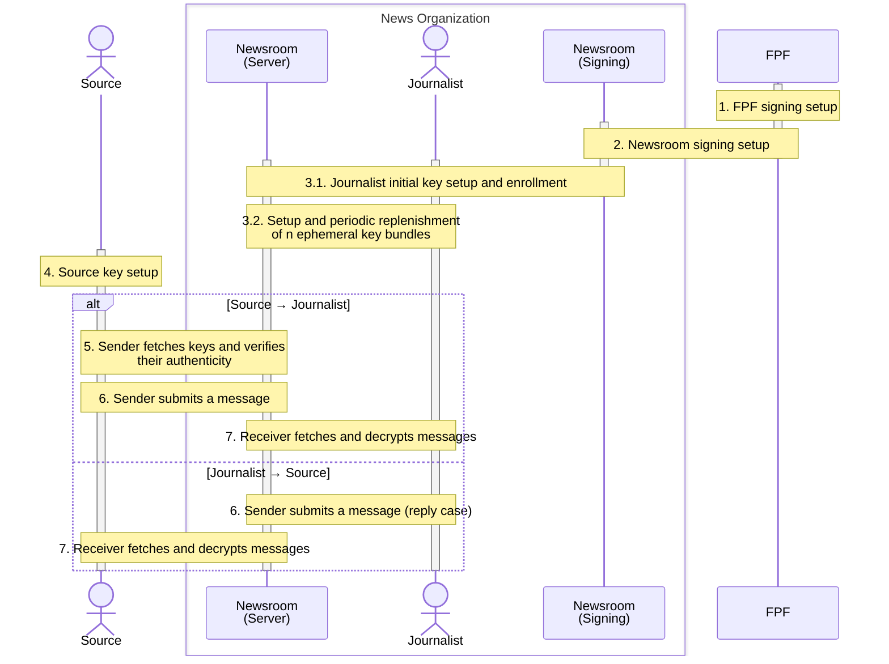

# SecureDrop Protocol specification

| Version |
| ------- |
| 0.3     |

> [!NOTE]
> The key words MUST, MUST NOT, REQUIRED, SHALL, SHALL NOT, SHOULD, SHOULD NOT,
> RECOMMENDED, MAY, and OPTIONAL in this document are to be interpreted as
> described in [RFC 2119].

## Table of contents

This sequence diagram is a visual table of contents to the SecureDrop Protocol
outlined in the sections below. See individual protocol steps for details.



## Key hierarchy <!-- as of 243f384 -->

Throughout this document, keys are notated as $component_{owner}^{scheme}$, where:

- $`component \in \{sk, pk, vk\}`$ for private ($sk$) or public ($pk$ or $vk$) components
- $`owner \in \{FPF, NR, J, S\}`$ for FPF, newsroom $NR$, journalist $J$, or source $S$
- $`scheme \in \{fetch, sig, APKE, PKE\}`$ for:
  - $fetch$ for use in the [message-fetching protocol][message-fetching]
  - $sig$ for a signature scheme TBD
  - $APKE = \text{SD-APKE}$ ($APKE_E$ if one-time)
  - $PKE = \text{SD-PKE}$ ($PKE_E$ if one-time)

[message-fetching]: #7-receiver-fetches-and-decrypts-messages-

| Owner      | Private Key         | Public Key          | Usage     | Purpose  | Direction | Lifetime      | Algorithm                           | Signed by        |
| ---------- | ------------------- | ------------------- | --------- | -------- | --------- | ------------- | ----------------------------------- | ---------------- |
| FPF        | $sk_{FPF}^{sig}$    | $vk_{FPF}^{sig}$    |           | Signing  |           | Long-term     | ?                                   |                  |
| Newsroom   | $sk_{NR}^{sig}$     | $vk_{NR}^{sig}$     |           | Signing  |           | Long-term     | ?                                   | $sk_{FPF}^{sig}$ |
| Journalist | $sk_J^{sig}$        | $vk_J^{sig}$        |           | Signing  |           | Long-term     | ?                                   | $sk_{NR}^{sig}$  |
| Journalist | $sk_J^{APKE}$       | $pk_J^{APKE}$       | [SD-APKE] | Message  | Outgoing  | Long-term     | DHKEM(X25519, HKDF-SHA256) + ML-KEM | $sk_J^{sig}$     |
| Journalist | $sk_J^{fetch}$      | $pk_J^{fetch}$      |           | Fetching |           | TBD[^6]       | ristretto255 (Curve25519)           | $sk_J^{sig}$     |
| Journalist | $sk_{J,i}^{APKE_E}$ | $pk_{J,i}^{APKE_E}$ | [SD-APKE] | Message  | Incoming  | One-time      | DHKEM(X25519, HKDF-SHA256) + ML-KEM | $sk_J^{sig}$     |
| Journalist | $sk_{J,i}^{PKE_E}$  | $pk_{J,i}^{PKE_E}$  | [SD-PKE]  | Metadata | Incoming  | One-time      | X-Wing(X25519, ML-KEM-768)          | $sk_J^{sig}$     |
| Source     | $sk_S^{fetch}$      | $pk_S^{fetch}$      |           | Fetching |           | Permanent[^7] | ristretto255 (Curve25519)           |                  |
| Source     | $sk_S^{APKE}$       | $pk_S^{APKE}$       | [SD-APKE] | Message  | In+Out    | Permanent[^7] | DHKEM(X25519, HKDF-SHA256) + ML-KEM |                  |
| Source     | $sk_S^{PKE}$        | $pk_S^{PKE}$        | [SD-PKE]  | Metadata | Incoming  | Permanent[^7] | X-Wing(X25519, ML-KEM-768)          |                  |

[SD-APKE]: #sd-apke-securedrop-apke-
[SD-PKE]: #metadata-protection-via-sd-pke-securedrop-pke-

[^6]: **TODO:** https://github.com/freedomofpress/securedrop-protocol/blob/a0252a8ee7a6e4051c65e4e0c06b63d6ce921110/docs/wip-protocol-0.3.md?plain=1#L87

## Building blocks[^9] <!-- Section 4 as of 243f384 -->

| Scheme               | Function                                                  | Use                                                                                                             |
| -------------------- | --------------------------------------------------------- | --------------------------------------------------------------------------------------------------------------- |
|                      | $`k \gets \text{KDF}(ik, params)`$                        | Derive a key from input key $ik$ and $params$                                                                   |
|                      | $`k \gets \text{PBKDF}(pw)`$                              | Derive a key from password $pw$ (including any parameters)                                                      |
| `SIG`                | Signature scheme                                          |                                                                                                                 |
|                      | $`(sk, vk) \gets^{\$} \text{KGen}()`$                     | Generate keys                                                                                                   |
|                      | $`\sigma \gets^{\$} \text{Sign}(sk, m)`$                  | Sign a message $m$ using a signing key $sk$                                                                     |
|                      | $`b \in \{0, 1\} \gets \text{Vfy}(vk, m, \sigma)`$        | Verify signature $\sigma$ over a message $m$ using a verifying key $vk$                                         |
| `AEAD`               | Nonce-based authenticated encryption with associated data |                                                                                                                 |
|                      | $`c \gets \text{Enc}(k, nonce, ad, m)`$                   | Encrypt a message $m$ using a key $k$, a nonce $nonce$, and associated data $ad$                                |
|                      | $`m \gets \text{Dec}(k, nonce, ad, c)`$                   | Decrypt a ciphertext $c$; rest as above                                                                         |
| [`SD-PKE`][SD-PKE]   | [Public-key encryption][SD-PKE]                           |                                                                                                                 |
|                      | $`(sk, pk) \gets^{\$} \text{KGen}()`$                     | Generate keys                                                                                                   |
|                      | $`c \gets^{\$} \text{Enc}(pk, m, ad, info)`$              | Encrypt a message $m$ to a recipient's public key $pk$, associated data $ad$, and $info$                        |
|                      | $`m \gets \text{Dec}(sk, c, ad, info)`$                   | Decrypt a ciphertext $c$ using a recipient's private key $sk$; rest as above                                    |
| [`SD-APKE`][SD-APKE] | [Authenticated public-key encryption][SD-APKE]            |                                                                                                                 |
|                      | $`(sk, pk) \gets^{\$} \text{KGen}()`$                     | Generate keys                                                                                                   |
|                      | $`c \gets^{\$} \text{AuthEnc}(sk, pk, m, ad, info)`$      | Encrypt a message $m$ to a recipient's public key $pk$ using private key $sk$, associated data $ad$, and $info$ |
|                      | $`m \gets \text{AuthDec}(sk, pk, c, ad, info)`$           | Decrypt a ciphertext $c$ using a recipient's private key $sk$ and a sender's public key $pk$; rest as above     |

The protocol composes two modes of [Hybrid Public-Key Encryption (RFC 9180)][RFC 9180]:

- For metadata protection, `SD-PKE` is an instantiation of [HPKE `Base`
  mode][RFC 9180 §5.1.1].
- For message encryption, `SD-APKE` wraps HPKE `AuthPSK` mode, following listing
  17 of Alwen et al. (2023), ["The Pre-Shared Key Modes of HPKE"][alwen2023].

### Metadata protection via `SD-PKE`: SecureDrop PKE <!-- Figure 8 as of 243f384 -->

$\text{SD-PKE}[\text{KEM}_H, \text{AEAD}, \text{KS}]$ instantiates [HPKE `Base`
mode][RFC 9180 §5.1.1] with:

- $\text{KEM}_H =$ X-Wing
- $\text{AEAD} =$ AES-GCM
- $\text{KS} =$ HPKE's [`KeySchedule()`][RFC 9180 §5.1] with [HKDF-SHA256][RFC 9180 §7.2]

| Syntax                                                | Description                                                  |
| ----------------------------------------------------- | ------------------------------------------------------------ |
| $`(sk_S^{PKE}, pk_S^{PKE}) \gets^{\$} \text{KGen}()`$ | Generate keys                                                |
| $`(c, c') \gets^{\$} \text{Enc}(pk_R^{PKE}, m)`$      | Encrypt a message $m$ via HPKE in [`mode_base`][RFC 9180 §5] |
| $`m \gets \text{Dec}(sk_R^{PKE}, (c, c'))`$           | Decrypt a message $m$ via HPKE in [`mode_base`][RFC 9180 §5] |

Concretely, using HPKE's [single-shot APIs][RFC 9180 §6.1]:

```python
def KGen():
    (skS, pkS) = KEM_H.KGen()
    return (skS, pkS)

def Enc(pkR, m):
    c, cp = HPKE.SealBase(pkR=pkR, info=None, aad=None, pt=m)  # where cp = c'
    return (c, cp)

def Dec(skR, c, cp):  # where cp = c' in (c, cp)
    m = HPKE.OpenBase(enc=c, skR=skR, info=None, aad=None, ct=cp)
    return m
```

### Message encryption

#### `AKEM`: Authenticated KEM <!-- Definition A.7 as of 243f384 -->

$\text{AKEM}$ instantiates the [DH-based KEM][RFC 9180 §4.1]
$\text{DHKEM}(\text{Group}, \text{KDF})$ with:

- $\text{Group} =$ [X25519][RFC 9180 §7.1]
- $\text{KDF} =$ [HKDF-SHA256][RFC 9180 §7.1]

| Syntax                                                           | Description                                                                                                                                                              |
| ---------------------------------------------------------------- | ------------------------------------------------------------------------------------------------------------------------------------------------------------------------ |
| $`(sk_S^{AKEM}, pk_S^{AKEM}) \gets^{\$} \text{KGen}()`$          | Generate keys; for DH-AKEM, $(sk, pk) = (x, \text{DH}(g, x)) = (x, g^x)$                                                                                                 |
| $`(c, K) \gets^{\$} \text{AuthEncap}(sk_S^{AKEM}, pk_R^{AKEM})`$ | Encapsulate a ciphertext $c$ and a shared secret $K$ using a sender's private key $sk_S$ and a receiver's public key $pk_R$; for DH-AKEM, $(c, K) = (pkE, K) = (g^x, K)$ |
| $`K \gets \text{AuthDecap}(sk_R^{AKEM}, pk_S^{AKEM}, c)`$        | Decapsulate a shared secret $K$ using a receiver's private key $sk_R$, a sender's public key $pk_S$, and a ciphertext $c$; for DH-AKEM, $c = pkE$                        |

Concretely, these functions are used as specified in [RFC 9180 §4.1].

#### `pskAPKE`: Pre-shared-key authenticated PKE <!-- Figure 6 as of 243f384 -->

$\text{pskAPKE}[\text{AKEM}, \text{KS}, \text{AEAD}]$ instantiates [HPKE
`AuthPSK` mode][RFC 9180 §5.1.4] with:

- $\text{AKEM}$ as above
- $\text{KS} =$ HPKE's [`KeySchedule()`][RFC 9180 §5.1] with [HKDF-SHA256][RFC 9180 §7.2]
- $\text{AEAD} =$ AES-GCM

| Syntax                                                                              | Description                                                                                           |
| ----------------------------------------------------------------------------------- | ----------------------------------------------------------------------------------------------------- |
| $`(c_1, c') \gets^{\$} \text{pskAEnc}(sk_S^{AKEM}, pk_R^{AKEM}, psk, m, ad, info)`$ | Encrypt a message $m$ with associated data $ad$ and $info$ via HPKE in [`mode_auth_psk`][RFC 9180 §5] |
| $`m \gets \text{pskADec}(pk_S^{AKEM}, sk_R^{AKEM}, psk, (c_1, c'), ad, info)`$      | Decrypt a message $m$ with associated data $ad$ and $info$ via HPKE in [`mode_auth_psk`][RFC 9180 §5] |

Concretely, using HPKE's [single-shot APIs][RFC 9180 §6.1]:

```python
PSK_ID = "SD-pskAPKE"

def pskAEnc(skS, pkR, psk, m, ad, info):
    c1, cp = HPKE.SealAuthPSK(pkR=pkR, info=info, aad=ad, pt=m, psk=psk, psk_id=PSK_ID, skS=skS)  # where cp = c'
    return (c1, cp)

def pskADec(pkS, skR, psk, c1, cp, ad, info):  # where cp = c' in (c1, cp)
    m = HPKE.OpenAuthPSK(enc=c1, skR=skR, info=info, aad=ad, ct=cp, psk=psk, psk_id=PSK_ID, pkS=pkS)
    return m
```

#### `SD-APKE`: SecureDrop APKE <!-- Figure 7 as of 243f384 -->

$\text{SD-APKE}[\text{AKEM}, \text{KEM}_{PQ}, \text{AEAD}]$ is constructed with:

- $\text{AKEM}$ as above
- $\text{KEM}_{PQ} =$ ML-KEM-768
- $\text{pskAPKE}$ as above

| Syntax                                                                                                                                      | Description                                                |
| ------------------------------------------------------------------------------------------------------------------------------------------- | ---------------------------------------------------------- |
| $`(sk_S^{APKE}, pk_S^{APKE}) \gets^{\$} \text{KGen}()`$                                                                                     | Generate keys                                              |
| $`((c_1, c'), c_2) \gets^{\$} \text{AuthEnc}(sk_S^{APKE} = (sk_S^{AKEM}, sk_S^{PQ}), pk_R^{APKE} = (pk_R^{AKEM}, pk_R^{PQ}), m, ad, info)`$ | Encrypt a message $m$ with associated data $ad$ and $info$ |
| $`m \gets \text{AuthDec}(sk_R^{APKE} = (sk_R^{AKEM}, sk_R^{PQ}), pk_S^{APKE} = (pk_S^{AKEM}, pk_S^{PQ}), ((c_1, c'), c_2), ad, info)`$      | Decrypt a message $m$ with associated data $ad$ and $info$ |

Concretely:

```python
def KGen():
    (sk1, pk1) = AKEM.KGen()
    (sk2, pk2) = KEM_PQ.KGen()
    sk = (sk1, sk2)
    pk = (pk1, pk2)
    return (sk, pk)

def AuthEnc(
        sk=(skS1, skS2),  # NB. invalid Python syntax for parity with the mathematical signature
        pk=(pkR1, pkR2),
        m, ad, info):
    (c2, K2) = KEM_PQ.Encap(pkR=pkR2)
    (c1, cp) = pskAEnc(skS=skS1, pkR=pkR1, psk=K2, m=m, ad=ad, info=c2 + info)  # where cp = c' and "+" means concatenation
    return ((c1, cp), c2)

def AuthDec(
        sk=(skR1, skR2),  # NB. invalid Python syntax for parity with the mathematical signature
        pk=(pkS1, pkS2),
        c1, cp, c2,  # where cp = c' in ((c1, cp), c2)
        ad, info):
    K2 = KEM_PQ.Decap(skR=skR2, enc=c2)
    m = pskADec(pkS=pkS1, skR=skR1, psk=K2, c1=c1, cp=cp, ad=ad, info=c2 + info)  # "+" for concatenation
    return m
```

## Setup

### 1. FPF signing setup

| FPF                                                               |
| ----------------------------------------------------------------- |
| $`(sk_{FPF}^{sig}, vk_{FPF}^{sig}) \gets^{\$} \text{SIG.KGen}()`$ |

The server, the journalist client, and the source client SHOULD be built with
FPF's signing key $vk_{FPF}^{sig}$ pinned.[^2]

### 2. Newsroom signing setup <!-- Figure 1 as of 243f384 -->

Given:

|       | FPF              |
| ----- | ---------------- |
| Holds | $vk_{FPF}^{sig}$ |
|       | $sk_{FPF}^{sig}$ |

Then:

| Newsroom                                                        |                                   | FPF                                                                        |
| --------------------------------------------------------------- | --------------------------------- | -------------------------------------------------------------------------- |
| $`(sk_{NR}^{sig}, vk_{NR}^{sig}) \gets^{\$} \text{SIG.KGen}()`$ |                                   |                                                                            |
|                                                                 | $`\longrightarrow vk_{NR}^{sig}`$ | Verify manually                                                            |
|                                                                 |                                   | $`\sigma_{FPF} \gets^{\$} \text{SIG.Sign}(sk_{FPF}^{sig}, vk_{NR}^{sig})`$ |
|                                                                 | $`\sigma_{FPF} \longleftarrow`$   |

The server MUST be deployed with the newsroom's verifying key $vk_{NR}^{sig}$
pinned. The server MAY be deployed with FPF's verifying key $vk_{FPF}^{sig}$
pinned.[^2]

### 3. Journalist

#### 3.1. Journalist initial key setup <!-- Figure 2 as of 243f384 -->

Given:

|       | Newsroom        |
| ----- | --------------- |
| Holds | $vk_{NR}^{sig}$ |
|       | $sk_{NR}^{sig}$ |

Then:

| Journalist                                                                       |                                                                       | Newsroom                                                                      |
| -------------------------------------------------------------------------------- | --------------------------------------------------------------------- | ----------------------------------------------------------------------------- |
| $`(sk_J^{sig}, vk_J^{sig}) \gets^{\$} \text{SIG.KGen}()`$                        |                                                                       |                                                                               |
| $`(sk_J^{APKE}, pk_J^{APKE}) \gets^{\$} \text{SD-APKE.KGen}()`$                  |                                                                       |                                                                               |
| $`sk_J^{fetch} \gets^{\$} \mathcal{E}_H`$[^8]                                    |                                                                       |                                                                               |
| $`pk_J^{fetch} \gets g^x`$                                                       |                                                                       |                                                                               |
| $`\sigma_J \gets^{\$} \text{SIG.Sign}(sk_J^{sig}, (pk_J^{APKE}, pk_J^{fetch}))`$ |                                                                       |                                                                               |
|                                                                                  | $`\longrightarrow (vk_J^{sig}, \sigma_J, pk_J^{APKE}, pk_J^{fetch})`$ |                                                                               |
|                                                                                  |                                                                       | Verify $vk_J^{sig}$ manually, then store for $J$                              |
|                                                                                  |                                                                       | $`\sigma_{NR,J} \gets^{\$} \text{SIG.Sign}(sk_{NR}^{sig}, vk_J^{sig})`$       |
|                                                                                  |                                                                       | Store $\sigma_{NR,J}$ for $J$                                                 |
|                                                                                  |                                                                       | $`b \gets \text{SIG.Vfy}(vk_J^{sig}, (pk_J^{APKE}, pk_J^{fetch}), \sigma_J)`$ |
|                                                                                  |                                                                       | If $b = 1$: Store $(\sigma_J, pk_J^{APKE}, pk_J^{fetch})$ for $J$             |

#### 3.2. Setup and periodic replenishment of $n$ ephemeral key bundles <!-- Figure 2 as of 243f384 -->

Following [enrollment](#31-enrollment-), each journalist $J$ MUST generate and
maintain a pool of $n$ ephemeral key bundles. For each key bundle $i$:

| Journalist                                                                                                                      |                                                                         | Server                                                                                                |
| ------------------------------------------------------------------------------------------------------------------------------- | ----------------------------------------------------------------------- | ----------------------------------------------------------------------------------------------------- |
| $`(sk_{J,i}^{APKE_E}, pk_{J,i}^{APKE_E}) \gets^{\$} \text{SD-APKE.KGen}()`$                                                     |                                                                         |                                                                                                       |
| $`(sk_{J,i}^{PKE_E}, pk_{J,i}^{PKE_E}) \gets^{\$} \text{SD-PKE.KGen}()`$                                                        |                                                                         |                                                                                                       |
| $`\sigma_{J,i} \gets^{\$} \text{SIG.Sign}(sk_J^{sig}, (pk_{J,i}^{APKE_E}, pk_{J,i}^{PKE_E}, pk_J^{fetch}))`$ (**TODO:** [#127]) |                                                                         |                                                                                                       |
|                                                                                                                                 | $`\longrightarrow (\sigma_{J,i}, pk_{J,i}^{APKE_E}, pk_{J,i}^{PKE_E})`$ |
|                                                                                                                                 |                                                                         | $`b = \text{SIG.Vfy}(vk_J^{sig}, (pk_{J,i}^{APKE_E}, pk_{J,i}^{PKE_E}, pk_J^{fetch}), \sigma_{J,i})`$ |
|                                                                                                                                 |                                                                         | If $b = 1$: Store $(\sigma_{J,i}, pk_{J,i}^{APKE_E}, pk_{J,i}^{PKE_E})$ for $J$                       |

### 4. Source key setup <!-- Section 4 as of 243f384 -->

To begin each session, a source MUST enter (on their first visit) or reenter (on
a subsequent visit) some $passphrase$:

| Source                                                         |
| -------------------------------------------------------------- |
| $`mk \gets \text{PBKDF}(passphrase)`$                          |
| $`sk_S^{fetch} \gets \text{KDF}(mk, \texttt{sourcefetchkey})`$ |
| $`sk_S^{APKE} \gets \text{KDF}(mk, \texttt{sourceAPKEkey})`$   |
| $`sk_S^{PKE} \gets \text{KDF}(mk, \texttt{sourcePKEkey})`$     |

## Messaging protocol

SecureDrop is a first-contact protocol between an unknown party (an anonymous
source) and well-known parties (journalists).

The preceding setup steps are _role-specific_: sources' and journalists' setup
steps are different. By contrast, the following protocol steps are
_role-agnostic_ and _turn-specific_. Except where otherwise noted, sources and
journalists execute the same fetching step (5), sending step (6), and receiving
step (7), in any order.

Only a source can initiate a conversation. In other words, a source is always
the first sender.

### 5. Sender fetches keys and verifies their authenticity <!-- Figure 3 as of 243f384 -->

Given:

|                     | Anyone          |
| ------------------- | --------------- |
| Published by server | $vk_{NR}^{sig}$ |

Then:

| Sender                                                                                                                                          |                                 | Server                                                                                                                              |
| ----------------------------------------------------------------------------------------------------------------------------------------------- | ------------------------------- | ----------------------------------------------------------------------------------------------------------------------------------- |
|                                                                                                                                                 | $\longrightarrow$ `RequestKeys` |                                                                                                                                     |
|                                                                                                                                                 |                                 | $`pks \gets \{(vk_J^{sig}, pk_{J,i}^{APKE_E}, pk_{J,i}^{PKE_E}, pk_J^{fetch}, pk_J^{APKE})\}`$ for all $J$ and key bundles $i$[^10] |
|                                                                                                                                                 |                                 | $`sigs \gets \{(\sigma_{NR,J}, \sigma_J, \sigma_{J,i})\}`$ for all $J$ and key bundles $i$                                          |
|                                                                                                                                                 | $`pks, sigs \longleftarrow`$    |                                                                                                                                     |
| If $`\text{SIG.Vfy}(vk_{NR}^{sig}, vk_J^{sig}, \sigma_{NR,J}) = 0`$ for some $J$: abort                                                         |                                 |                                                                                                                                     |
| If $`\text{SIG.Vfy}(vk_J^{sig}, (pk_J^{APKE}, pk_J^{fetch}), \sigma_J) = 0`$ for some $J$: abort                                                |                                 |                                                                                                                                     |
| If $`\text{SIG.Vfy}(vk_J^{sig}, (pk_{J,i}^{APKE_E}, pk_{J,i}^{PKE_E}, pk_J^{fetch}), \sigma_{J,i}) = 0`$ (**TODO:** [#127]) for some $J$: abort |                                 |                                                                                                                                     |

### 6. Sender submits a message <!-- Figure 4 as of 243f384 -->

A sender knows their own keys, the newsroom's signing key $vk_{NR}^{sig}$, and
the $pks$ and $sigs$ they previously [fetched].

In addition, in the **reply case,** if the sender is a journalist replying to a
source, they also already know their recipient's keys without further
verification.

|                                                   | All senders     | Reply case     |
| ------------------------------------------------- | --------------- | -------------- |
| Published by server                               | $vk_{NR}^{sig}$ |                |
| Holds                                             | $sk^{APKE}$     |                |
|                                                   | $sk^{PKE}$      |                |
|                                                   | $sk^{fetch}$    |                |
| [Fetched][fetched] for all $J$                    | $pk_J^{APKE_E}$ |                |
|                                                   | $pk_J^{PKE_E}$  |                |
|                                                   | $pk_J^{fetch}$  |                |
|                                                   | $pk_J^{APKE}$   |                |
| [Decrypted] from previous message from source $R$ |                 | $pk_R^{APKE}$  |
|                                                   |                 | $pk_R^{PKE}$   |
|                                                   |                 | $pk_R^{fetch}$ |

[fetched]: #5-sender-fetches-keys-and-verifies-their-authenticity-
[decrypted]: #7-receiver-fetches-and-decrypts-messages-

Then:

| Sender                                                                                                                                                                                                        |                                 | Server                                         |
| ------------------------------------------------------------------------------------------------------------------------------------------------------------------------------------------------------------- | ------------------------------- | ---------------------------------------------- |
| **Reply case:** A journalist $J$ replaces their own keys with those of the source $R$ to whom they are replying:                                                                                              |                                 |                                                |
| &nbsp;&nbsp;&nbsp;&nbsp;$`pks \gets pks \setminus \{vk_J^{sig}, \forall i: pk_{J,i}^{APKE_E}, \forall i: pk_{J,i}^{PKE_E}, pk_J^{fetch}, pk_J^{APKE}\} \cup \{-, pk_R^{APKE}, pk_R^{PKE}, pk_R^{fetch}, -\}`$ |                                 |                                                |
| For some message $m$, $`\forall (\_, pk_{R,i}^{APKE}, pk_{R,i}^{PKE}, pk_{R,i}^{fetch}, \_) \in pks`$:                                                                                                        |                                 |                                                |
| $`pt \gets m \Vert pk_S^{fetch} \Vert pk_S^{PKE} `$                                                                                                                                                           |                                 |                                                |
| $`ct^{APKE} \gets \text{SD-APKE.AuthEnc}(sk_S^{APKE}, pk_{R,i}^{APKE}, pt, NR, pk_{R,i}^{fetch})`$                                                                                                            |                                 |                                                |
| $`ct^{PKE} \gets \text{SD-PKE.Enc}(pk_{R,i}^{PKE}, pk_S^{APKE}, -, -)`$                                                                                                                                       |                                 |                                                |
| $`C_S \gets (ct^{APKE}, ct^{PKE})`$                                                                                                                                                                           |                                 |                                                |
| $`x \gets^{\$} \mathcal{E}_H`$[^8]                                                                                                                                                                            |                                 |                                                |
| $`X \gets g^x`$                                                                                                                                                                                               |                                 |                                                |
| $`Z \gets (pk_{R,i}^{fetch})^x`$                                                                                                                                                                              |                                 |                                                |
|                                                                                                                                                                                                               | $`\longrightarrow (C_S, X, Z)`$ |                                                |
|                                                                                                                                                                                                               |                                 | $`id \gets^{\$} \{0,1\}^{il}`$ for length $il$ |
|                                                                                                                                                                                                               |                                 | Store $(id, C_S, X, Z)$ in $database$          |

### 7. Receiver fetches and decrypts messages <!-- Figure 5 as of 243f384 -->

A receiver knows their own keys, the newsroom's signing key $vk_{NR}^{sig}$, and
the $pks$ and $sigs$ they previously [fetched].

|                                | Source          | Journalist                  |
| ------------------------------ | --------------- | --------------------------- |
| Published by server            | $vk_{NR}^{sig}$ | $vk_{NR}^{sig}$             |
| Holds                          | $pk_R^{APKE}$   | $pk_{R,i}^{APKE} \forall i$ |
|                                | $pk_R^{PKE}$    | $pk_{R,i}^{PKE} \forall i$  |
|                                | $pk_R^{fetch}$  | $pk_R^{fetch}$              |
|                                | $sk_R^{APKE}$   | $sk_{R,i}^{APKE} \forall i$ |
|                                | $sk_R^{PKE}$    | $sk_{R,i}^{PKE} \forall i$  |
|                                | $sk_R^{fetch}$  | $sk_R^{fetch}$              |
| [Fetched][fetched] for all $J$ | $pk_J^{APKE_E}$ |                             |
|                                | $pk_J^{PKE_E}$  |                             |
|                                | $pk_J^{fetch}$  |                             |
|                                | $pk_J^{APKE}$   |                             |

For some newsroom $NR$:

| Server                                                                                                          |                                                | Receiver                                                                                                            |
| --------------------------------------------------------------------------------------------------------------- | ---------------------------------------------- | ------------------------------------------------------------------------------------------------------------------- |
|                                                                                                                 |                                                | $`fetched \gets \emptyset`$                                                                                         |
|                                                                                                                 | $\longleftarrow$ `RequestMessages`             |                                                                                                                     |
| If $`\|database\| > \texttt{MAX\_MESSAGES}`$[^1]: return $\bot$                                                 |                                                |                                                                                                                     |
| $`challs \gets \emptyset`$                                                                                      |                                                |                                                                                                                     |
| $`\forall C_k = (id_k, C_{S_k}, X_k, Z_k) \in database:`$                                                       |                                                |                                                                                                                     |
| &nbsp;&nbsp;&nbsp;&nbsp;$`r_k \gets^{\$} \mathcal{E}_H`$[^8]                                                    |                                                |                                                                                                                     |
| &nbsp;&nbsp;&nbsp;&nbsp;$`Q_k \gets X_k^{r_k}`$                                                                 |                                                |                                                                                                                     |
| &nbsp;&nbsp;&nbsp;&nbsp;$`idk_k \gets \text{KDF}(Z_k^{r_k}, NR)`$                                               |                                                |                                                                                                                     |
| &nbsp;&nbsp;&nbsp;&nbsp;$`eid_k \gets \text{AEAD.Enc}(idk_k, 0^{nl}, -, id_k)`$ for length $nl$                 |                                                |                                                                                                                     |
| &nbsp;&nbsp;&nbsp;&nbsp;$`challs \gets challs \cup \{(eid_k, Q_k)\}`$                                           |                                                |                                                                                                                     |
| If $`\|database\| < \texttt{MAX\_MESSAGES}`$: $`\forall j \in [0, \texttt{MAX\_MESSAGES} - \|database\| - 1]`$: |                                                |                                                                                                                     |
| &nbsp;&nbsp;&nbsp;&nbsp;$`r_j \gets^{\$} \mathcal{E}_H`$                                                        |                                                |                                                                                                                     |
| &nbsp;&nbsp;&nbsp;&nbsp;$`x_j \gets^{\$} \mathcal{E}_H`$                                                        |                                                |                                                                                                                     |
| &nbsp;&nbsp;&nbsp;&nbsp;$`z_j \gets^{\$} \mathcal{E}_H`$                                                        |                                                |                                                                                                                     |
| &nbsp;&nbsp;&nbsp;&nbsp;$`id_j \gets^{\$} \{0,1\}^{nl}`$ for length $il$                                        |                                                |                                                                                                                     |
| &nbsp;&nbsp;&nbsp;&nbsp;$`idk_j \gets \text{KDF}(g^{z_jr_j}, NR)`$                                              |                                                |                                                                                                                     |
| &nbsp;&nbsp;&nbsp;&nbsp;$`eid_j \gets \text{AEAD.Enc}(idk_j, 0^{nl}, -, id_j)`$ for length $il$                 |                                                |                                                                                                                     |
| &nbsp;&nbsp;&nbsp;&nbsp;$`Q_j \gets g^{x_jr_j}`$                                                                |                                                |                                                                                                                     |
| &nbsp;&nbsp;&nbsp;&nbsp;$`challs \gets challs \cup \{(eid_j, Q_j)\}`$                                           |                                                |                                                                                                                     |
|                                                                                                                 | $`\longrightarrow challs`$                     |                                                                                                                     |
|                                                                                                                 |                                                | $`cids = \emptyset`$                                                                                                |
|                                                                                                                 |                                                | $`\forall k \in [0, \|challs\| - 1]:`$                                                                              |
|                                                                                                                 |                                                | &nbsp;&nbsp;&nbsp;&nbsp;$`(eid_k, Q_k) \gets challs[k]`$                                                            |
|                                                                                                                 |                                                | &nbsp;&nbsp;&nbsp;&nbsp;$`tk_k \gets \text{KDF}(Q_k^{sk_R^{fetch}}, NR)`$                                           |
|                                                                                                                 |                                                | &nbsp;&nbsp;&nbsp;&nbsp;$`res_k \gets \text{AEAD.Dec}(tk_k, 0^{nl}, -, eid_k)`$ for length $nl$                     |
|                                                                                                                 |                                                | &nbsp;&nbsp;&nbsp;&nbsp;If $res_k \neq \bot$: $`cids \gets cids \cup \{res_k\}`$                                    |
|                                                                                                                 |                                                | $`tofetch = fetched \setminus cids`$                                                                                |
|                                                                                                                 |                                                | If $tofetch \neq \emptyset$: $`cid \gets tofetch[0]`$                                                               |
|                                                                                                                 | $`cid \longleftarrow`$                         |                                                                                                                     |
|                                                                                                                 | $`\longrightarrow C_{S_k}`$ where $id_k = cid$ |                                                                                                                     |
|                                                                                                                 |                                                | $`(ct^{APKE}, ct^{PKE}) \gets C_{S_k}`$                                                                             |
|                                                                                                                 |                                                | If journalist:                                                                                                      |
|                                                                                                                 |                                                | &nbsp;&nbsp;&nbsp;&nbsp;$`\forall i`$:                                                                              |
|                                                                                                                 |                                                | &nbsp;&nbsp;&nbsp;&nbsp;&nbsp;&nbsp;&nbsp;&nbsp;$`sk_R^{PKE} \gets sk_{R,i}^{PKE}`$                                 |
|                                                                                                                 |                                                | &nbsp;&nbsp;&nbsp;&nbsp;&nbsp;&nbsp;&nbsp;&nbsp;$`pk_S^{APKE} \gets \text{SD-PKE.Dec}(sk_R^{PKE}, ct^{PKE}, -, -)`$ |
|                                                                                                                 |                                                | &nbsp;&nbsp;&nbsp;&nbsp;&nbsp;&nbsp;&nbsp;&nbsp;If $pk_S^{APKE} \neq \bot$: break                                   |
|                                                                                                                 |                                                | $`pt \gets \text{SD-APKE.AuthDec}(sk_R^{APKE}, pk_S^{APKE}, ct^{APKE}, NR, pk_R^{fetch})`$                          |
|                                                                                                                 |                                                | $`m \Vert pk_S^{fetch} \Vert pk_S^{PKE} \gets pt`$                                                                  |
|                                                                                                                 |                                                | If source:                                                                                                          |
|                                                                                                                 |                                                | &nbsp;&nbsp;&nbsp;&nbsp;If $`(\_, pk_S^{APKE}, \_, \_, \_) \notin pks`$: **TODO**                                   |
|                                                                                                                 |                                                | $`fetched \gets fetched \cup \{cid\}`$                                                                              |
|                                                                                                                 |                                                | If $tofetch \setminus \{cid\} \neq \emptyset$: repeat from `RequestMessages`                                        |

## Changelog

Beginning with v1, the protocol may adopt [semantic versioning]. For now,
versions like `0.x` reflect coarse-grained phases of the protocol's development,
with finer-grained changes reflected in individual Git commits. All changes
SHOULD be considered breaking.

### [0.1]

Initial proof of concept.

### [0.2]

As analyzed in Maier (2025), ["A Formal Analysis of the SecureDrop
Protocol"][maier2025], using modified $`\text{HPKE}^{pq}_{auth}`$.

### 0.3

Using standard HPKE modes `Base` and `AuthPSK`.

<!--
## Footnotes

It's okay if order and even numbering here gets out of sync.  Markdown will
render them numbered by reference order, so it's okay to keep this list in
insertion order.
-->

[^1]: See ["Configuration"](../README.md#config).

[^2]: See [`draft-pki.md`](./draft-pki.md) for further considerations.

<!--
[^6]: TODO kept inline above.
-->

[^7]:
    The source's keys are considered "permanent" because they are derived
    deterministically from the source's passphrase, which cannot be changed.

[^8]:
    $\mathcal{E}_H \subset \mathbb{Z}$ per Definition 4 of Alwen et al.
    (2020), ["Analyzing the HPKE Standard"][alwen2020].

[^9]:
    In the listings that follow, mathematical syntax uses `-` for the empty
    string, while Python pseudocode uses `None`. In tuples, `_` denotes a value we
    don't care about for the current operation.

[^10]:
    `pks` is assumed to have this arity and sequence for the remainder of
    this document.

[0.1]: https://github.com/freedomofpress/securedrop-protocol/blob/ffc07fd85d1d43dc2796e3b63aca91298adb018e/docs/protocol.md
[0.2]: https://github.com/freedomofpress/securedrop-protocol/blob/9e6c165673c03e9821725f72b3df4d8292b8cabf/docs/protocol.md
[#127]: https://github.com/freedomofpress/securedrop-protocol/issues/127
[alwen2020]: https://eprint.iacr.org/2020/1499
[alwen2023]: https://eprint.iacr.org/2023/1480
[maier2025]: https://github.com/lumaier/securedrop-formalanalysis/tree/fd0daf0ce90144e12956032abf1817e18cec48e0
[RFC 2119]: https://datatracker.ietf.org/doc/html/rfc2119
[RFC 9180]: https://datatracker.ietf.org/doc/html/rfc9180
[RFC 9180 §4.1]: https://datatracker.ietf.org/doc/html/rfc9180#name-dh-based-kem-dhkem
[RFC 9180 §5]: https://datatracker.ietf.org/doc/html/rfc9180#name-hybrid-public-key-encryptio
[RFC 9180 §5.1]: https://datatracker.ietf.org/doc/html/rfc9180#name-creating-the-encryption-con
[RFC 9180 §5.1.1]: https://datatracker.ietf.org/doc/html/rfc9180#name-encryption-to-a-public-key
[RFC 9180 §5.1.4]: https://datatracker.ietf.org/doc/html/rfc9180#name-authentication-using-both-a
[RFC 9180 §6.1]: https://datatracker.ietf.org/doc/html/rfc9180#section-6.1
[RFC 9180 §7.1]: https://datatracker.ietf.org/doc/html/rfc9180#name-key-encapsulation-mechanism
[RFC 9180 §7.2]: https://datatracker.ietf.org/doc/html/rfc9180#name-key-derivation-functions-kd
[semantic versioning]: https://semver.org
