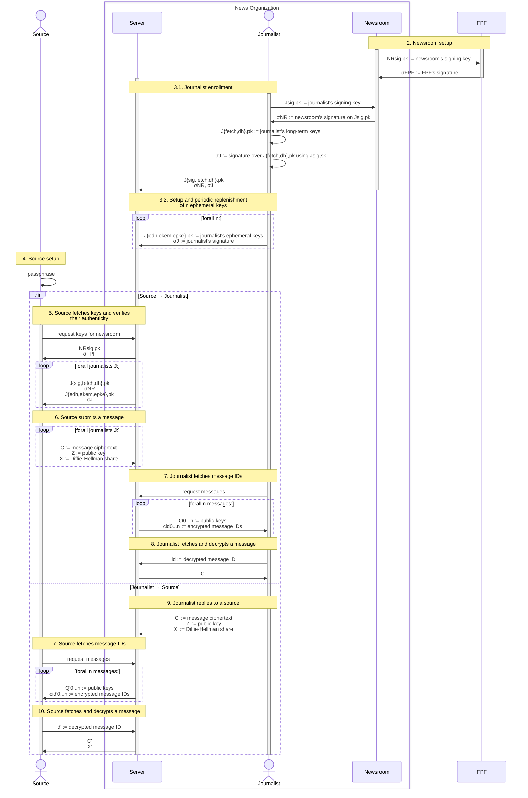

# SecureDrop Protocol specification

| Version |
| ------- |
| 0.3     |

> [!NOTE]
> The key words MUST, MUST NOT, REQUIRED, SHALL, SHALL NOT, SHOULD, SHOULD NOT,
> RECOMMENDED, MAY, and OPTIONAL in this document are to be interpreted as
> described in [RFC 2119].

## Overview

This sequence diagram shows the flow of messages and values in the SecureDrop
Protocol. The yellow boxes correspond to sections in the specification below
that describe how these values are constructed and consumed.



## Keys

Throughout this document, keys are notated as $component_{owner}^{scheme}$, where:

- $component \in \{sk, pk\}$ for private ($sk$) or public ($pk$) components;
- $owner \in \{FPF, NR, J, S\}$ for FPF, newsroom $NR$, journalist $J$, or source $S$; and
- $scheme \in \{fetch, sig, AKEM, APKE, PKE, PQ\}$ for:
  - $fetch$ fetching
  - $sig$ signature
  - $APKE = \text{SD-APKE}$, composed concretely of:
    - $AKEM = \text{AKEM}$ ($AKEM_E$ if one-time)
    - $PQ = \text{KEM}_{PQ}$
- $PKE = \text{SD-PKE}$ ($PKE_E$ if one-time)

| Owner      | Private Key        | Public Key         | Usage   | Purpose  | Direction         | Lifetime      | Algorithm                    | Signed by          |
| ---------- | ------------------ | ------------------ | ------- | -------- | ----------------- | ------------- | ---------------------------- | ------------------ |
| FPF        | $`sk_{FPF}^{sig}`$ | $`pk_{FPF}^{sig}`$ |         | Signing  |                   | Long-term     | ?                            |                    |
| Newsroom   | $`sk_{NR}^{sig}`$  | $`pk_{NR}^{sig}`$  |         | Signing  |                   | Long-term     | ?                            | $`sk_{FPF}^{sig}`$ |
| Journalist | $`sk_J^{sig}`$     | $`pk_J^{sig}`$     |         | Signing  |                   | Long-term     | ?                            | $`sk_{NR}^{sig}`$  |
| Journalist | $`sk_J^{AKEM}`$    | $`pk_J^{AKEM}`$    | SD-APKE | Message  | Outgoing          | Long-term     | DH-AKEM(X25519, HKDF-SHA256) | $`sk_J^{sig}`$     |
| Journalist | $`sk_J^{fetch}`$   | $`pk_J^{fetch}`$   |         | Fetching |                   | **TBD**[^6]   | ristretto255 (Curve25519)    | $`sk_J^{sig}`$     |
| Journalist | $`sk_J^{PQ_E}`$    | $`pk_J^{PQ_E}`$    | SD-APKE | Message  | Incoming          | One-time      | ML-KEM-768                   | $`sk_J^{sig}`$     |
| Journalist | $`sk_J^{AKEM_E}`$  | $`pk_J^{AKEM_E}`$  | SD-APKE | Message  | Incoming          | One-time      | DH-AKEM(X25519, HKDF-SHA256) | $`sk_J^{sig}`$     |
| Journalist | $`sk_J^{PKE_E}`$   | $`pk_J^{PKE_E}`$   | SD-PKE  | Metadata | Incoming          | One-time      | X-Wing (X25519, ML-KEM-768)  | $`sk_J^{sig}`$     |
| Source     | $`sk_S^{fetch}`$   | $`pk_S^{fetch}`$   |         | Fetching |                   | Permanent[^7] | ristretto255 (Curve25519)    |                    |
| Source     | $`sk_S^{PQ}`$      | $`pk_S^{PQ}`$      | SD-APKE | Message  | Incoming          | Permanent[^7] | ML-KEM-768                   |                    |
| Source     | $`sk_S^{AKEM}`$    | $`pk_S^{AKEM}`$    | SD-APKE | Message  | Incoming+Outgoing | Permanent[^7] | DH-AKEM(X25519, HKDF-SHA256) |                    |
| Source     | $`sk_S^{PKE}`$     | $`pk_S^{PKE}`$     | SD-PKE  | Metadata | Incoming          | Permanent[^7] | X-Wing (X25519, ML-KEM-768)  |                    |

[^6]: **TODO:** https://github.com/freedomofpress/securedrop-protocol/blob/a0252a8ee7a6e4051c65e4e0c06b63d6ce921110/docs/wip-protocol-0.3.md?plain=1#L87

## Functions and notation

| Syntax                                                    | Description                                                                         |
| --------------------------------------------------------- | ----------------------------------------------------------------------------------- |
| $`h \gets \text{Hash}(m)`$                                | Hash message $m$ to digest $h$                                                      |
| $`k \Vert k_1 \Vert \dots \Vert k_n \gets \text{KDF}(m)`$ | Derive one or more keys $k$ from a message $m$                                      |
| $`\sigma_S \gets^{\$} \text{Sign}(sk_S, m)`$              | Sign a message $m$ with the sender's private key $sk_S$                             |
| $`b \in \{0,1\} \gets \text{Vfy}(pk_S, m, \sigma_S)`$     | Verify a message $m$ and a signature $\sigma_S$ with the sender's public key $pk_S$ |
| $` g^x \gets \text{DH(g, x)}`$                            | Diffie-Hellman exponentiation of private component $x$                              |
| $`r \gets^{\$} \text{Rand}()`$                            | Generate a random value                                                             |
| $`-`$                                                     | The empty string (or `None` in pseudocode)                                          |

## Cryptographic APIs

The protocol composes two modes of [Hybrid Public-Key Encryption (RFC 9180)][RFC 9180]:

- For metadata protection, `SD-PKE` is an instantiation of [HPKE `Base`
  mode][RFC 9180 §5.1.1].
- For message encryption, `SD-APKE` wraps HPKE `AuthPSK` mode, following listing
  17 of Alwen et al. (2023), ["The Pre-Shared Key Modes of HPKE"][alwen2023].

### Metadata protection via `SD-PKE`: SecureDrop PKE <!-- Figure 4 as of 7944378 -->

$\text{SD-PKE}[\text{KEM}_H, \text{AEAD}, \text{KS}]$ instantiates [HPKE `Base`
mode][RFC 9180 §5.1.1] with:

- $\text{KEM}_H =$ X-Wing
- $\text{AEAD} =$ AES-GCM
- $\text{KS} =$ HPKE's [`KeySchedule()`][RFC 9180 §5.1] with [HKDF-SHA256][RFC 9180 §7.2]

| Syntax                                                | Description                                                  |
| ----------------------------------------------------- | ------------------------------------------------------------ |
| $`(sk_S^{PKE}, pk_S^{PKE}) \gets^{\$} \text{KGen}()`$ | Generate keys                                                |
| $`(c, c') \gets^{\$} \text{Enc}(pk_R^{PKE}, m)`$      | Encrypt a message $m$ via HPKE in [`mode_base`][RFC 9180 §5] |
| $`m \gets \text{Dec}(sk_R^{PKE}, (c, c'))`$           | Decrypt a message $m$ via HPKE in [`mode_base`][RFC 9180 §5] |

Concretely:

```python
def KGen():
    (sk, pk) = KEM_H.KGen()
    return (sk, pk)

def Enc(pkR, m):
    (c, K3) = KEM_H.Encap(pkR)
    (k, nonce) = KS(K3, None, None)
    cp = AEAD.Enc(k, nonce, None, m)  # cp = c'
    return (c, cp)

def Dec(skR, (c, cp)):  # cp = c'
    K3 = KEM_H.Decap(skR, c)
    (k, nonce) = KS(K3, None, None)
    m = AEAD.Dec(k, nonce, None, cp)
    return m
```

### Message encryption

#### `AKEM`: Authenticated KEM <!-- Definition 4.1 as of 7944378 -->

$\text{AKEM}$ instantiates the [DH-based KEM][RFC 9180 §4.1]
$\text{DHKEM}(\text{Group}, \text{KDF})$ with:

- $\text{Group} =$ [X25519][RFC 9180 §7.1]
- $\text{KDF} =$ [HKDF-SHA256][RFC 9180 §7.1]

| Syntax                                                           | Description                                                                                                                                                              |
| ---------------------------------------------------------------- | ------------------------------------------------------------------------------------------------------------------------------------------------------------------------ |
| $`(sk_S^{AKEM}, pk_S^{AKEM}) \gets^{\$} \text{KGen}()`$          | Generate keys; for DH-AKEM, $(sk, pk) = (x, \text{DH}(g, x)) = (x, g^x)$                                                                                                 |
| $`(c, K) \gets^{\$} \text{AuthEncap}(sk_S^{AKEM}, pk_R^{AKEM})`$ | Encapsulate a ciphertext $c$ and a shared secret $K$ using a sender's private key $sk_S$ and a receiver's public key $pk_R$; for DH-AKEM, $(c, K) = (pkE, K) = (g^x, K)$ |
| $`K \gets \text{AuthDecap}(sk_R^{AKEM}, pk_S^{AKEM}, c)`$        | Decapsulate a shared secret $K$ using a receiver's private key $sk_R$, a sender's public key $pk_S$, and a ciphertext $c$; for DH-AKEM, $c = pkE$                        |

Concretely, these functions are used as specified in [RFC 9180 §4.1].

#### `pskAPKE`: Pre-shared-key authenticated PKE <!-- Figure 5 as of 7944378 -->

$\text{pskAPKE}[\text{AKEM}, \text{KS}, \text{AEAD}]$ instantiates [HPKE
`AuthPSK` mode][RFC 9180 §5.1.4] with:

- $\text{AKEM}$ as above
- $\text{KS} =$ HPKE's [`KeySchedule()`][RFC 9180 §5.1] with [HKDF-SHA256][RFC 9180 §7.2]
- $\text{AEAD} =$ AES-GCM

| Syntax                                                                              | Description                                                                                                                   |
| ----------------------------------------------------------------------------------- | ----------------------------------------------------------------------------------------------------------------------------- |
| $`(c_1, c') \gets^{\$} \text{pskAEnc}(sk_S^{AKEM}, pk_R^{AKEM}, psk, m, ad, info)`$ | Encrypt a message $m$ with associated data $ad$ and $info$ via HPKE in [`mode_auth_psk`][RFC 9180 §5]                         |
| $`m \gets \text{pskADec}(pk_S^{AKEM}, sk_R^{AKEM}, psk, (c_1, c'), ad, info)`$      | Decrypt a message $m$ with associated data $ad$ and $info$ via HPKE in [`mode_auth_psk`][RFC 9180 §5] <!-- FIXME: 7194db1 --> |

Concretely:

```python
def pskAEnc(skS, pkR, psk, m, ad, info):
    (c1, K1) = AKEM.AuthEncap(skS, pkR)
    (k, nonce) = KS(K1, psk, info)
    cp = AEAD.Enc(k, nonce, ad, m)  # cp = c'
    return (c1, cp)

# FIXME: 7194db1
def pskADec(pkS, skR, psk, (c1, cp), ad, info):  # cp = c'
    K1 = AKEM.AuthDecap(skR, pkS, c1)
    (k, nonce) = KS(K1, psk, info)
    m = AEAD.Dec(k, nonce, ad, cp)
    return m
```

#### `SD-APKE`: SecureDrop APKE <!-- Figure 3 as of 7944378 -->

$\text{SD-APKE}[\text{AKEM}, \text{KEM}_{PQ}, \text{AEAD}]$ is constructed with:

- $\text{AKEM}$ as above
- $\text{KEM}_{PQ} =$ ML-KEM-768
- $\text{pskAPKE}$ as above

| Syntax                                                                                                                                      | Description                                                |
| ------------------------------------------------------------------------------------------------------------------------------------------- | ---------------------------------------------------------- |
| $`(sk_S^{APKE}, pk_S^{APKE}) \gets^{\$} \text{KGen}()`$                                                                                     | Generate keys                                              |
| $`((c_1, c'), c_2) \gets^{\$} \text{AuthEnc}(sk_S^{APKE} = (sk_S^{AKEM}, sk_S^{PQ}), pk_R^{APKE} = (pk_R^{AKEM}, pk_R^{PQ}), m, ad, info)`$ | Encrypt a message $m$ with associated data $ad$ and $info$ |
| $`m \gets \text{AuthDec}(sk_R^{APKE} = (sk_R^{AKEM}, sk_R^{PQ}), pk_S^{APKE} = (pk_S^{AKEM}, pk_S^{PQ}), ((c_1, c'), c_2), ad, info)`$      | Decrypt a message $m$ with associated data $ad$ and $info$ |

Concretely:

```python
def KGen():
    (sk1, pk1) = AKEM.KGen()
    (sk2, pk2) = KEM_PQ.KGen()
    sk = (sk1, sk2)
    pk = (pk1, pk2)
    return (sk, pk)

def AuthEnc((skS1, skS2), (pkR1, pkR2), m, ad, info):
    (c2, K2) = KEM_PQ.Encap(pkR2)
    (c1, cp) = pskAEnc(skS1, pkR1, K2, m, ad, c2)  # cp = c'
    return ((c1, cp), c2)

def AuthDec((skR1, skR2), (pkS1, pkS2), ((c1, cp), c2), ad, info):  # cp = c'
    K2 = KEM_PQ.Decap(skR2, c2)
    m = pskADec(pkS1, skR1, K2, (c1, cp), ad, c2)  # FIXME: 7194db1
    return m
```

## Setup

### 1. FPF

| FPF                                                          |
| ------------------------------------------------------------ |
| $`(sk_{FPF}^{sig}, pk_{FPF}^{sig}) \gets^{\$} \text{Gen}()`$ |

The server, the journalist client, and the source client SHOULD be built with
FPF's signing key $pk_{FPF}^{sig}$ pinned.[^2]

### 2. Newsroom

| Newsroom                                                   |                                   | FPF                                                                    |
| ---------------------------------------------------------- | --------------------------------- | ---------------------------------------------------------------------- |
| $`(sk_{NR}^{sig}, pk_{NR}^{sig}) \gets^{\$} \text{Gen}()`$ |                                   |                                                                        |
|                                                            | $`\longrightarrow pk_{NR}^{sig}`$ | Verify manually                                                        |
|                                                            |                                   | $`\sigma_{FPF} \gets^{\$} \text{Sign}(sk_{FPF}^{sig}, pk_{NR}^{sig})`$ |
|                                                            | $`\sigma_{FPF} \longleftarrow`$   |

The server MUST be deployed with the newsroom's signing key $pk_{NR}^{sig}$
pinned. The server MAY be deployed with FPF's signing key $pk_{FPF}^{sig}$
pinned.[^2]

### 3. Journalist

#### 3.1. Enrollment

| Journalist                                                                   |                                                           | Newsroom                                                          |
| ---------------------------------------------------------------------------- | --------------------------------------------------------- | ----------------------------------------------------------------- |
| $`(sk_J^{sig}, pk_J^{sig}) \gets^{\$} \text{Gen}()`$                         |                                                           |                                                                   |
|                                                                              | $`\longrightarrow pk_J^{sig}`$                            | Verify $pk_J^{sig}$ manually, then store for $J$                  |
|                                                                              |                                                           | $`\sigma_{NR} \gets^{\$} \text{Sign}(sk_{NR}^{sig}, pk_J^{sig})`$ |
|                                                                              |                                                           | Store $\sigma_{NR}$ for $J$                                       |
| $`(sk_J^{AKEM}, pk_J^{AKEM}) \gets^{\$} \text{AKEM.KGen}()`$                 |                                                           |                                                                   |
| $`(sk_J^{fetch}, pk_J^{fetch}) \gets^{\$} \text{KGen}()`$ (**TODO**)         |                                                           |                                                                   |
| $`\sigma_J \gets^{\$} \text{Sign}(sk_J^{sig}, (pk_J^{AKEM}, pk_J^{fetch}))`$ |                                                           |                                                                   |
|                                                                              | $`\longrightarrow (\sigma_J, pk_J^{AKEM}, pk_J^{fetch})`$ |                                                                   |
|                                                                              |                                                           | $`\text{Vfy}(pk_J^{sig}, (pk_J^{AKEM}, pk_J^{fetch}), \sigma_J)`$ |
|                                                                              |                                                           | Store $(\sigma_J, pk_J^{AKEM}, pk_J^{fetch})$ for $J$             |

#### 3.2. Setup and periodic replenishment of $n$ ephemeral keybundles

Each journalist $J$ MUST generate and maintain a pool of $n$ ephemeral
keybundles. For each keybundle:

| Journalist                                                                     |                                                             | Server                                                              |
| ------------------------------------------------------------------------------ | ----------------------------------------------------------- | ------------------------------------------------------------------- |
| $`(sk_J^{APKE_E}, pk_J^{APKE_E}) \gets^{\$} \text{SD-APKE.KGen}()`$            |                                                             |                                                                     |
| $`(sk_J^{PKE_E}, pk_J^{PKE_E} \gets^{\$} \text{SD-PKE.KGen}()`$                |                                                             |                                                                     |
| $`\sigma_J \gets^{\$} \text{Sign}(sk_J^{sig}, (pk_J^{APKE_E}, pk_J^{PKE_E}))`$ |                                                             |                                                                     |
|                                                                                | $`\longrightarrow (\sigma_J, pk_J^{APKE_E}, pk_J^{PKE_E})`$ |
|                                                                                |                                                             | $`\text{Vfy}(pk_J^{sig}, (pk_J^{APKE_E}, pk_J^{PKE_E}), \sigma^J)`$ |
|                                                                                |                                                             | Store $(\sigma_J, pk_J^{APKE_E}, pk_J^{PKE_E})$ for $J$             |

### 4. Source

To begin each session, a source MUST enter (on their first visit) or reenter (on
a subsequent visit) some $passphrase$:

| Source                                                                                           |
| ------------------------------------------------------------------------------------------------ |
| $`sk_S^{fetch} \Vert sk_S^{PQ} \Vert sk_S^{AKEM} \Vert sk_S^{PKE} \gets \text{KDF}(passphrase)`$ |

## Messaging protocol

SecureDrop is a first-contact protocol between an unknown party (an anonymous
source) and well-known parties (journalists).

The preceding setup steps are _role-specific_: sources' and journalists' setup
steps are different. By contrast, the following protocol steps are
_role-agnostic_ and _turn-specific_. Except where otherwise noted, sources and
journalists execute the same fetching step (5), sending step (6), and receiving
step (7), in any order.

Only a source can initiate a conversation. In other words, a source is always
the first sender.

### 5. Sender fetches keys and verifies their authenticity <!-- Figure 1 as of 7944378 -->

A sender knows their own keys and the newsroom's signing key $pk_{NR}^{sig}$. In
addition, in the **reply case,** if the sender is a journalist replying to a
source, they also already know their recipient's keys without further
verification.

| Anyone          | All senders     | Reply case      |
| --------------- | --------------- | --------------- |
| $pk_{NR}^{sig}$ | $pk_{NR}^{sig}$ | $pk_{NR}^{sig}$ |
|                 | $pk_S^{APKE}$   | $pk_R^{APKE}$   |
|                 | $pk_S^{PKE}$    | $pk_R^{PKE}$    |
|                 | $pk_S^{fetch}$  | $pk_R^{fetch}$  |
|                 | $sk_S^{APKE}$   |
|                 | $sk_S^{PKE}$    |
|                 | $sk_S^{fetch}$  |

For some newsroom $NR$ and all its enrolled journalists $J_i$:

| Sender                                                                                                               |                                 | Server                                                                                        |
| -------------------------------------------------------------------------------------------------------------------- | ------------------------------- | --------------------------------------------------------------------------------------------- |
|                                                                                                                      | $\longrightarrow$ `RequestKeys` |                                                                                               |
|                                                                                                                      |                                 | $`pks = \{(pk_{R,i}^{sig}, pk_{R,i}^{APKE}, pk_{R,i}^{PKE}, pk_{R,i}^{fetch})\}`$ for all $i$ |
|                                                                                                                      |                                 | $`sigs = \{(\sigma_{R,i}, \sigma_{NR,i})\}`$ for all $i$                                      |
|                                                                                                                      | $`(pks, sigs) \longleftarrow`$  |                                                                                               |
| $`\forall i:`$                                                                                                       |                                 |                                                                                               |
| $`\text{Vfy}(pk_{NR}^{sig}, pk_{R,i}^{sig}, \sigma_{NR,i})`$                                                         |                                 |                                                                                               |
| $`\text{Vfy}(pk_{R,i}^{sig}, (pk_{R,i}^{APKE}, pk_{R,i}^{PKE}, pk_{R,i}^{fetch}), \sigma_{R,i})`$                    |                                 |                                                                                               |
|                                                                                                                      |                                 |                                                                                               |
| **Reply case:** The journalist replaces their own keys with those of the source to whom they are replying:           |                                 |                                                                                               |
| $`pks \gets pks \setminus \{pk_S^{APKE}, pk_S^{PKE}, pk_S^{fetch}\} \cup \{pk_R^{APKE}, pk_R^{PKE}, pk_R^{fetch}\}`$ |                                 |                                                                                               |

### 6. Sender submits a message <!-- Figure 1 as of 7944378 -->

Then, for some message $m$, for all keys $(pk_{R,i}^{APKE}, pk_{R,i}^{PKE},
pk_{R,i}^{fetch}) \in pks$:

| Source                                                                              |                                 | Server                                         |
| ----------------------------------------------------------------------------------- | ------------------------------- | ---------------------------------------------- |
| $`pt \gets m \Vert pk_S^{fetch} \Vert pk_S^{PKE} `$                                 |                                 |                                                |
| $`ct^{APKE} \gets \text{SD-APKE.AuthEnc}(sk_S^{APKE}, pk_{R,i}^{APKE}, pt, NR, -)`$ |                                 |                                                |
| $`ct^{PKE} \gets \text{SD-PKE.Enc}(pk_{R,i}^{PKE}, pk_S^{APKE}, -, -)`$             |                                 |                                                |
| $`C_S \gets (ct^{APKE}, ct^{PKE})`$                                                 |                                 |                                                |
| $`x \gets^{\$} \mathcal{E}_H`$[^8]                                                  |                                 |                                                |
| $`X \gets g^x`$                                                                     |                                 |                                                |
| $`Z \gets (pk_{R,i}^{fetch})^x`$                                                    |                                 |                                                |
|                                                                                     | $`\longrightarrow (C_S, X, Z)`$ |                                                |
|                                                                                     |                                 | $`id \gets^{\$} \{0,1\}^{il}`$ for length $il$ |
|                                                                                     |                                 | Store $(id, C_S, X, Z)$                        |

### 7. Receiver fetches and decrypts messages <!-- Figure 2 as of 7944378 -->

A receiver knows their own keys and the newsroom's $pk_{NR}^{sig}$:

| Anyone          | All receivers   |
| --------------- | --------------- |
| $pk_{NR}^{sig}$ | $pk_{NR}^{sig}$ |
|                 | $pk_R^{APKE}$   |
|                 | $pk_R^{PKE}$    |
|                 | $pk_R^{fetch}$  |
|                 | $sk_R^{APKE}$   |
|                 | $sk_R^{PKE}$    |
|                 | $sk_R^{fetch}$  |

For some newsroom $NR$:

| Server                                                                                |                                                | Receiver                                                                        |
| ------------------------------------------------------------------------------------- | ---------------------------------------------- | ------------------------------------------------------------------------------- |
|                                                                                       |                                                | $`fetched \gets \emptyset`$                                                     |
|                                                                                       | $\longleftarrow$ `RequestMessages`             |                                                                                 |
| $`\forall C_i = (id_i, C_{S_i}, X_i, Z_i):`$ **TODO:** pad up to $n$ total challenges |                                                |                                                                                 |
| $`r_i \gets^{\$} \mathcal{E}_H`$[^8]                                                  |                                                |                                                                                 |
| $`nonce_i \gets 0^{nl}`$ for length $nl$                                              |                                                |                                                                                 |
| $`idk_i \gets \text{KDF}(Z_i^{r_i}, NR)`$                                             |                                                |                                                                                 |
| $`eid_i \gets \text{AEAD.Enc}(idk_i, nonce_i, -, id_i)`$                              |                                                |                                                                                 |
| $`Q_i \gets X_i^{r_i}`$                                                               |                                                |                                                                                 |
|                                                                                       | $`\longrightarrow \forall i: \{(eid_i, Q_i\}`$ |                                                                                 |
|                                                                                       |                                                | $`cids = \emptyset`$                                                            |
|                                                                                       |                                                | $`\forall i:`$                                                                  |
|                                                                                       |                                                | $`tk_i \gets \text{KDF}(Q_i^{sk_R^{fetch}}, NR)`$                               |
|                                                                                       |                                                | $`nonce_i \gets 0^{nl}`$ for length $nl$                                        |
|                                                                                       |                                                | $`res_i \gets \text{AEAD.Dec}(tk_i, nonce_i, -, eid_i)`$                        |
|                                                                                       |                                                | If $res_i \neq \bot$: $`cids \gets cids \cup \{res_i\}`$                        |
|                                                                                       |                                                | $`tofetch = fetched \setminus cids`$                                            |
|                                                                                       |                                                | If $tofetch \neq \emptyset$: $`cid \gets tofetch[0]`$                           |
|                                                                                       | $`cid \longleftarrow`$                         |                                                                                 |
|                                                                                       | $`\longrightarrow C_{S_i}`$ where $id_i = cid$ |                                                                                 |
|                                                                                       |                                                | $`(ct^{APKE}, ct^{PKE}) \gets C_{S_i}`$                                         |
|                                                                                       |                                                | $`pk_S^{APKE} \gets \text{SD-PKE.Dec}(sk_R^{PKE}, ct^{PKE}, -, -)`$             |
|                                                                                       |                                                | $`pt \gets \text{SD-APKE.AuthDec}(sk_R^{APKE}, pk_S^{APKE}, ct^{APKE}, NR, -)`$ |
|                                                                                       |                                                | $`m \Vert pk_S^{fetch} \Vert pk_S^{PKE} \gets pt`$                              |
|                                                                                       |                                                | $`fetched \gets fetched \cup \{cid\}`$                                          |
|                                                                                       |                                                | If $tofetch \setminus \{cid\} \neq \emptyset$: repeat from `RequestMessages`    |

[^1]: Currently configured as [`CHUNK`][chunk].

[^2]: See [`draft-pki.md`](./draft-pki.md) for further considerations.

[^3]: Adapted from Maier §5.4.1.

<!--
[^6]: TODO kept inline above.
-->

[^7]:
    The source's keys are considered "permanent" because they are derived
    deterministically from the source's passphrase, which cannot be changed.

[^8]:
    $\mathcal{E}_H \subset \mathbb{Z}$ per Definition 4 of Alwen et al.
    (2020), ["Analyzing the HPKE Standard"][alwen2020].

[alwen2020]: https://eprint.iacr.org/2020/1499
[alwen2023]: https://eprint.iacr.org/2023/1480
[chunk]: https://github.com/freedomofpress/securedrop-protocol/blob/664f8c66312b45e00d1e2b4a26bc466ff105c3ca/README.md?plain=1#L105
[RFC 2119]: https://datatracker.ietf.org/doc/html/rfc2119
[RFC 9180]: https://datatracker.ietf.org/doc/html/rfc9180
[RFC 9180 §4.1]: https://datatracker.ietf.org/doc/html/rfc9180#name-dh-based-kem-dhkem
[RFC 9180 §5]: https://datatracker.ietf.org/doc/html/rfc9180#name-hybrid-public-key-encryptio
[RFC 9180 §5.1]: https://datatracker.ietf.org/doc/html/rfc9180#name-creating-the-encryption-con
[RFC 9180 §5.1.1]: https://datatracker.ietf.org/doc/html/rfc9180#name-encryption-to-a-public-key
[RFC 9180 §5.1.4]: https://datatracker.ietf.org/doc/html/rfc9180#name-authentication-using-both-a
[RFC 9180 §7.1]: https://datatracker.ietf.org/doc/html/rfc9180#name-key-encapsulation-mechanism
[RFC 9180 §7.2]: https://datatracker.ietf.org/doc/html/rfc9180#name-key-derivation-functions-kd
