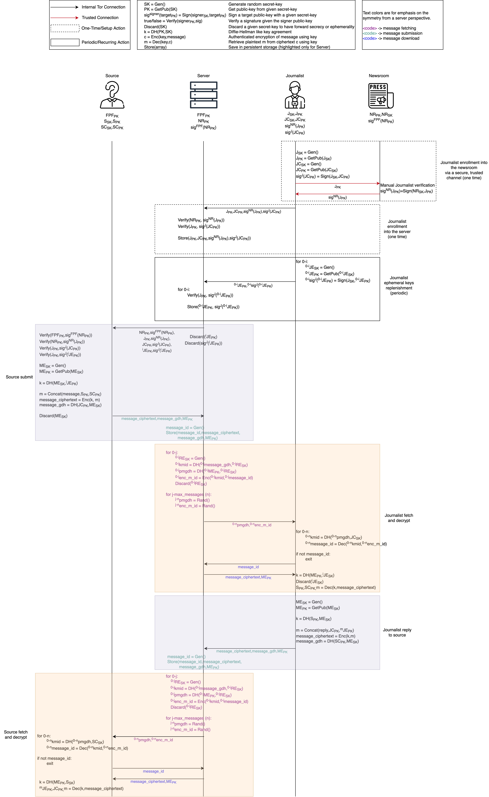

# SecureDrop Protocol specification

> [!NOTE]
> Except where indicated, this document follows the notation and other
> conventions used in Luca Maier's ["Formal Analysis of the SecureDrop
> Protocol"][maier].

> [!NOTE]
> The key words MUST, MUST NOT, REQUIRED, SHALL, SHALL NOT, SHOULD, SHOULD NOT,
> RECOMMENDED, MAY, and OPTIONAL in this document are to be interpreted as
> described in [RFC 2119].

For simplicity, in this chart, messages are sent to a single _Journalist_ rather than to all journalists enrolled with a given newsroom, and the attachment submission and retrieval procedure is omitted.

## Keys

<!--
TODO: Not yet accounted for from Maier:
- **FPF**:
  - _FPFSK_: Long term FPF signing private key
  - _FPFPK_: Long term FPF signing public key
- **Server**:
  - _RESK_: Ephemeral Server, per-request message-fetching private key
  - _REPK_: Ephemeral Server, per-request message-fetching public key
  - _DEnPK_: Per-request, ephemeral decoy public key
-->

In the table below:

> For keys, we use the notation $X_{A,B}$, where $X$ represents the key owner
> ($`X \in \{NR, J, S\}`$ [for newsroom, journalist, and source, respectively]),
> $A$ represents the key's usage ($`A \in \{pke,sig,fetch,dh\}`$), and is prefixed
> with an "e" if the key is ephemeral. $B$ indicates whether the component is
> private or public. For Diffie-Hellman keys $x$, the public component is
> represented by the exponentiation $DH(g, x)$. (Maier §5.4.1)

| Party      | Private Key      | Public Key       | Type          | Usage            | Signed by       |
| ---------- | ---------------- | ---------------- | ------------- | ---------------- | --------------- |
| Newsroom   | $`NR_{sig,sk}`$  | $`NR_{sig,pk}`$  | PPK           | Signing          |                 |
| Journalist | $`J_{sig,sk}`$   | $`J_{sig,pk}`$   | PPK           | Signing          | $`NR_{sig,sk}`$ |
| Journalist | $`J_{fetch,sk}`$ | $`J_{fetch,pk}`$ | DH            | Fetching         | $`NR_{sig,sk}`$ |
| Journalist | $`J_{dh,sk}`$    | $`J_{dh,pk}`$    | DH            | DH-AKEM          | $`NR_{sig,sk}`$ |
| Journalist | $`J_{ekem,sk}`$  | $`J_{ekem,pk}`$  | Ephemeral PPK | KEMpq | $`J_{sig,sk}`$  |
| Journalist | $`J_{epke,sk}`$  | $`J_{epke,pk}`$  | Ephemeral PPK | PKE              | $`J_{sig,sk}`$  |
| Journalist | $`J_{edh,sk}`$   | $`J_{edh,pk}`$   | Ephemeral DH  | DH-AKEM          | $`J_{sig,sk}`$  |
| Source     | $`S_{fetch,sk}`$ | $`S_{fetch,pk}`$ | DH            | Fetching         |                 |
| Source     | $`S_{dh,sk}`$    | $`S_{dh,pk}`$    | DH            | DH-AKEM          |                 |
| Source     | $`S_{kem,sk}`$   | $`S_{kem,pk}`$   | PPK           | KEMpq |                 |
| Source     | $`S_{pke,sk}`$   | $`S_{pke,pk}`$   | PPK           | PKE              |                 |

## Functions and notation

| Syntax                                                    | Description                                                                                                                                                                      |
| --------------------------------------------------------- | -------------------------------------------------------------------------------------------------------------------------------------------------------------------------------- |
| $`h \gets \text{Hash}(m)`$                                | Hash message $m$ to digest $h$                                                                                                                                                   |
| $`k \Vert k_1 \Vert \dots \Vert k_n \gets \text{KDF}(m)`$ | Derive one or more keys $k$ from a message $m$                                                                                                                                   |
| $`\sigma \gets^{\$} \text{Sign}(sk, m)`$                  | Sign a message $m$ with the private key $sk$                                                                                                                                     |
| $`b \in \{0,1\} \gets \text{Vfy}(pk, m, \sigma)`$         | Verify a message $m$ and a signature $\sigma$ with a public key $pk$                                                                                                             |
| $` g^x \gets \text{DH(g, x)}`$                            | Diffie-Hellman exponentiation of private component $x$                                                                                                                           |
| $`(sk, pk) \gets^{\$} \text{Gen}()`$                      | Generate keys; for DH-AKEM, $(sk, pk) = (x, \text{DH}(g, x)) = (x, g^x)$                                                                                                         |
| $`(c, K) \gets^{\$} \text{AuthEncap}(skS, pkR)`$          | Encapsulate a ciphertext $c$ and a shared secret $K$ using a sender's private key $skS$ and a receiver's public key $pkR$; for DH-AKEM, $(c, K) = (pkE, K) = (pk, K) = (g^x, K)$ |
| $`K \gets \text{AuthDecap}(skR, pkS, pkE)`$               | Decapsulate a shared secret $K$ using a receiver's private key $skR$, a sender's public key $pkS$, and a ciphertext $c$                                                          |
| $`r \gets^{\$} \text{Rand}()`$                            | Generate a random value                                                                                                                                                          |
| $`mp \gets \text{Pad}(m)`$                                | Pad a message $m$                                                                                                                                                                |
| $`\varepsilon`$                                           | The empty string                                                                                                                                                                 |

### HPKEpqauth

| Syntax                                                                                       | Description                                                                   |
| -------------------------------------------------------------------------------------------- | ----------------------------------------------------------------------------- |
| $`(skS_{dh}, pkS_{dh}) \gets^{\$} \text{Gen}_S()`$                                           | Generate keys for a sender $S$                                                |
| $`((skR_{dh}, skR_{kem}), (pkR_{dh}, pkR_{kem})) \gets^{\$} \text{Gen}_R()`$                 | Generate keys for a receiver $R$                                              |
| $`((c_1, c_2), c) \gets^{\$} \text{AuthEnc}(skS_{dh}, (pkR_{dh}, pkR_{kem}), m, aad, info)`$ | Encrypt to a receiver $R$ a message $m$ with associated data $aad$ and $info$ |
| $`m \gets \text{AuthDec}((skR_{dh}, skR_{kem}), pkS_dh, ((c_1, c_2), c), aad, info)`$        | Decrypt from a sender $S$ a message $m$ with associated data $aad$ and $info$ |

### Usage

| Keys                       | Source → Journalist            | Journalist → Source          |
| -------------------------- | ------------------------------ | ---------------------------- |
| $`(skS_{dh}, pkS_{dh})`$   | $`(S_{dh,sk}, S_{dh,pk})`$     | $`(J_{dh,sk}, J_{dh,pk})`$   |
| $`(skR_{dh}, pkR_{dh})`$   | $`(J_{edh,sk}, J_{edh,pk})`$   | $`(S_{dh,sk}, S_{dh,pk})`$   |
| $`(skR_{kem}, pkR_{kem})`$ | $`(J_{ekem,sk}, J_{ekem,pk})`$ | $`(S_{kem,sk}, S_{kem,pk})`$ |

> For messages sent from a source to a journalist, the source is identified by
> $`S_{dh,pk}`$ and utilizes the ephemeral keys $`J_{edh,pk}`$ and $`J_{ekem,pk}`$ to
> encrypt its message. The journalist, in turn, authenticates itself using the
> new long-term key $`J_{dh,pk}`$ and relies on the source's long-term keys
> $`S_{dh,pk}`$ and $`S_{kem,pk}`$ to encrypt messages back to the source securely.
> (Maier §5.2)

## Setup

### FPF

| FPF                                                      |
| -------------------------------------------------------- |
| $`(FPF_{sig,sk}, FPF_{sig,pk}) \gets^{\$} \text{Gen}()`$ |

$FPF_{sig,pk}$ is pinned in all components that participate in the protocol
(likely in a library they share): the server, the journalist client, and the
source client.

### Newsroom

| Newsroom                                               |                                 | FPF                                                                |
| ------------------------------------------------------ | ------------------------------- | ------------------------------------------------------------------ |
| $`(NR_{sig,sk}, NR_{sig,pk}) \gets^{\$} \text{Gen}()`$ |                                 |                                                                    |
|                                                        | $`\longrightarrow NR_{sig,pk}`$ | for manual verification.                                           |
|                                                        |                                 | $`\sigma^{FPF} \gets^{\$} \text{Sign}(FPF_{sig,sk}, NR_{sig,pk})`$ |
|                                                        | $`\sigma^{FPF} \longleftarrow`$ |

$NR_{sig,pk}$ and $\sigma^{FPF}$ are pinned in the server during deployment.[^1]

### Journalist

#### Enrollment

| Journalist                                               |                                                         | Newsroom                                                                                   |
| -------------------------------------------------------- | ------------------------------------------------------- | ------------------------------------------------------------------------------------------ |
| $`(J_{sig,sk}, J_{sig,pk}) \gets^{\$} \text{Gen}()`$     |                                                         |                                                                                            |
| $`(J_{fetch,sk}, J_{fetch,pk}) \gets^{\$} \text{Gen}()`$ |                                                         |                                                                                            |
| $`(J_{dh,sk}, J_{dh,pk}) \gets^{\$} \text{Gen}()`$       |                                                         |                                                                                            |
|                                                          | $`\longrightarrow J_{sig,pk}, J_{fetch,pk}, J_{dh,pk}`$ | for manual verification.                                                                   |
|                                                          |                                                         | $`\sigma^{NR} \gets^{\$} \text{Sign}(NR_{sig,sk}, (J_{sig,pk}, J_{fetch,pk}, J_{dh,pk}))`$ |
|                                                          | $`\sigma^{NR} \longleftarrow`$                          |                                                                                            |

Public keys and $\sigma^{NR}$ are saved to the server.

#### Setup and periodic replenishment of $n$ ephemeral keys

Repeat $n$ times:

| Journalist                                                                              |
| --------------------------------------------------------------------------------------- |
| $`(J_{edh,sk}, J_{edh,pk}) \gets^{\$} \text{Gen}()`$                                    |
| $`(J_{ekem,sk}, J_{ekem,pk}) \gets^{\$} \text{Gen}()`$                                  |
| $`(J_{epke,sk}, J_{epke,pk}) \gets^{\$} \text{Gen}()`$                                  |
| $`\sigma^J \gets^{\$} \text{Sign}(J_{sig,sk}, (J_{edh,pk}, J_{ekem,pk}, J_{epke,pk}))`$ |

Public keys and $\sigma^{J}$ are saved to the server.

### Source

After entering (on their first visit) or reentering (on a subsequent visit) some $passphrase$:

| Source                                                                                          |
| ----------------------------------------------------------------------------------------------- |
| $`S_{dh,sk} \Vert S_{fetch,sk} \Vert S_{pke,sk} \Vert S_{kem,sk} \gets \text{KDF}(passphrase)`$ |

## Messaging protocol overview

Only a source can initiate a conversation; there are no other choices as sources
are effectively unknown until they initiate contact first.

### Source fetches keys and verifies their authenticity

For some newsroom $NR$ and all its enrolled journalists $J^i$:

| Source                                                    |                                                                             | Server                                               |
| --------------------------------------------------------- | --------------------------------------------------------------------------- | ---------------------------------------------------- |
|                                                           | $\longrightarrow$ request keys for $NR$                                     |                                                      |
|                                                           | $`NR_{sig,pk}, \sigma^{FPF} \longleftarrow`$                                |                                                      |
|                                                           |                                                                             | $`\forall J^i`$:                                     |
|                                                           | $`J^i_{sig,pk}, J^i_{fetch,pk}, J^i_{dh,pk}, \sigma^{NR} \longleftarrow`$   |                                                      |
|                                                           | $`J^i_{edh,pk}, J^i_{ekem,pk}, J^i_{epke,pk}, \sigma^{J^i} \longleftarrow`$ | chosen at random for $J^i$                           |
|                                                           |                                                                             | Discard $J^i_{edh,pk}, J^i_{ekem,pk}, J^i_{epke,pk}$ |
| $`\text{Vfy}(FPF_{sig,pk}, NR_{sig,pk}, \sigma^{FPF})`$   |                                                                             |                                                      |
| $`\forall J^i`$:                                          |                                                                             |                                                      |
| $`\text{Vfy}(NR_{sig,pk}, J^i_{sig,pk}, \sigma^{NR})`$    |                                                                             |                                                      |
| $`\text{Vfy}(NR_{sig,pk}, J^i_{fetch,pk}, \sigma^{NR})`$  |                                                                             |                                                      |
| $`\text{Vfy}(NR_{sig,pk}, J^i_{dh,pk}, \sigma^{NR})`$     |                                                                             |                                                      |
| $`\text{Vfy}(J^i_{sig,pk}, J^i_{edh,pk}, \sigma^{J^i})`$  |                                                                             |                                                      |
| $`\text{Vfy}(J^i_{sig,pk}, J^i_{ekem,pk}, \sigma^{J^i})`$ |                                                                             |                                                      |
| $`\text{Vfy}(J^i_{sig,pk}, J^i_{epke,pk}, \sigma^{J^i})`$ |                                                                             |                                                      |

### Source submits a message

For some message $msg$ to all journalists $J^i$ enrolled for a newsroom $NR$:

| Source                                                                                                                       |                             | Server                           |
| ---------------------------------------------------------------------------------------------------------------------------- | --------------------------- | -------------------------------- |
| $`\forall J^i`$:                                                                                                             |                             |                                  |
| $`m \gets \text{Pad}(msg \Vert S_{dh,pk} \Vert S_{pke,pk} \Vert S_{kem,pk} \Vert S_{fetch,pk} \Vert J^i_{sig,pk} \Vert NR)`$ |                             |                                  |
| $`((c_1, c_2), C'') \gets^{\$} \text{AuthEnc}(S_{dh,pk}, (J^i_{edh,pk}, J^i_{ekem,pk}), m, \varepsilon, \varepsilon)`$       |                             |
| $`C' \gets^{\$} \text{Enc}(J^i_{epke,pk}, S_d,pk \Vert c_1 \Vert c_2)`$                                                      |                             |                                  |
| $`C \gets C' \Vert C''`$                                                                                                     |                             |                                  |
| $`x \gets^{\$} \mathbb Z_q`$                                                                                                 |                             |                                  |
| $`X \gets \text{DH}(g, x)`$                                                                                                  |                             |                                  |
| $`Z \gets \text{DH}(J^i_{fetch,pk}, x)`$                                                                                     |                             |                                  |
|                                                                                                                              | $`\longrightarrow C, Z, X`$ |
|                                                                                                                              |                             | $`id \gets^{\$} \text{Rand}()`$  |
|                                                                                                                              |                             | $`messages[id] \gets (C, Z, X)`$ |

> [!NOTE]
> The source client MUST follow the same procedure for replying to a message
> from a journalist.

### Source or journalist fetches messages IDs

For a total of $n$ messages:

| User $`U \in \{J, S\}`$ for journalist $J$ or source $S$ |                                                   | Server                                                       |
| -------------------------------------------------------- | ------------------------------------------------- | ------------------------------------------------------------ |
|                                                          | $\longrightarrow$ request messages                |                                                              |
|                                                          |                                                   | $`\forall i \in 0\dots \text{Len}(messages)`$:               |
|                                                          |                                                   | $`(id_i, (c_i, Z_i, X_i)) \gets messages.\text{items}()[i]`$ |
|                                                          |                                                   | $`y \gets^{\$} \mathbb Z_q`$                                 |
|                                                          |                                                   | $`k_i \gets \text{DH}(Z_i, y)`$                              |
|                                                          |                                                   | $`Q_i \gets \text{DH}(X_i, y)`$                              |
|                                                          |                                                   | $`cid_i \gets^{\$} \text{Enc}(k_i, id_i)`$                   |
|                                                          |                                                   |                                                              |
|                                                          |                                                   | $`\forall i \in \text{Len}(messages) \dots n`$:              |
|                                                          |                                                   | $`Q_i \gets \text{DH}(X_i, y)`$                              |
|                                                          |                                                   | $`cid_i \gets ^{\$} \text{Enc}(k_i, id_i)`$                  |
|                                                          |                                                   |                                                              |
|                                                          | $`Q_{0 \dots n}, cid_{0 \dots n} \longleftarrow`$ |
| $`ids \gets \{\}`$                                       |                                                   |                                                              |
| $`\forall i \in 0 \dots n`$:                             |                                                   |                                                              |
| $`k_i \gets \text{DH}(Q_i, U_{fetch,sk})`$:              |                                                   |                                                              |
| $`id_i \gets \text{Dec}(k_i, cid_i) \neq \bot`$          |                                                   |                                                              |
| $`ids \gets ids \cup \{id_i\}`$                          |                                                   |                                                              |
|                                                          |                                                   |                                                              |
| Return $ids$                                             |                                                   |                                                              |

### Journalist fetches and decrypts a message

For some message $id$:

| Journalist                                                                                                               |                         | Server                         |
| ------------------------------------------------------------------------------------------------------------------------ | ----------------------- | ------------------------------ |
|                                                                                                                          | $`\longrightarrow id`$  |                                |
|                                                                                                                          |                         | $`C, Z, X \gets messages[id]`$ |
|                                                                                                                          | $`c, X \longleftarrow`$ |
| $`\forall J_{edh,sk}, J_{ekem,sk}, J_{epke,sk}`$:                                                                        |                         |                                |
| Parse $C$ as $C' \Vert C''$                                                                                              |                         |                                |
| $`\tilde{M} \gets \text{Dec}(J_{epke,sk}, C') \neq \bot`$                                                                |                         |                                |
| Parse $\tilde{M}$ as $S \Vert c_1 \Vert c_2$                                                                             |                         |                                |
| $`m \gets \text{AuthDec}((J_{edh,sk}, J_{ekem,sk}), S, ((c_1, c_2), C''), \varepsilon, \varepsilon) \neq \bot`$          |                         |                                |
| Parse $m$ as $msg \Vert \tilde{S} \Vert S_{pke,pk} \Vert S_{kem,pk} \Vert S_{fetch,pk} \Vert \tilde{J} \Vert \tilde{NR}$ |                         |                                |
| Check $NR = \tilde{NR}$, $J_{sig,pk} = \tilde{J}$, $S = \tilde{S}$                                                       |                         |                                |
| Discard $J_{edh,sk}, J_{ekem,sk}, J_{fetch,sk}$                                                                          |                         |                                |
| Return $msg \Vert S_{dh,pk} \Vert S_{kem,pk} \Vert S_{fetch,pk}$                                                         |                         |                                |

### Journalist replies to a source

| Journalist                                                                                               |                             | Server                          |
| -------------------------------------------------------------------------------------------------------- | --------------------------- | ------------------------------- |
| $`m \gets msg \Vert S \Vert J_{sig,pk} \Vert J_{fetch,pk} \Vert J_{dh,pk} \Vert \sigma^{NR} \Vert NR`$   |                             |                                 |
| $`((c_1, c_2), C'') \gets^{\$} \text{AuthEnc}(J_{dh,sk}, (S, S_{kem,pk}), m, \varepsilon, \varepsilon)`$ |                             |
| $`C' \gets ^{\$} \text{Enc}(S_{pke,pk}, J_{dh,pk} \Vert c_1 \Vert c_2)`$                                 |                             |                                 |
| $`C \gets C' \Vert C''`$                                                                                 |                             |                                 |
| $`x \gets^{\$} \mathbb Z_q`$                                                                             |                             |                                 |
| $`Z \gets \text{DH}(S_{fetch,pk}, x)`$                                                                   |                             |                                 |
| $`X \gets \text{DH}(g, x)`$                                                                              |                             |                                 |
|                                                                                                          | $`\longrightarrow C, Z, X`$ |                                 |
|                                                                                                          |                             | $`id \gets^{\$} \text{Rand}()`$ |
|                                                                                                          |                             | $`messages[id] \gets C, Z, X`$  |

> [!NOTE]
> As a mitigation against traffic analysis, in addition to sending the reply
> encrypted to the source $S$, the journalist client SHOULD also send a copy
> encrypted to each of the other $n-1$ journalists currently enrolled in the
> newsroom $NR$.

### Source fetches and decrypts a message

For some message $id$:

| Source                                                                                                        |                         | Server                         |
| ------------------------------------------------------------------------------------------------------------- | ----------------------- | ------------------------------ |
|                                                                                                               | $`\longrightarrow id`$  |                                |
|                                                                                                               |                         | $`C, Z, X \gets messages[id]`$ |
|                                                                                                               | $`C, X \longleftarrow`$ |                                |
| Parse $C$ as $C' \Vert C''$                                                                                   |                         |                                |
| $`\tilde{M} \gets \text{Dec}(S_{pke,sk}, C') \neq \bot`$                                                      |                         |                                |
| Parse $\tilde{M}$ as $J \Vert c_1 \Vert c_2$                                                                  |                         |                                |
| $`m \gets \text{AuthDec}((S_{dh,sk}, S_{kem,sk}), J, ((c_1, c_2), C''), \varepsilon, \varepsilon) \neq \bot`$ |                         |                                |
| Parse $m$ as $msg \Vert \tilde{S} \Vert J_1 \Vert J_2 \Vert J_3 \Vert \sigma \Vert \tilde{NR}$                |                         |                                |
| Check $NR = \tilde{NR}$, $J = J_3$, $S_{dh,pk} = \tilde{S}$                                                   |                         |                                |
| Return $msg \Vert J \Vert NR$                                                                                 |                         |                                |

### Source replies to a journalist

See ["Source Submits a Message"](#source-submits-a-message).

[^1]: See [`draft-pki.md`](./draft-pki.md) for further considerations.

[maier]: https://datatracker.ietf.org/doc/html/rfc2119
[RFC 2119]: https://datatracker.ietf.org/doc/html/rfc2119
