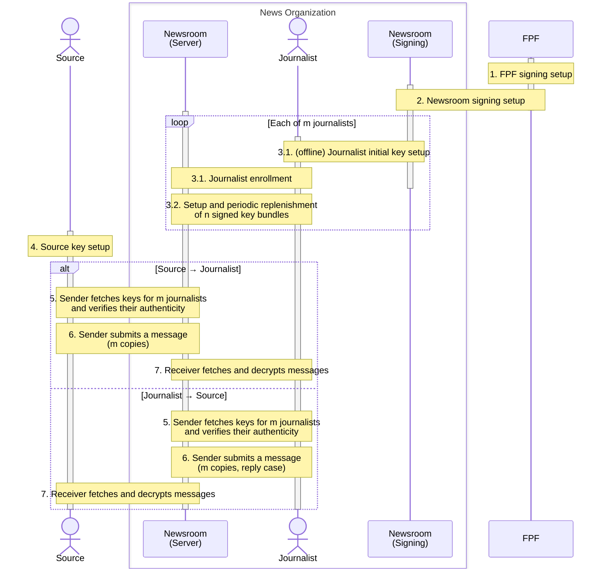

# SecureDrop Protocol specification

| Version |
| ------- |
| 0.4     |

> [!NOTE]
> The key words MUST, MUST NOT, REQUIRED, SHALL, SHALL NOT, SHOULD, SHOULD NOT,
> RECOMMENDED, MAY, and OPTIONAL in this document are to be interpreted as
> described in [RFC 2119].

> [!NOTE]
> This protocol is under active development.

## Table of contents

- [Overview](#overview)
  - [Introduction](#introduction)
  - [Sequence Diagram](#sequence-diagram)
- [Keys](#keys)
  - [Key Hierarchy](#key-hierarchy-)
  - [Key Setup Steps](#key-setup-steps)
- [Messaging Protocol](#messaging-protocol)
  - [Messaging Protocol Steps](#messaging-protocol-steps)
  - [Message Format](#message-formats)
- [Known Limitations](#known-limitations)
- [Glossary](#glossary)
- [Changelog](#changelog)

## Overview

### Introduction

SecureDrop Protocol is a first-contact messaging protocol between anonymous users (sources) and non-anonymous user(s) (journalists) with a shared affiliation (newsroom).
The design is largely motivated by the requirement that sources avoid local persistent state, for plausible deniability.

This specification describes:

- Each party (source, journalist, newsroom, FPF) and their [setup](#key-setup-steps)
- Message encryption, retrieval, and decryption
- What type of security and confidentiality properties are provided
- What encryption algorithms and parameters are used

Throughout, the terms **source**, **journalist** and **newsroom** are used.
These may be understood to mean: the anonymous users who initiate conversations (sources); the non-anonymous users who receive and reply to messages (journalists), and the public organization that manages the system and authorizes allowed journalists (newsroom).

The terms **sender** and **recipient** are also used, more abstractly, to refer to a user's role at a given point in the protocol's execution: when a source writes to a journalist, they are a sender, and when they receive a reply, they are a recipient, and vice-versa.

The protocol has:

- A limited, stateless, _unauthenticated_ public API (`requestKeys`, `sendMessage`, `requestMessages`, `getMessage`) used by all parties for message sending and retrieval
- A limited, authenticated administrator API, used by newsrooms to enroll and unenroll journalists
- A limited, authenticated journalist API, used to replenish their message encryption keys

One of the system's goals is to consider real-world deployment scenarios and their risks.
The choice of an unauthenticated API avoids a serverside "users" database.

#### Design Constraints

- Prioritize the safety/anonymity of the source
- Do not require sources to use any specific software or download any applications to communicate; they should be able to use Tor Browser, visit a url like `newsorg.securedrop.tor.onion`, and begin messaging
- Be maintainable: Use well-known encryption primitives and existing cryptography libraries
- Be readily-deployable: Use a single-server design, consider realistic threat models with respect to cloud deployments.

For further context, see Berra et al. (2026), ["The SecureDrop Protocol: End-to-End Encrypted Whistleblowing for All"][berra-2026] and our [research] page.

### Sequence Diagram

This diagram provides a high-level visual depiction of SecureDrop Protocol.


```mermaid
sequenceDiagram

actor Source

box News Organization
participant Server as Newsroom<br>(Server)
actor Journalist
participant Newsroom as Newsroom<br>(Signing)
end

participant FPF

activate FPF
Note over FPF: 1. FPF signing setup

activate Newsroom
Note over Newsroom, FPF: 2. Newsroom signing setup
deactivate FPF

activate Server
loop Each of m journalists
activate Journalist
Note over Journalist, Newsroom: 3.1. (offline) Journalist initial key setup
Note over Server, Journalist: 3.1. Journalist enrollment
deactivate Newsroom

Note over Journalist, Server: 3.2. Setup and periodic replenishment<br>of n signed key bundles
end

activate Source
Note over Source: 4. Source key setup
alt Source → Journalist
Note over Source, Server: 5. Sender fetches keys for m journalists<br>and verifies their authenticity
Note over Source, Server: 6. Sender submits a message<br>(m copies)
Note over Server, Journalist: 7. Receiver fetches and decrypts messages
else Journalist → Source
Note over Journalist, Server: 5. Sender fetches keys for m journalists<br>and verifies their authenticity
Note over Server, Journalist: 6. Sender submits a message<br>(m copies, reply case)
Note over Source, Server: 7. Receiver fetches and decrypts messages
end
deactivate Source
deactivate Journalist
deactivate Server
```

## Keys

Protocol participants (sources, journalists) have separate keys for message encryption, metadata encryption and message fetching.
Journalists also have signing keys and long-term message authentication keys, and generate a pool of usable message/metadata keys.
The newsroom and FPF have signing keys to confer trust on journalists and newsrooms respectively.

### Key hierarchy <!-- as of b1e4d41 -->

Throughout this document, keys are notated as $component_{owner}^{scheme}$, where:

- $`component \in \{sk, pk, vk\}`$ for private ($sk$) or public ($pk$ or $vk$) components
- $`owner \in \{FPF, NR, J, S\}`$ for FPF, newsroom $NR$, journalist $J$, or source $S$
- $`scheme \in \{fetch, sig, APKE, PKE\}`$ for:
  - $fetch$ for [message-fetching keys][message-fetching]
  - $sig$ for a signature scheme TBD
  - $APKE = \text{SD-APKE}$ ($APKE_E$ if one-time) for [message encryption keys][SD-APKE]
  - $PKE = \text{SD-PKE}$ ($PKE_E$ if one-time) for [metadata encryption keys][SD-PKE]

[message-fetching]: #protocol-step-7-receiver-fetches-and-decrypts-messages-

| Owner      | Private Key         | Public Key          | Purpose       | Lifetime      | Algorithm                                     | Signed by        | Bundled in          |
| ---------- | ------------------- | ------------------- | ------------- | ------------- | --------------------------------------------- | ---------------- | ------------------- |
| FPF        | $sk_{FPF}^{sig}$    | $vk_{FPF}^{sig}$    | Signing       | Long-term     | ?                                             |                  |                     |
| Newsroom   | $sk_{NR}^{sig}$     | $vk_{NR}^{sig}$     | Signing       | Long-term     | ?                                             | $sk_{FPF}^{sig}$ | [Welcome bundle]    |
| Journalist | $sk_J^{sig}$        | $vk_J^{sig}$        | Signing       | Long-term     | ?                                             | $sk_{NR}^{sig}$  | [Roster]            |
| Journalist | $sk_J^{fetch}$      | $pk_J^{fetch}$      | Fetching      | TBD[^6]       | ristretto255                                  | $sk_J^{sig}$     | [Roster]            |
| Journalist | $sk_J^{APKE}$       | $pk_J^{APKE}$       | Message (out) | Long-term     | DHKEM(X25519, HKDF-SHA256) + ML-KEM-768 [^13] | $sk_J^{sig}$     | [Roster]            |
| Journalist | $sk_{J,i}^{APKE_E}$ | $pk_{J,i}^{APKE_E}$ | Message (in)  | One-time      | DHKEM(X25519, HKDF-SHA256) + ML-KEM-768 [^13] | $sk_J^{sig}$     | [Signed key bundle] |
| Journalist | $sk_{J,i}^{PKE_E}$  | $pk_{J,i}^{PKE_E}$  | Metadata (in) | One-time      | X-Wing(X25519, ML-KEM-768)                    | $sk_J^{sig}$     | [Signed key bundle] |
| Source     | $sk_S^{fetch}$      | $pk_S^{fetch}$      | Fetching      | Permanent[^7] | ristretto255                                  |                  |                     |
| Source     | $sk_S^{APKE}$       | $pk_S^{APKE}$       | Message       | Permanent[^7] | DHKEM(X25519, HKDF-SHA256) + ML-KEM-768 [^13] |                  | [Key bundle]        |
| Source     | $sk_S^{PKE}$        | $pk_S^{PKE}$        | Metadata      | Permanent[^7] | X-Wing(X25519, ML-KEM-768)                    |                  | [Key bundle]        |

[SD-APKE]: #message-encryption-sd-apke
[SD-PKE]: #metadata-encryption-sd-pke

[^6]: **TODO:** https://github.com/freedomofpress/securedrop-protocol/blob/a0252a8ee7a6e4051c65e4e0c06b63d6ce921110/docs/wip-protocol-0.3.md?plain=1#L87

### Key Setup Steps

#### Protocol Step 1: FPF signing setup

FPF (Freedom of the Press Foundation) serves as the root of trust for the
SecureDrop ecosystem.[^2] FPF generates a long-term signing keypair whose
verification key is pinned into client and server software. This key is used to
sign newsroom verification keys, establishing a chain of trust: FPF signs
newsrooms, and newsrooms sign journalists.

| FPF                                                               |
| ----------------------------------------------------------------- |
| $`(sk_{FPF}^{sig}, vk_{FPF}^{sig}) \gets^{\$} \text{SIG.KGen}()`$ |

The server, the journalist client, and the source client SHOULD be built with
FPF's verification key $vk_{FPF}^{sig}$ pinned.

#### Protocol Step 2: Newsroom signing setup

Each newsroom that operates a SecureDrop instance generates its own signing
keypair. The newsroom sends its verification key to FPF, which manually verifies
it (out of band) and signs it.[^2] The resulting signature $\sigma_{FPF}^{NR}$ allows
anyone holding FPF's pinned verification key to verify that this newsroom is
legitimate.

Given:

|       | FPF              |
| ----- | ---------------- |
| Holds | $vk_{FPF}^{sig}$ |
|       | $sk_{FPF}^{sig}$ |

Then:

| Newsroom                                                        |                                      | FPF                                                                                                       |
| --------------------------------------------------------------- | ------------------------------------ | --------------------------------------------------------------------------------------------------------- |
| $`(sk_{NR}^{sig}, vk_{NR}^{sig}) \gets^{\$} \text{SIG.KGen}()`$ |                                      |                                                                                                           |
|                                                                 | $`\longrightarrow vk_{NR}^{sig}`$    | Verify manually                                                                                           |
|                                                                 |                                      | $`\sigma_{FPF}^{NR} \gets^{\$} \text{SIG.Sign}(sk_{FPF}^{sig}, \texttt{fpf-sig-nr} \Vert vk_{NR}^{sig})`$ |
|                                                                 | $`\sigma_{FPF}^{NR} \longleftarrow`$ |                                                                                                           |

The server MUST be deployed with the newsroom's verification key $vk_{NR}^{sig}$
pinned. The server MAY be deployed with FPF's verification key $vk_{FPF}^{sig}$
pinned.[^2]

#### Protocol Step 3: Journalist Setup

##### 3.1. Journalist initial key setup <!-- Figure 2 as of b1e4d41 -->

Each journalist generates three long-term keypairs: $sig$ for signing, $APKE$ for message encryption (outgoing), and $fetch$ for message fetching. The journalist signs their $APKE$ and $fetch$ public keys with their new $sig$ signing key and sends the public keys to the newsroom along with the signature and verification key.

The newsroom manually verifies the journalist's verification key (out of band),
then signs it with the newsroom signing key to produce $\sigma_{NR,J}$. The
newsroom then verifies the journalist's signature over their public keys. If the signature is
valid, the server stores the journalist's public keys and signatures, and the journalist is considered enrolled.

Given:

|       | Newsroom        |
| ----- | --------------- |
| Holds | $vk_{NR}^{sig}$ |
|       | $sk_{NR}^{sig}$ |

Then:

| Journalist                                                                                                |                                                                       | Newsroom                                                                                               |
| --------------------------------------------------------------------------------------------------------- | --------------------------------------------------------------------- | ------------------------------------------------------------------------------------------------------ |
| $`(sk_J^{sig}, vk_J^{sig}) \gets^{\$} \text{SIG.KGen}()`$                                                 |                                                                       |                                                                                                        |
| $`(sk_J^{APKE}, pk_J^{APKE}) \gets^{\$} \text{SD-APKE.KGen}()`$                                           |                                                                       |                                                                                                        |
| $`(sk_J^{fetch}, pk_J^{fetch}) \gets^{\$} \text{Ristretto255.KGen}()`$[^8]                                |                                                                       |                                                                                                        |
| $`\sigma_J \gets^{\$} \text{SIG.Sign}(sk_J^{sig}, \texttt{j-sig-ltk} \Vert (pk_J^{APKE}, pk_J^{fetch}))`$ |                                                                       |                                                                                                        |
|                                                                                                           | $`\longrightarrow (vk_J^{sig}, \sigma_J, pk_J^{APKE}, pk_J^{fetch})`$ |                                                                                                        |
|                                                                                                           |                                                                       | Verify $vk_J^{sig}$ manually, then store for $J$                                                       |
|                                                                                                           |                                                                       | $`\sigma_{NR}^{J} \gets^{\$} \text{SIG.Sign}(sk_{NR}^{sig}, \texttt{nr-sig} \Vert vk_J^{sig})`$        |
|                                                                                                           |                                                                       | $`b \gets \text{SIG.Vfy}(vk_J^{sig}, \texttt{j-sig-ltk} \Vert (pk_J^{APKE}, pk_J^{fetch}), \sigma_J)`$ |
|                                                                                                           |                                                                       | If $b = 1$: Store $`(\sigma_J, pk_J^{APKE}, pk_J^{fetch})`$ and $\sigma_{NR}^{J}$ for $J$              |

##### 3.2. Setup and periodic replenishment of $n$ signed key bundles <!-- Figure 3(a) as of b1e4d41 -->

Following [enrollment][step 3.1], each journalist $J$ MUST generate and maintain
a pool of $n$ [signed key bundles][signed key bundle]. Each bundle consists of
an ephemeral APKE (message) public key, an ephemeral PKE (metadata) public key, for which the journalist locally retains the complete keypair, and a signature by the
journalist's long-term signing key.

The server verifies the signature, and stores the signed key bundle.
These keys are used by other participants to address messages to the journalist.

For each key bundle $i$:[^11]

| Journalist                                                                                                              |                                                                         | Server                                                                                                               |
| ----------------------------------------------------------------------------------------------------------------------- | ----------------------------------------------------------------------- | -------------------------------------------------------------------------------------------------------------------- |
| $`(sk_{J,i}^{APKE_E}, pk_{J,i}^{APKE_E}) \gets^{\$} \text{SD-APKE.KGen}()`$                                             |                                                                         |                                                                                                                      |
| $`(sk_{J,i}^{PKE_E}, pk_{J,i}^{PKE_E}) \gets^{\$} \text{SD-PKE.KGen}()`$                                                |                                                                         |                                                                                                                      |
| $`\sigma_{J,i} \gets^{\$} \text{SIG.Sign}(sk_J^{sig}, \texttt{j-sig-eph} \Vert (pk_{J,i}^{APKE_E}, pk_{J,i}^{PKE_E}))`$ |                                                                         |                                                                                                                      |
|                                                                                                                         | $`\longrightarrow (\sigma_{J,i}, pk_{J,i}^{APKE_E}, pk_{J,i}^{PKE_E})`$ |                                                                                                                      |
|                                                                                                                         |                                                                         | $`b \gets \text{SIG.Vfy}(vk_J^{sig}, \texttt{j-sig-eph} \Vert (pk_{J,i}^{APKE_E}, pk_{J,i}^{PKE_E}), \sigma_{J,i})`$ |
|                                                                                                                         |                                                                         | If $b = 1$: Store $`(\sigma_{J,i}, pk_{J,i}^{APKE_E}, pk_{J,i}^{PKE_E})`$ for $J$                                    |

#### Protocol Step 4: Source key setup

To begin each session, a source MUST enter (on their first visit) or reenter
(on a subsequent visit) a $passphrase$ encoded as a 12 word [BIP39] mnemonic.
The mnemonic encodes 128 bits of entropy plus a 4 bit checksum carried in the
trailing bits of the final word, which checks for single-word typos. The
application SHOULD verify the checksum before passing $passphrase$ to the
key-derivation procedure specified below.

The 16 byte BIP39 entropy is used directly as the master key $mk$. From $mk$,
four private keys are derived using a domain-separated $\text{KDF}$,
instantiated as [HKDF-SHA256][RFC 5869] with $mk$ as the input keying material,
the fixed ASCII application-specific salt $`\texttt{securedrop-source-v1}`$ as
the $salt$ parameter, the per-key label below as the $info$ parameter, and an
output length of $n$ bits as required by each consumer:

- 256 bits for $sk_S^{APKE}(\text{DH})$ and $sk_S^{PKE}$
- 512 bits for $sk_S^{fetch}$ and $sk_S^{APKE}(\text{ML-KEM})$

All source keys are long term and fully determined by the passphrase.

| Source                                                                            |
| --------------------------------------------------------------------------------- |
| $`mk \gets \text{BIP39.Entropy}(passphrase)`$                                     |
| $`sk_S^{fetch} \gets \text{KDF}(mk, \texttt{sourcefetchkey})`$                    |
| $`sk_S^{APKE}(\text{DH}) \gets \text{KDF}(mk, \texttt{sourceAPKEkey-dh})`$        |
| $`sk_S^{APKE}(\text{ML-KEM}) \gets \text{KDF}(mk, \texttt{sourceAPKEkey-mlkem})`$ |
| $`sk_S^{PKE} \gets \text{KDF}(mk, \texttt{sourcePKEkey})`$                        |

$\text{BIP39.Entropy}$ parses the mnemonic and returns the 16 byte entropy, or
returns $\bot$ if the checksum failed to verify.

The BIP39 wordlist is static, a source's mnemonic remains valid indefinitely.
BIP39 also defines wordlists for nine other languages, implementations MAY
support any. Note that $mk$ is a 128-bit symmetric secret and is not threatened by quantum
attack (see [NIST IR 8547][nist-ir-8547] §4.1.3).

Note that $sk_S^{APKE}$ is a key tuple: SD-APKE requires separate DH-AKEM and ML-KEM-768
components, each derived independently using its own info label.

As with the journalist, $`(sk_S^{fetch}, pk_S^{fetch})`$ key generation uses the ristretto255 prime order group [RFC 9496].

## Messaging Protocol

The sending party begins the messaging protocol by fetching and verifying journalist keys.
They then compose a message that is encrypted individually to each journalist, separately encrypt information required for message decryption ("metadata") and message delivery, and upload these to the server.

The protocol composes two modes of [Hybrid Public-Key Encryption (RFC 9180)][RFC 9180]:

- For message encryption, `SD-APKE` wraps HPKE `AuthPSK` mode, following listing
  17 of Alwen et al. (2023), ["The Pre-Shared Key Modes of HPKE"][alwen2023].
- For metadata encryption, `SD-PKE` is an instantiation of [HPKE `Base`
  mode][RFC 9180 §5.1.1].

To check for messages, a recipient runs a challenge-based fetching protocol.

### Notation[^9] <!-- Section 4 as of b1e4d41 -->

| Scheme               | Function                                                                           | Use                                                                                                                                                                                                                       |
| -------------------- | ---------------------------------------------------------------------------------- | ------------------------------------------------------------------------------------------------------------------------------------------------------------------------------------------------------------------------- |
|                      | $`k \gets \text{KDF}(ik, params)`$                                                 | Derive a key from input key $ik$ and $params$                                                                                                                                                                             |
| `SIG`                | Signature scheme                                                                   |                                                                                                                                                                                                                           |
|                      | $`(sk, vk) \gets^{\$} \text{KGen}()`$                                              | Generate keys                                                                                                                                                                                                             |
|                      | $`\sigma \gets^{\$} \text{Sign}(sk, \text{len}(tag) \Vert tag \Vert m)`$           | Sign a preimage[^12] $m$ with tag $tag$ using a signing key $sk$                                                                                                                                                          |
|                      | $`b \in \{0, 1\} \gets \text{Vfy}(vk, \text{len}(tag) \Vert tag \Vert m, \sigma)`$ | Verify signature $\sigma$ over a preimage[^12] $m$ with tag $tag$ using a verification key $vk$                                                                                                                           |
| `AEAD`               | Nonce-based authenticated encryption with associated data                          |                                                                                                                                                                                                                           |
|                      | $`c \gets \text{Enc}(k, nonce, ad, m)`$                                            | Encrypt a message $m$ using a key $k$, a nonce $nonce$, and associated data $ad$                                                                                                                                          |
|                      | $`m \gets \text{Dec}(k, nonce, ad, c)`$                                            | Decrypt a ciphertext $c$; rest as above                                                                                                                                                                                   |
| [`SD-PKE`][SD-PKE]   | [Public-key encryption][SD-PKE]                                                    |                                                                                                                                                                                                                           |
|                      | $`(sk, pk) \gets^{\$} \text{KGen}()`$                                              | Generate keys                                                                                                                                                                                                             |
|                      | $`c \gets^{\$} \text{Enc}(pk, m, ad, info)`$                                       | Encrypt a message $m$ to a recipient's public key $pk$, associated data $ad$, and $info$                                                                                                                                  |
|                      | $`m \gets \text{Dec}(sk, c, ad, info)`$                                            | Decrypt a ciphertext $c$ using a recipient's private key $sk$; rest as above                                                                                                                                              |
| [`SD-APKE`][SD-APKE] | [Authenticated public-key encryption][SD-APKE]                                     |                                                                                                                                                                                                                           |
|                      | $`(sk, pk) \gets^{\$} \text{KGen}()`$                                              | Generate keys                                                                                                                                                                                                             |
|                      | $`c \gets^{\$} \text{AuthEnc}(sk, pk, m, ad, info\_incl)`$                         | Encrypt a message $m$ to a recipient's public key $pk$ using private key $sk$, associated data $ad$, and $info\_incl$                                                                                                     |
|                      | $`m \gets \text{AuthDec}(sk, pk, c, ad, info\_incl)`$                              | Decrypt a ciphertext $c$ using a recipient's private key $sk$ and a sender's public key $pk$; rest as above                                                                                                               |
| `Ristretto255`       | $`(sk, pk) \gets^{\$} \text{KGen}()`$                                              | Generate a ristretto255 Diffie–Hellman keypair by sampling $`x \gets^{\$} \mathbb{F}_\ell`$, the ristretto255 scalar field, and computing $`pk = x \cdot B`$, where $`B \in \mathbb{G}_{\mathrm{R255}}`$ is the basepoint |
|                      | $`K \gets \text{DH}(sk, pk')`$                                                     | Perform a Diffie–Hellman agreement between two ristretto255 keys, where $`K = sk \cdot pk' = sk' \cdot pk \in \mathbb{G}_{\mathrm{R255}}`$                                                                                |

### Message encryption (`SD-APKE`)

$\text{SD-APKE}$ is message encryption using Hybrid Public Key Encryption with an authenticated KEM ($\text{AKEM}$), plus a ($\text{KEM}_{PQ}$) used to provide quantum-safe input into the key schedule.
Its components are described below.
Because it combines two constructions, $\text{AKEM}$ and $\text{KEM}_{PQ}$, the SD-APKE encryption key is a tuple of the AKEM key and the KEM_PQ key. See [SD-APKE AuthEnc/AuthDec `KGen()`](#sd-apke-authencauthdec) for details.

#### SD-APKE AuthEnc/AuthDec

$\text{SD-APKE}[\text{KEM}_{PQ}, \text{AKEM}, \text{AEAD}]$ is constructed with:

- $\text{KEM}_{PQ} =$ ML-KEM-768
- HPKE's [single-shot `SealAuthPSK()` and `OpenAuthPSK()` APIs][RFC 9180 §6.1]; see also [Appendix: pskAPKE](#pskapke-pre-shared-key-authenticated-pke)

via a wrapper function that connects them.

HPKE's `SealAuthPSK`/`OpenAuthPSK` use:

- $\text{AKEM}$, a [(DH-based) Authenticated KEM][RFC 9180 §4.1] with $\text{DHKEM}(\text{Group}, \text{KDF})$ = ([X25519][RFC 9180 §7.1], [HKDF-SHA256][RFC 9180 §7.1]); see also [Appendix: AKEM](#akem-authenticated-kem)
- $\text{KS} =$ HPKE's [`KeySchedule()`][RFC 9180 §5.1] with [HKDF-SHA256][RFC 9180 §7.2]
- $\text{AEAD} =$ ChaCha20Poly1305

Senders and receivers MUST also possess a ristretto255 fetching keypair $(sk^{fetch}, pk^{fetch})$, and have access to the other party's public fetching key, $pk_{fetch}$, as they do with message keys.

| Syntax                                                                                                                                                         | Description                                                                                                                   |
| -------------------------------------------------------------------------------------------------------------------------------------------------------------- | ----------------------------------------------------------------------------------------------------------------------------- |
| $`(sk_S^{APKE}, pk_S^{APKE}) \gets^{\$} \text{KGen}()`$                                                                                                        | Generate keys                                                                                                                 |
| $`((c_1, c'), c_2) \gets^{\$} \text{AuthEnc}(sk_S^{APKE} = (sk_S^{AKEM}, sk_S^{PQ}), pk_R^{APKE} = (pk_R^{AKEM}, pk_R^{PQ}), m, ad, info\_incl=pk_R^{fetch})`$ | Encrypt a message $m$ with associated data $ad$, including $pk_R^{fetch}$ as part of the additional authenticated information |
| $`m \gets \text{AuthDec}(sk_R^{APKE} = (sk_R^{AKEM}, sk_R^{PQ}), pk_S^{APKE} = (pk_S^{AKEM}, pk_S^{PQ}), ((c_1, c'), c_2), ad, info\_incl=pk_R^{fetch})`$      | Decrypt a message $m$ with associated data $ad$, including $pk_R^{fetch}$ as part of the additional authenticated information |

Concretely:

```python
PSK_ID = "SD-pskAPKE"

def KGen():
    (sk1, pk1) = AKEM.KGen()
    (sk2, pk2) = KEM_PQ.KGen()
    sk = (sk1, sk2)
    pk = (pk1, pk2)
    return (sk, pk)

def AuthEnc(
        sk=(skS1, skS2),  # NB. invalid Python syntax for parity with the mathematical signature
        pk=(pkR1, pkR2),
        m, ad, info_incl=pkR_fetch): # Sender commits to recipient fetch pubkey here
    pkS = (skS1.public(), skS2.public())
    (c2, K2) = KEM_PQ.Encap(pkR=pkR2)
    # `info` parameter binds all of: c2, 'info_incl' (pkR_fetch), and pkS to encryption context
    info_param = c2 + info_incl + pkS
    (c1, cp) = Hpke.SealAuthPSK(skS=skS1, pkR=pkR1, psk=K2, psk_id=PSK_ID, m=m, ad=ad, info=info_param)  # where cp = c'
    return ((c1, cp), c2)

def AuthDec(
        sk=(skR1, skR2),  # NB. invalid Python syntax for parity with the mathematical signature
        pk=(pkS1, pkS2),
        c1, cp, c2,  # where cp = c' in ((c1, cp), c2)
        ad, info_incl=pkR_fetch):
    K2 = KEM_PQ.Decap(skR=skR2, enc=c2)

    # Reconstruct info parameter
    info_reconstructed = c2 + info_incl + pkS  # c2 + pkR_fetch + pkS
    m = Hpke.OpenAuthPSK(pkS=pkS1, skR=skR1, psk=K2, psk_id=PSK_ID, c1=c1, cp=cp, ad=ad, info=info_reconstructed)
    return m
```

##### HPKE Info Parameter

The `info` parameter commits to information not otherwise bound to the [authenticated encrypted ciphertext][RFC 9180 §8.1.2]. The sender supplies $`pkR_fetch`$ (recipient's fetch public key) to the `AuthEnc` wrapper function, but the final `info` parameter passed to `Hpke.SealAuthPSK` includes: $`c2`$ (encapsulation of the PQ shared secret); $`pkS`$ (sender's SD-APKE public key); and $`pkR_fetch`$.

This `info` parameter MUST NOT be transmitted with the ciphertext by the underlying AEAD, since it includes cleartext public keys, which are identifying.
Comformant implementations of HPKE pass the `info` parameter to [`KeySchedule()`][RFC 9180 §5.1] but do not transmit it with the ciphertext.

The receiver reconstructs the `info` parameter using: $`c2`$ (transmitted in encrypted message payload); $`pkS`$ (by decrypting the [`SD-PKE` ciphertext](#metadata-ciphertext-sd-pke-ciphertext)), and $`pkR_fetch`$ (not transmitted, receiver knows their own key).

HPKE decryption will fail unless sender and receiver use the same values for all these components.

This `info` parameter is greater than 64 bytes. Implementors MUST ensure that the HPKE implementation and the underlying AEAD support a sufficiently long `info` parameter, or implement a modification to the protocol that hashes the concatenated values to the supported `info` length.

**Why this `info` parameter?** $ Via the `info` parameter, the sender binds material to the SD-APKE ciphertext:

| Component                                  | Purpose                        | How transmitted                                                                            | Where authenticated                              | Authentication prevents?                                                                              |
| ------------------------------------------ | ------------------------------ | ------------------------------------------------------------------------------------------ | ------------------------------------------------ | ----------------------------------------------------------------------------------------------------- |
| Sender $pk_S^{PKE}$, sender $pk_S^{fetch}$ | Attach to receive replies      | Inside SD-APKE (authenticated)                                                             | Transmitted inside PQ/T authenticated ciphertext | Key-swapping                                                                                          |
| Sender $pk_S^{APKE}$                       | Sender authentication          | Inside SD-PKE ct (SD-APKE.DH-AKEM via underlying AEAD, SD-APKE.MLKEM **unauthenticated.**) | **Commit to in `info`**                          | Forged sender                                                                                         |
| Receiver fetch pubkey                      | Send to intended recipient     | Not transmitted, but DH share used in message hint                                         | **commit to in `info`**                          | Ciphertext relay/hint swap by impersonator                                                            |
| PSK ciphertext ($`c2`$)                    | Receiver decaps() to learn PSK | Transmitted in message envelope (unauthenticated)                                          | **commit to in `info`**                          | [Re-encaps attacks](https://durumcrustulum.com/2024/02/24/how-to-hold-kems/#re-encapsulation-attacks) |

Note: Although the DH-AKEM portion of $`pkS`$ is already implicitly authenticated by its use in the [DH-AKEM construction][RFC 9180 §4.1], the entire $`pkS`$ is attached for clarity, parity with formal verification methods that treat the combined key as an opaque type, and ease of future drop-in replacement if a suitable PQ-authenticated construction to replace SD-APKE emerges.

### Metadata encryption (`SD-PKE`) <!-- Figure 6 as of b1e4d41 -->

$\text{SD-PKE}[\text{KEM}_H, \text{AEAD}, \text{KS}]$ instantiates [HPKE `Base`
mode][RFC 9180 §5.1.1] with:

- $\text{KEM}_H =$ X-Wing
- $\text{AEAD} =$ ChaCha20Poly1305
- $\text{KS} =$ HPKE's [`KeySchedule()`][RFC 9180 §5.1] with [HKDF-SHA256][RFC 9180 §7.2]

| Syntax                                                | Description                                                  |
| ----------------------------------------------------- | ------------------------------------------------------------ |
| $`(sk_S^{PKE}, pk_S^{PKE}) \gets^{\$} \text{KGen}()`$ | Generate keys                                                |
| $`(c, c') \gets^{\$} \text{Enc}(pk_R^{PKE}, m)`$      | Encrypt a message $m$ via HPKE in [`mode_base`][RFC 9180 §5] |
| $`m \gets \text{Dec}(sk_R^{PKE}, (c, c'))`$           | Decrypt a message $m$ via HPKE in [`mode_base`][RFC 9180 §5] |

Concretely, using HPKE's [single-shot APIs][RFC 9180 §6.1]:

```python
def KGen():
    (skS, pkS) = KEM_H.KGen()
    return (skS, pkS)

def Enc(pkR, m):
    c, cp = HPKE.SealBase(pkR=pkR, info=None, aad=None, pt=m)  # where cp = c'
    return (c, cp)

def Dec(skR, c, cp):  # where cp = c' in (c, cp)
    m = HPKE.OpenBase(enc=c, skR=skR, info=None, aad=None, ct=cp)
    return m
```

### Messaging Protocol Steps

Sources and journalists use different [setup steps](#key-setup-steps) to manage their encryption keys.
By contrast, messaging protocol steps are
_role-agnostic_ and _turn-specific_. Except where otherwise noted, sources and
journalists execute the same fetching step (5), sending step (6), and receiving
step (7), in any order.

Only a source can initiate a conversation. In other words, a source is always
the first sender.

#### Protocol Step 5: Sender fetches keys and verifies their authenticity <!-- Figure 3(b) as of b1e4d41 -->

The server answers a sender's key request in two parts, which differ in lifetime:

1. The [welcome bundle], including the [roster], is per-session, and the sender
   MAY cache it.
2. Each journalist's one-time [signed key bundle] is consumed by the server once
   served. See ["Known Limitations"] re: key exhaustion.

A sender MUST verify the welcome bundle before use. It MUST associate each
signed key bundle with a journalist in the roster by $vk_J^{sig}$ and discard
any bundle that cannot be associated.

Given:

|                     | Anyone           |
| ------------------- | ---------------- |
| Pinned in client    | $vk_{FPF}^{sig}$ |
| Published by server | $vk_{NR}^{sig}$  |

Then:

| Sender                                                                                                                                           |                                 | Server                                                                                                          |
| ------------------------------------------------------------------------------------------------------------------------------------------------ | ------------------------------- | --------------------------------------------------------------------------------------------------------------- |
|                                                                                                                                                  | $\longrightarrow$ `RequestKeys` |                                                                                                                 |
|                                                                                                                                                  |                                 | For all journalists $J$, select one key bundle $i$ at random                                                    |
|                                                                                                                                                  |                                 | $`pks \gets \{(vk_J^{sig}, pk_{J,i}^{APKE_E}, pk_{J,i}^{PKE_E}, pk_J^{fetch}, pk_J^{APKE})\}`$ for all $J$[^10] |
|                                                                                                                                                  |                                 | $`sigs \gets \{(\sigma_{NR}^{J}, \sigma_J, \sigma_{J,i})\}`$ for all $J$                                        |
|                                                                                                                                                  |                                 | For all journalists $J$, remove key bundle $i$ from storage                                                     |
|                                                                                                                                                  | $`pks, sigs \longleftarrow`$    |                                                                                                                 |
| If $`\sigma_{FPF}^{NR} \neq \bot`$ and $`\text{SIG.Vfy}(vk_{FPF}^{sig}, \texttt{fpf-sig-nr} \Vert vk_{NR}^{sig}, \sigma_{FPF}^{NR}) = 0`$: abort |                                 |                                                                                                                 |
| If $`\text{SIG.Vfy}(vk_{NR}^{sig}, \texttt{nr-sig} \Vert vk_J^{sig}, \sigma_{NR}^{J}) = 0`$ for some $J$: abort                                  |                                 |                                                                                                                 |
| If $`\text{SIG.Vfy}(vk_J^{sig}, \texttt{j-sig-ltk} \Vert (pk_J^{APKE}, pk_J^{fetch}), \sigma_J) = 0`$ for some $J$: abort                        |                                 |                                                                                                                 |
| If $`\text{SIG.Vfy}(vk_J^{sig}, \texttt{j-sig-eph} \Vert (pk_{J,i}^{APKE_E}, pk_{J,i}^{PKE_E}), \sigma_{J,i}) = 0`$ for some $J, i$: abort       |                                 |                                                                                                                 |

**Key exhaustion**: If $`(pk_{J,i}^{APKE_E}, pk_{J,i}^{PKE_E}), \sigma_{J_i}`$ are unavailable for $`{J_i}`$, $`{J_i}`$ is skipped (no "key of last resort" approach). See [key replenishment](#known-limitations).

#### Protocol Step 6: Sender submits a message <!-- Figure 3(c) as of b1e4d41 -->

For each recipient, a sender produces a message ciphertext (SD-APKE ciphertext), a metadata ciphertext (SD-PKE ciphertext), and a message delivery hint.

A sender knows their own keys, the newsroom's verification key $vk_{NR}^{sig}$, and
the $pks$ and $sigs$ they previously [fetched].

In addition, in the **reply case,** if the sender is a journalist replying to a
source, they also already know their recipient's keys without further
verification.
In this case, they substitute the source's long-term keys
for their own in the recipient list, and address the remaining slots to all other
enrolled journalists.

##### Message Ciphertext (SD-APKE Ciphertext)

The SD-APKE ciphertext is sender authenticated using classical DH-AKEM implicit authentication, and provides hybrid (post-quantum/traditional) message encryption by including a quantum-resistent secret in the encryption context using [HPKE `AuthPSK` mode][RFC 9180 §5.1.4],
Despite the name, the "PSK" value is not a true 'pre-shared' key, and functions more like a [KEM combiner](https://datatracker.ietf.org/doc/draft-ounsworth-cfrg-kem-combiners/).
Our terminology follows Alwen et al. (2023), ["The Pre-Shared Key Modes of HPKE"][alwen-2023].
The PQ `psk` itself provides receiver authentication, but not sender authentication, due to the way it is [constructed](#pskapke-pre-shared-key-authenticated-pke).

The SD-APKE ciphertext carries a [structured plaintext message](#message-formats).
Sources MUST include their long-term fetching and PKE public keys in this plaintext in order to receive replies, since otherwise recipients cannot know all public key material required to reply to them.
Since recipients always retrieve fresh public keys before responding to a Journalist, long-term keys included by journalists inside the structured plaintext message are ignored by recipients during decryption, and Journalists MAY therefore include placeholder values, particularly because a Journalist does not have a "long-term" PKE key.
Journalists MUST always produce both the same size SD-APKE ciphertext and same size structured plaintext message as sources.

_One-time drop mode extension_: An extension implementation MAY omit the sender's fetching and $PKE$ keys from the plaintext message, offering improved deniability (no possibility for pending ciphertexts) but forgoing the sender's ability to receive replies.
If this mode is implemented, the structured plaintext message length, or the ciphertext length, MUST not be shorter than a plaintext or ciphertext that includes reply keys.

##### Metadata Ciphertext (SD-PKE Ciphertext)

Because decrypting the SD-APKE ciphertext requires the recipient to know the sender's long-term APKE public key, an SD-PKE ciphertext (metadata ciphertext) delivers this SD-APKE public key, encrypted to the recipient's SD-PKE key, thus keeping the sender's identity hidden from the server, as described in HPKE's metadata protection guidance ([RFC 9180 §9.9]).

The SD-PKE (metadata) ciphertext is unauthenticated, so its contents MUST be committed to in the SD-APKE ciphertext's encryption context.
This is satisfied by the use of implicit authenticated encryption plus the `info` parameter, as described above.

The SD-PKE ciphertext MUST provide hybrid post-quantum/traditional confidentiality.

##### Message Delivery Hint

The sender also computes a hint from the recipient's fetching key: a fresh
ephemeral DH public key $X = g^x$ and a Diffie–Hellman share $Z =
(pk_R^{fetch})^x$. This lets the recipient privately scan for their messages in
step 7 without disclosing their identity to the server. The server stores the two
ciphertexts and hint under a randomly generated message ID.

As follows, the final message payload to the server includes: each ciphertext; the encapsulated shared secrets required to decrypt each of them; the encapsulated PQ secret; and the two components of the message delivery hint.

|                                                   | All senders         | Reply case     |
| ------------------------------------------------- | ------------------- | -------------- |
| Published by server                               | $vk_{NR}^{sig}$     |                |
| Holds                                             | $sk^{APKE}$         |                |
|                                                   | $sk^{PKE}$          |                |
|                                                   | $sk^{fetch}$        |                |
| [Fetched][fetched] for all $J$                    | $pk_{J,i}^{APKE_E}$ |                |
|                                                   | $pk_{J,i}^{PKE_E}$  |                |
|                                                   | $pk_J^{fetch}$      |                |
|                                                   | $pk_J^{APKE}$       |                |
| [Decrypted] from previous message from source $R$ |                     | $pk_R^{APKE}$  |
|                                                   |                     | $pk_R^{PKE}$   |
|                                                   |                     | $pk_R^{fetch}$ |

Then, for some message $m$:

| Sender                                                                                                                                                               |                                 | Server                                         |
| -------------------------------------------------------------------------------------------------------------------------------------------------------------------- | ------------------------------- | ---------------------------------------------- |
| **Reply case:** A journalist $J$ replaces their own entry, holding key bundle $i$, with the key bundle and fetching key of the source $R$ to whom they are replying: |                                 |                                                |
| &nbsp;&nbsp;&nbsp;&nbsp;$`pks \gets pks \setminus \{(vk_J^{sig}, pk_{J,i}^{APKE_E}, pk_{J,i}^{PKE_E}, pk_J^{fetch}, \_)\}`$                                          |                                 |                                                |
| &nbsp;&nbsp;&nbsp;&nbsp;$`pks \gets pks \cup \{(-, pk_R^{APKE}, pk_R^{PKE}, pk_R^{fetch}, -)\}`$                                                                     |                                 |                                                |
| $`\forall (\_, pk_{R,i}^{APKE}, pk_{R,i}^{PKE}, pk_{R,i}^{fetch}, \_) \in pks`$:                                                                                     |                                 |                                                |
| &nbsp;&nbsp;&nbsp;&nbsp;$`pt \gets pk_S^{fetch} \Vert pk_S^{PKE} \Vert m `$                                                                                          |                                 |                                                |
| &nbsp;&nbsp;&nbsp;&nbsp;$`ct^{APKE} \gets \text{SD-APKE.AuthEnc}(sk_S^{APKE}, pk_{R,i}^{APKE}, pt, NR, pk_{R,i}^{fetch}) `$ \*                                       |                                 |                                                |
| &nbsp;&nbsp;&nbsp;&nbsp;$`ct^{PKE} \gets \text{SD-PKE.Enc}(pk_{R,i}^{PKE}, pk_S^{APKE}, -, -)`$                                                                      |                                 |                                                |
| &nbsp;&nbsp;&nbsp;&nbsp;$`C_S \gets (ct^{APKE}, ct^{PKE})`$                                                                                                          |                                 |                                                |
| &nbsp;&nbsp;&nbsp;&nbsp;$`(x, X) \gets^{\$} \text{Ristretto255.KGen}()`$[^8]                                                                                         |                                 |                                                |
| &nbsp;&nbsp;&nbsp;&nbsp;$`Z \gets \text{Ristretto255.DH}(x, pk_{R,i}^{fetch})`$                                                                                      |                                 |                                                |
|                                                                                                                                                                      | $`\longrightarrow (C_S, X, Z)`$ |                                                |
|                                                                                                                                                                      |                                 | $`id \gets^{\$} \{0,1\}^{il}`$ for length $il$ |
|                                                                                                                                                                      |                                 | Store $(id, C_S, X, Z)$ in $database$          |

\* $SD-APKE.AuthEnc$ passes an `info` parameter to the underlying AEAD comprised of an encapsulared PQ secret, $`pk_{R,i}^{fetch}`$, and $`pk_S^{APKE}`$. See [HPKE info parameter](#hpke-info-parameter).

#### Protocol Step 7: Receiver fetches and decrypts messages <!-- Figure 3(d) as of b1e4d41 -->

A receiver knows their own keys, the newsroom's signing key $vk_{NR}^{sig}$, and
the $pks$ and $sigs$ they previously [fetched].

|                                | Source              | Journalist                  |
| ------------------------------ | ------------------- | --------------------------- |
| Published by server            | $vk_{NR}^{sig}$     | $vk_{NR}^{sig}$             |
| Holds                          | $pk_R^{APKE}$       | $pk_{R,i}^{APKE} \forall i$ |
|                                | $pk_R^{PKE}$        | $pk_{R,i}^{PKE} \forall i$  |
|                                | $pk_R^{fetch}$      | $pk_R^{fetch}$              |
|                                | $sk_R^{APKE}$       | $sk_{R,i}^{APKE} \forall i$ |
|                                | $sk_R^{PKE}$        | $sk_{R,i}^{PKE} \forall i$  |
|                                | $sk_R^{fetch}$      | $sk_R^{fetch}$              |
| [Fetched][fetched] for all $J$ | $pk_{J,i}^{APKE_E}$ | $pk_{J,i}^{APKE_E}$         |
|                                | $pk_{J,i}^{PKE_E}$  | $pk_{J,i}^{PKE_E}$          |
|                                | $pk_J^{fetch}$      | $pk_J^{fetch}$              |
|                                | $pk_J^{APKE}$       | $pk_J^{APKE}$               |

For some newsroom $NR$:

| Server                                                                                           |                                                | Receiver                                                                                        |
| ------------------------------------------------------------------------------------------------ | ---------------------------------------------- | ----------------------------------------------------------------------------------------------- |
|                                                                                                  |                                                | $`fetched \gets \emptyset`$                                                                     |
|                                                                                                  | $\longleftarrow$ `RequestMessages`             |                                                                                                 |
| $`challs \gets \emptyset`$                                                                       |                                                |                                                                                                 |
| $`\forall k \in [0, \texttt{MAX\_MESSAGES}]`$[^1]                                                |                                                |                                                                                                 |
| &nbsp;&nbsp;&nbsp;&nbsp;$`r_k \gets^{\$} \mathbb{Z}_\ell`$                                       |                                                |                                                                                                 |
| &nbsp;&nbsp;&nbsp;&nbsp;If $`C_k = (id_k, C_{S_k}, X_k, Z_k) \in database:`$                     |                                                |                                                                                                 |
| &nbsp;&nbsp;&nbsp;&nbsp;&nbsp;&nbsp;&nbsp;&nbsp;$`Q_k \gets X_k^{r_k}`$                          |                                                |                                                                                                 |
| &nbsp;&nbsp;&nbsp;&nbsp;Otherwise, pad with random values up to `MAX_MESSAGES`:                  |                                                |                                                                                                 |
| &nbsp;&nbsp;&nbsp;&nbsp;&nbsp;&nbsp;&nbsp;&nbsp;$`z_k \gets^{\$} \mathbb{Z}_\ell`$               |                                                |                                                                                                 |
| &nbsp;&nbsp;&nbsp;&nbsp;&nbsp;&nbsp;&nbsp;&nbsp;$`Z_k \gets g^{z_k}`$                            |                                                |                                                                                                 |
| &nbsp;&nbsp;&nbsp;&nbsp;&nbsp;&nbsp;&nbsp;&nbsp;$`x_k \gets^{\$} \mathbb{Z}_\ell`$               |                                                |                                                                                                 |
| &nbsp;&nbsp;&nbsp;&nbsp;&nbsp;&nbsp;&nbsp;&nbsp;$`Q_k \gets g^{x_k r_k}`$                        |                                                |                                                                                                 |
| &nbsp;&nbsp;&nbsp;&nbsp;&nbsp;&nbsp;&nbsp;&nbsp;$`id_k \gets^{\$} \{0,1\}^{il}`$ for length $il$ |                                                |                                                                                                 |
| &nbsp;&nbsp;&nbsp;&nbsp;$`idk_k \gets \text{KDF}(Z_k^{r_k}, NR)`$                                |                                                |                                                                                                 |
| &nbsp;&nbsp;&nbsp;&nbsp;$`eid_k \gets \text{AEAD.Enc}(idk_k, 0^{nl}, -, id_k)`$ for length $nl$  |                                                |                                                                                                 |
| &nbsp;&nbsp;&nbsp;&nbsp;$`challs \gets challs \cup \{(eid_k, Q_k)\}`$                            |                                                |                                                                                                 |
|                                                                                                  | $`\longrightarrow challs`$                     |                                                                                                 |
|                                                                                                  |                                                | $`cids = \emptyset`$                                                                            |
|                                                                                                  |                                                | $`\forall k \in [0, \|challs\| - 1]:`$                                                          |
|                                                                                                  |                                                | &nbsp;&nbsp;&nbsp;&nbsp;$`(eid_k, Q_k) \gets challs[k]`$                                        |
|                                                                                                  |                                                | &nbsp;&nbsp;&nbsp;&nbsp;$`tk_k \gets \text{KDF}(Q_k^{sk_R^{fetch}}, NR)`$                       |
|                                                                                                  |                                                | &nbsp;&nbsp;&nbsp;&nbsp;$`res_k \gets \text{AEAD.Dec}(tk_k, 0^{nl}, -, eid_k)`$ for length $nl$ |
|                                                                                                  |                                                | &nbsp;&nbsp;&nbsp;&nbsp;If $res_k \neq \bot$: $`cids \gets cids \cup \{res_k\}`$                |
|                                                                                                  |                                                | $`tofetch = cids \setminus fetched`$                                                            |
|                                                                                                  |                                                | If $tofetch \neq \emptyset$: $`cid \gets tofetch[0]`$                                           |
|                                                                                                  | $`cid \longleftarrow`$                         |                                                                                                 |
|                                                                                                  | $`\longrightarrow C_{S_k}`$ where $id_k = cid$ |                                                                                                 |
|                                                                                                  |                                                | $`(ct^{APKE}, ct^{PKE}) \gets C_{S_k}`$                                                         |
|                                                                                                  |                                                | If journalist, then $\forall i$ key bundles:                                                    |
|                                                                                                  |                                                | &nbsp;&nbsp;&nbsp;&nbsp;$`sk_R^{PKE} \gets sk_{R,i}^{PKE}`$                                     |
|                                                                                                  |                                                | &nbsp;&nbsp;&nbsp;&nbsp;$`sk_R^{APKE} \gets sk_{R,i}^{APKE}`$                                   |
|                                                                                                  |                                                | &nbsp;&nbsp;&nbsp;&nbsp;$`pk_S^{APKE} \gets \text{SD-PKE.Dec}(sk_R^{PKE}, ct^{PKE}, -, -)`$     |
|                                                                                                  |                                                | &nbsp;&nbsp;&nbsp;&nbsp;If $pk_S^{APKE} \neq \bot$: break                                       |
|                                                                                                  |                                                | $`pt \gets \text{SD-APKE.AuthDec}(sk_R^{APKE}, pk_S^{APKE}, ct^{APKE}, NR, pk_R^{fetch})`$ *    |
|                                                                                                  |                                                | $`m \Vert pk_S^{fetch} \Vert pk_S^{PKE} \gets pt`$                                              |
|                                                                                                  |                                                | If source:                                                                                      |
|                                                                                                  |                                                | &nbsp;&nbsp;&nbsp;&nbsp;If $`(\_, pk_S^{APKE}, \_, \_, \_) \notin pks`$: discard message        |
|                                                                                                  |                                                | $`fetched \gets fetched \cup \{cid\}`$                                                          |
|                                                                                                  |                                                | If $`tofetch \setminus \{cid\} \neq \emptyset`$: repeat from `RequestMessages`                  |

\* $SD-APKE.AuthDec$ reconstructs the `info` parameter used by the sender by concatenating the PQ encapsulated shared secret, decrypted $`pk_S^{APKE}`$, and the receiver's own $`pk_R^{fetch}`$. See [info parameter](#pskaenc-info-parameter).

Implementors MUST mitigate timing attacks via the API that could leak the number of ciphertexts on the server, for example by ensuring that `requestMessages` is constant-time at the server.

### Message Formats

Implementors MUST implement robust message-parsing and are expected to gracefully handle malformed plaintext and ciphertext messages, both at the server and on the client.

### Plaintext

#### SD-APKE (Message) Plaintext

<!-- FIXME: protocol versioning?; message padding? https://github.com/freedomofpress/securedrop-protocol/issues/228 -->

`SENDER_FETCH_PUBKEY_BYTES || SENDER_PKE_PUBKEY_BYTES || structured_message_bytes || padding`

Unpadded len: 32 bytes + 1216 bytes + len(structured_message)

= structured message size + 1248; messages will then be padded to a fixed message size before encryption.

#### SD-PKE (Metadata) Plaintext

<!-- FIXME: protocol versioning? -->

`SENDER_LONG_TERM_SD_APKE_DHAKEM_PUBKEY_BYTES || SENDER_LONG_TERM_SD_APKE_MLKEM768_PUBKEY_BYTES`

Len: 32 + 1184 = 1216 bytes

### Ciphertext

Encrypting the SD-APKE (message) plaintext yields a ciphertext and encapsulated shared secret ciphertext:

`CT_APKE` = `MLKEM768_CT_ENCAPS_SHARED_SECRET || DHAKEM_ENCAPS_SHARED_SECRET || CT_SD_APKE`

Len: 1088 + 32 + ((fixed message size) + AEAD_TAG_LEN) = 1120 + (fixed message size + 16)

= fixed message size + 1136

Encrypting the SD-PKE (metadata) plaintext also yields a ciphertext and encapsulated shared secret ciphertext:

`CT_PKE` = `CT_SD_PKE_ENCAPS_SS_CT || CT_SD_PKE`

Len: XWING_SHARED_SECRET_ENCAPS_CT_LEN + (DHAKEM_PK_LEN + MLKEM768_PK_LEN + AEAD_TAG_LEN) = 1120 + 32 + 1184 + 16

= 2352

### Encrypted Envelope (Message payload)

`encrypted_envelope` = `X || Z || CT_APKE || CT_PKE` = (epehemeral pk || dh(ephemeral pk, receiver fetch pk) || CT_APKE || CT_PKE)

Len: 32 + 32 + (fixed message size + 1136) + 2352

= fixed message size + 3552

### Message storage on server

Message tuples:

$`id_k, encrypted_envelope, X, Z, timestamp`$ (`server_generated_uuid, encrypted_envelope, ephemeral_pk, dh_share, server_generated_fuzzy_expiry_time`)

Len: [16, len(`encrypted_envelope`), 32, 32, 12 ] per row; server pads to fixed number of messages (rows)

### Message delivery hint (Challenges)

$`(eid_k, Q_k)`$ <!-- mgdh, dh(mgdh, receiver fetch) --> (`encrypted_uuid, message_challenge_3party`)

Len: 32 + 32 + 32 = 96 bytes * n challenges; server pads to fixed numnber of challenges

## Known Limitations

- The protocol does not currently include a specification for transferring attachments.
- The protocol does not currently include a specification for Journalist key replenishment, or for rotation of journalist long-term keys.
- The protocol does not currently include a specification for rotation of the Newsroom key. The relationship between the Newsroom key and the server URL is not yet specified.
- The protocol is not designed for scalability. There is a maximum number of messages that can be held by the server, constrained by the number of per-request challenges that the server can reasonably perform during message-fetching without unacceptable latency for users, particularly over Tor. See benchmarks for more information.
- The use of HPKE's implicit authentication for message sending means that the protocol is vulnerable to [key compromise impersonation](https://datatracker.ietf.org/doc/html/rfc9180#section-9.1.1).
- The protocol currently offers quantum-resistant message encryption, but not quantum-resistant message authentication or message-fetching.

## Glossary

### Key bundle

A user's [SD-APKE] message key and [SD-PKE] metadata key. Sources' and
journalists' key bundles have different lifetimes (see ["Key
Hierarchy"][key-hierarchy]):

- A journalist's ephemeral, one-time key bundles are generated during their
  initial setup and then periodically refreshed (see [step 3.2]) and are consumed
  by the server when [served to a sender][fetched].

- A source's permanent key bundle is derived from their passphrase (see [step
  4]) and included in each message they send to journalists.

### Roster

The set of journalists currently [enrolled][step 3.1] by the newsroom. Each
entry includes the journalist's verification key, long-term public keys, and
their signatures.

### Signed key bundle

A journalist's [key bundle], signed under their long-term signing key.

### Welcome bundle

The newsroom's verification key, FPF's signature over it, and the [roster].

## Appendix

### Building blocks: formal definitions

The following defintions are provided in ["The SecureDrop Protocol: End-to-End
Encrypted Whistleblowing for All"][berra-26].
Implementors of this specification can rely on HPKE APIs without needing to implement the underlying constructions, but definitions are included for cross-referencing purposes.

#### `AKEM`: Authenticated KEM <!-- Definition A.9 as of b1e4d41 -->

> Part of: [Securedrop APKE][SD-APKE].

$\text{AKEM}$ instantiates the [DH-based KEM][RFC 9180 §4.1]
$\text{DHKEM}(\text{Group}, \text{KDF})$ with:

- $\text{Group} =$ [X25519][RFC 9180 §7.1]
- $\text{KDF} =$ [HKDF-SHA256][RFC 9180 §7.1]

| Syntax                                                           | Description                                                                                                                                                              |
| ---------------------------------------------------------------- | ------------------------------------------------------------------------------------------------------------------------------------------------------------------------ |
| $`(sk_S^{AKEM}, pk_S^{AKEM}) \gets^{\$} \text{KGen}()`$          | Generate keys; for DH-AKEM, $(sk, pk) = (x, \text{DH}(g, x)) = (x, g^x)$                                                                                                 |
| $`(c, K) \gets^{\$} \text{AuthEncap}(sk_S^{AKEM}, pk_R^{AKEM})`$ | Encapsulate a ciphertext $c$ and a shared secret $K$ using a sender's private key $sk_S$ and a receiver's public key $pk_R$; for DH-AKEM, $(c, K) = (pkE, K) = (g^x, K)$ |
| $`K \gets \text{AuthDecap}(sk_R^{AKEM}, pk_S^{AKEM}, c)`$        | Decapsulate a shared secret $K$ using a receiver's private key $sk_R$, a sender's public key $pk_S$, and a ciphertext $c$; for DH-AKEM, $c = pkE$                        |

Concretely, these functions are used as specified in [RFC 9180 §4.1].

#### `pskAPKE`: Pre-shared-key Authenticated PKE <!-- Figure 4 as of b1e4d41 -->

> Part of: [SecureDrop APKE][SD-APKE].

$\text{pskAPKE}[\text{AKEM}, \text{KS}, \text{AEAD}]$ instantiates [HPKE
`AuthPSK` mode][RFC 9180 §5.1.4] with:

- $\text{AKEM}$ as above
- $\text{KS} =$ HPKE's [`KeySchedule()`][RFC 9180 §5.1] with [HKDF-SHA256][RFC 9180 §7.2]
- $\text{AEAD} =$ ChaCha20Poly1305

| Syntax                                                                              | Description                                                                                           |
| ----------------------------------------------------------------------------------- | ----------------------------------------------------------------------------------------------------- |
| $`(c_1, c') \gets^{\$} \text{pskAEnc}(sk_S^{AKEM}, pk_R^{AKEM}, psk, m, ad, info)`$ | Encrypt a message $m$ with associated data $ad$ and $info$ via HPKE in [`mode_auth_psk`][RFC 9180 §5] |
| $`m \gets \text{pskADec}(pk_S^{AKEM}, sk_R^{AKEM}, psk, (c_1, c'), ad, info)`$      | Decrypt a message $m$ with associated data $ad$ and $info$ via HPKE in [`mode_auth_psk`][RFC 9180 §5] |

Concretely, using HPKE's [single-shot APIs][RFC 9180 §6.1]:

```python
PSK_ID = "SD-pskAPKE"

def pskAEnc(skS, pkR, psk, m, ad, info):
    c1, cp = HPKE.SealAuthPSK(pkR=pkR, info=info, aad=ad, pt=m, psk=psk, psk_id=PSK_ID, skS=skS)  # where cp = c'
    return (c1, cp)

def pskADec(pkS, skR, psk, c1, cp, ad, info):  # where cp = c' in (c1, cp)
    m = HPKE.OpenAuthPSK(enc=c1, skR=skR, info=info, aad=ad, ct=cp, psk=psk, psk_id=PSK_ID, pkS=pkS)
    return m
```

## Changelog

Beginning with v1, the protocol may adopt [semantic versioning]. For now,
versions like `0.x` reflect coarse-grained [milestones] of the protocol's
development, with finer-grained changes reflected in individual Git commits.
All changes SHOULD be considered breaking.

### [0.1]

Initial proof of concept.

### [0.2]

As analyzed in Maier (2025), ["A Formal Analysis of the SecureDrop
Protocol"][maier2025], using modified $`\text{HPKE}^{pq}_{auth}`$.

### [0.3]

As formalized in Berra et al. (2026), ["The SecureDrop Protocol: End-to-End
Encrypted Whistleblowing for All"][berra-2026], using standard HPKE modes `base` and
`auth_psk`.

### 0.4

<!--
## Footnotes

It's okay if order and even numbering here gets out of sync.  Markdown will
render them numbered by reference order, so it's okay to keep this list in
insertion order.
-->

[^1]: See ["Configuration"][v0.1-config].

[^2]: See [`draft-pki.md`](./draft-pki.md) for further considerations.

[^7]: The source's keys are considered "permanent" because they are derived
    deterministically from the source's passphrase, which cannot be changed.

[^8]: $\mathbb{Z}_\ell$ (ristretto255 scalar field).

<!-- In protocol manuscript, $\mathcal{E}_H \subset \mathbb{Z}$ per Definition 4 of Alwen et al.
    (2020), ["Analyzing the HPKE Standard"][alwen2020]. -->

[^9]: In the listings that follow, mathematical syntax uses `-` for the empty
    string, while Python pseudocode uses `None`. In tuples, `_` denotes a value we
    don't care about for the current operation.

[^10]: `pks` is assumed to have this arity and sequence for the remainder of
    this document.

[^11]: `i` is zero-indexed for idiomatic implementation.

[^12]: We refer to the "preimage" and the "preimage tag" given as input to the
    signature scheme in order to avoid confusion with "messages" in the sense of
    the overall messaging protocol. The notation $tag \Vert m$ is encoded as
    $\text{len}(tag) \Vert tag \Vert m$, where $tag$ is the variable-length tag
    as ASCII bytes, $\text{len}(tag)$ is the length of the tag encoded as a
    single byte, and $m$ is the preimage bytes. Tags MUST contain only ASCII
    characters and MUST be at most 255 bytes.

[^13]: The [SD-APKE](#message-encryption-sd-apke) key used for message encryption/decryption is composed of a classical and a quantum-resistent key.

[0.1]: https://github.com/freedomofpress/securedrop-protocol/blob/v0.1/README.md#parties
[0.2]: https://github.com/freedomofpress/securedrop-protocol/blob/9e6c165673c03e9821725f72b3df4d8292b8cabf/docs/protocol.md
[0.3]: https://github.com/freedomofpress/securedrop-protocol/blob/v0.3/docs/protocol.md
[#127]: https://github.com/freedomofpress/securedrop-protocol/issues/127
[BIP39]: https://github.com/bitcoin/bips/blob/master/bip-0039.mediawiki
[alwen2020]: https://eprint.iacr.org/2020/1499
[alwen2023]: https://eprint.iacr.org/2023/1480
[berra-2026]: https://eprint.iacr.org/2026/1484
[decrypted]: #protocol-step-7-receiver-fetches-and-decrypts-messages-
[fetched]: #protocol-step-5-sender-fetches-keys-and-verifies-their-authenticity-
[key bundle]: #key-bundle
[key-hierarchy]: #key-hierarchy-
["Known Limitations"]: #known-limitations
[maier2025]: https://github.com/lumaier/securedrop-formalanalysis/tree/fd0daf0ce90144e12956032abf1817e18cec48e0
[milestones]: https://github.com/freedomofpress/securedrop-protocol/milestones
[nist-ir-8547]: https://nvlpubs.nist.gov/nistpubs/ir/2024/NIST.IR.8547.ipd.pdf
[RFC 2119]: https://datatracker.ietf.org/doc/html/rfc2119
[RFC 5869]: https://datatracker.ietf.org/doc/html/rfc5869
[RFC 9180]: https://datatracker.ietf.org/doc/html/rfc9180
[RFC 9180 §4.1]: https://datatracker.ietf.org/doc/html/rfc9180#name-dh-based-kem-dhkem
[RFC 9180 §5]: https://datatracker.ietf.org/doc/html/rfc9180#name-hybrid-public-key-encryptio
[RFC 9180 §5.1]: https://datatracker.ietf.org/doc/html/rfc9180#name-creating-the-encryption-con
[RFC 9180 §5.1.1]: https://datatracker.ietf.org/doc/html/rfc9180#name-encryption-to-a-public-key
[RFC 9180 §5.1.4]: https://datatracker.ietf.org/doc/html/rfc9180#name-authentication-using-both-a
[RFC 9180 §6.1]: https://datatracker.ietf.org/doc/html/rfc9180#section-6.1
[RFC 9180 §7.1]: https://datatracker.ietf.org/doc/html/rfc9180#name-key-encapsulation-mechanism
[RFC 9180 §7.2]: https://datatracker.ietf.org/doc/html/rfc9180#name-key-derivation-functions-kd
[RFC 9180 §8.1.2]: https://www.rfc-editor.org/info/rfc9180/#section-8.1-2
[RFC 9180 §9.9]: https://datatracker.ietf.org/doc/html/rfc9180#name-metadata-protection
[RFC 9496]: https://datatracker.ietf.org/doc/html/rfc9496
[research]: https://securedrop.org/research
[roster]: #roster
[semantic versioning]: https://semver.org
[signed key bundle]: #signed-key-bundle
[step 3.1]: #31-journalist-initial-key-setup-
[step 3.2]: #32-setup-and-periodic-replenishment-of-n-signed-key-bundles-
[step 4]: #protocol-step-4-source-key-setup
[welcome bundle]: #welcome-bundle
[v0.1-config]: https://github.com/freedomofpress/securedrop-protocol/blob/d512528f42760f7ccb5205291ba11a377333cc0e/README.md?plain=1#L29
