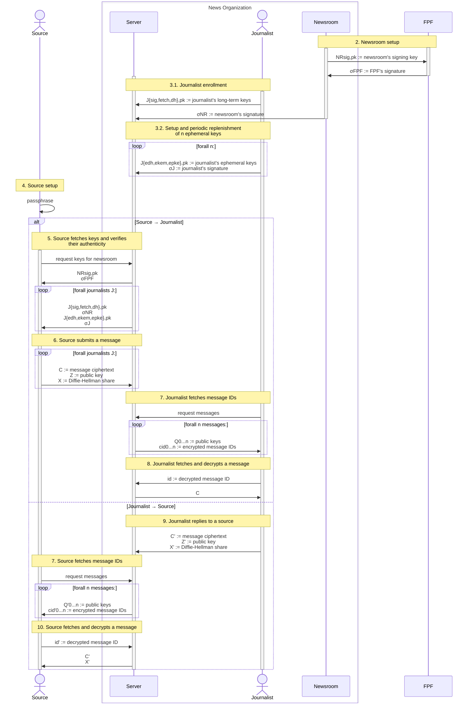

# SecureDrop Protocol specification

| Version |
| ------- |
| 0.3     |

> [!NOTE]
> The key words MUST, MUST NOT, REQUIRED, SHALL, SHALL NOT, SHOULD, SHOULD NOT,
> RECOMMENDED, MAY, and OPTIONAL in this document are to be interpreted as
> described in [RFC 2119].

## Overview

This sequence diagram shows the flow of messages and values in the SecureDrop
Protocol. The yellow boxes correspond to sections in the specification below
that describe how these values are constructed and consumed.

## Keys

In the table below:

> For keys, we use the notation $X_{A,B}$, where $X$ represents the key owner
> ($`X \in \{NR, J, S\}`$ [for newsroom, journalist, and source, respectively]),
> $A$ represents the key's usage ($`A \in \{sig,fetch,pke,pq,md\}`$), and is prefixed
> with an "e" if the key is a one-time key. $B$ indicates whether the component is
> private or public. For Diffie-Hellman keys $x$, the public component is
> represented by the exponentiation $DH(g, x)$.[^3]

| Owner      | Private key or decapsulation | Public key or encapsulation | Usage          | Scope    | Lifetime      | Algorithm                         | Signed by           |
| ---------- | ---------------------------- | --------------------------- | -------------- | -------- | ------------- | --------------------------------- | ------------------- |
| FPF        | $`FPF_{sig,sk}`$             | $`FPF_{sig,pk}`$            | Signing        |          | Long-term     | ?                                 |                     |
| Newsroom   | $`NR_{sig,sk}`$              | $`NR_{sig,pk}`$             | Signing        |          | Long-term     | ?                                 | $`FPF_{sig,sk}`$    |
| Journalist | $`J_{sig,sk}`$               | $`J_{sig,pk}`$              | Signing        |          | Long-term     | ?                                 | $`NR_{sig,sk}`$     |
| Journalist | $`J_{fetch,sk}`$             | $`J_{fetch,pk}`$            | Fetching       |          | **TBD**[^6]   | X25519                            | $`NR_{sig,sk}`$[^4] |
| Journalist | $`J_{epq,sk}`$               | $`J_{epq,pk}`$              | Encryption PSK | Message  | One-time      | ML-KEM-768                        | $`J_{sig,sk}`$      |
| Journalist | $`J_{epke,sk}`$              | $`J_{epke,pk}`$             | Encryption     | Message  | One-time      | HPKE (DH-AKEM, HKDF, AES-GCM)[^5] | $`J_{sig,sk}`$      |
| Journalist | $`J_{emd,sk}`$               | $`J_{emd,pk}`$              | Encryption     | Metadata | One-time      | X-Wing                            | $`J_{sig,sk}`$      |
| Source     | $`S_{fetch,sk}`$             | $`S_{fetch,pk}`$            | Fetching       |          | Permanent[^7] | X25519                            |                     |
| Source     | $`S_{pq,sk}`$                | $`S_{pq,pk}`$               | Encryption PSK | Message  | Permanent[^7] | ML-KEM-768                        |                     |
| Source     | $`S_{pke,sk}`$               | $`S_{pke,pk}`$              | Encryption     | Message  | Permanent[^7] | HPKE (DH-AKEM, HKDF, AES-GCM)[^5] |                     |
| Source     | $`S_{md,sk}`$                | $`S_{md,pk}`$               | Encryption     | Metadata | Permanent[^7] | X-Wing                            |                     |

[^4]: **TODO:** Discussion of whether the newsroom's or the journalist's signing key signs the journalist's fetching key.

[^6]: **TODO:** https://github.com/freedomofpress/securedrop-protocol/blob/a0252a8ee7a6e4051c65e4e0c06b63d6ce921110/docs/wip-protocol-0.3.md?plain=1#L87

## Functions and notation

| Syntax                                                    | Description                                                                                                                                                                      |
| --------------------------------------------------------- | -------------------------------------------------------------------------------------------------------------------------------------------------------------------------------- |
| $`h \gets \text{Hash}(m)`$                                | Hash message $m$ to digest $h$                                                                                                                                                   |
| $`k \Vert k_1 \Vert \dots \Vert k_n \gets \text{KDF}(m)`$ | Derive one or more keys $k$ from a message $m$                                                                                                                                   |
| $`\sigma \gets^{\$} \text{Sign}(sk, m)`$                  | Sign a message $m$ with the private key $sk$                                                                                                                                     |
| $`b \in \{0,1\} \gets \text{Vfy}(pk, m, \sigma)`$         | Verify a message $m$ and a signature $\sigma$ with a public key $pk$                                                                                                             |
| $` g^x \gets \text{DH(g, x)}`$                            | Diffie-Hellman exponentiation of private component $x$                                                                                                                           |
| $`(sk, pk) \gets^{\$} \text{Gen}()`$                      | Generate keys; for DH-AKEM, $(sk, pk) = (x, \text{DH}(g, x)) = (x, g^x)$                                                                                                         |
| $`(c, K) \gets^{\$} \text{AuthEncap}(skS, pkR)`$          | Encapsulate a ciphertext $c$ and a shared secret $K$ using a sender's private key $skS$ and a receiver's public key $pkR$; for DH-AKEM, $(c, K) = (pkE, K) = (pk, K) = (g^x, K)$ |
| $`K \gets \text{AuthDecap}(skR, pkS, c)`$                 | Decapsulate a shared secret $K$ using a receiver's private key $skR$, a sender's public key $pkS$, and a ciphertext $c$; for DH-AKEM, $c = pkE$                                  |
| $`r \gets^{\$} \text{Rand}()`$                            | Generate a random value                                                                                                                                                          |
| $`mp \gets \text{Pad}(m)`$                                | Pad a message $m$ to a constant size[^1]                                                                                                                                         |
| $`\varepsilon`$                                           | The empty string                                                                                                                                                                 |

### HPKEpqauth

| Syntax                                                                                       | Description                                                                   |
| -------------------------------------------------------------------------------------------- | ----------------------------------------------------------------------------- |
| $`(skS_{dh}, pkS_{dh}) \gets^{\$} \text{Gen}_S()`$                                           | Generate keys for a sender $S$                                                |
| $`((skR_{dh}, skR_{kem}), (pkR_{dh}, pkR_{kem})) \gets^{\$} \text{Gen}_R()`$                 | Generate keys for a receiver $R$                                              |
| $`((c_1, c_2), c) \gets^{\$} \text{AuthEnc}(skS_{dh}, (pkR_{dh}, pkR_{kem}), m, aad, info)`$ | Encrypt to a receiver $R$ a message $m$ with associated data $aad$ and $info$ |
| $`m \gets \text{AuthDec}((skR_{dh}, skR_{kem}), pkS_dh, ((c_1, c_2), c), aad, info)`$        | Decrypt from a sender $S$ a message $m$ with associated data $aad$ and $info$ |

### Usage

| Keys                       | Source → Journalist                              | Journalist → Source          |
| -------------------------- | ------------------------------------------------ | ---------------------------- |
| $`(skS_{dh}, pkS_{dh})`$   | $`(S_{dh,sk}, S_{dh,pk})`$                       | $`(J_{dh,sk}, J_{dh,pk})`$   |
| $`(skR_{dh}, pkR_{dh})`$   | $`(J_{\textbf{edh},sk}, J_{\textbf{edh},pk})`$   | $`(S_{dh,sk}, S_{dh,pk})`$   |
| $`(skR_{kem}, pkR_{kem})`$ | $`(J_{\textbf{ekem},sk}, J_{\textbf{ekem},pk})`$ | $`(S_{kem,sk}, S_{kem,pk})`$ |

> For messages sent from a source to a journalist, the source is identified by
> $`S_{dh,pk}`$ and utilizes the [bolded] ephemeral keys $`J_{edh,pk}`$ and
> $`J_{ekem,pk}`$ to encrypt its message. The journalist, in turn, authenticates
> itself using the new long-term key $`J_{dh,pk}`$ and relies on the source's
> long-term keys $`S_{dh,pk}`$ and $`S_{kem,pk}`$ to encrypt messages back to the
> source securely. (Maier §5.2)

## Setup

### 1. FPF

| FPF                                                      |
| -------------------------------------------------------- |
| $`(FPF_{sig,sk}, FPF_{sig,pk}) \gets^{\$} \text{Gen}()`$ |

The server, the journalist client, and the source client SHOULD be built with
$FPF_{sig,pk}$ pinned.[^2]

### 2. Newsroom

| Newsroom                                               |                                 | FPF                                                                |
| ------------------------------------------------------ | ------------------------------- | ------------------------------------------------------------------ |
| $`(NR_{sig,sk}, NR_{sig,pk}) \gets^{\$} \text{Gen}()`$ |                                 |                                                                    |
|                                                        | $`\longrightarrow NR_{sig,pk}`$ | Verify manually                                                    |
|                                                        |                                 | $`\sigma^{FPF} \gets^{\$} \text{Sign}(FPF_{sig,sk}, NR_{sig,pk})`$ |
|                                                        | $`\sigma^{FPF} \longleftarrow`$ |

The server MUST be deployed with $NR_{sig,pk}$ pinned. The server MAY be
deployed with $\sigma^{FPF}$ pinned.[^2]

### 3. Journalist

#### 3.1. Enrollment

| Journalist                                               |                                                         | Newsroom                                                                                   |
| -------------------------------------------------------- | ------------------------------------------------------- | ------------------------------------------------------------------------------------------ |
| $`(J_{sig,sk}, J_{sig,pk}) \gets^{\$} \text{Gen}()`$     |                                                         |                                                                                            |
| $`(J_{fetch,sk}, J_{fetch,pk}) \gets^{\$} \text{Gen}()`$ |                                                         |                                                                                            |
| $`(J_{dh,sk}, J_{dh,pk}) \gets^{\$} \text{Gen}()`$       |                                                         |                                                                                            |
|                                                          | $`\longrightarrow J_{sig,pk}, J_{fetch,pk}, J_{dh,pk}`$ | Verify manually, then save for $J$                                                         |
|                                                          |                                                         | $`\sigma^{NR} \gets^{\$} \text{Sign}(NR_{sig,sk}, (J_{sig,pk}, J_{fetch,pk}, J_{dh,pk}))`$ |

#### 3.2. Setup and periodic replenishment of $n$ ephemeral keys

Each journalist $J$ MUST generate and maintain a pool of $n$ ephemeral keys.
For each key:

| Journalist                                                                              |                                                                    | Server                                                                       |
| --------------------------------------------------------------------------------------- | ------------------------------------------------------------------ | ---------------------------------------------------------------------------- |
| $`(J_{edh,sk}, J_{edh,pk}) \gets^{\$} \text{Gen}()`$                                    |                                                                    |                                                                              |
| $`(J_{ekem,sk}, J_{ekem,pk}) \gets^{\$} \text{Gen}()`$                                  |                                                                    |                                                                              |
| $`(J_{epke,sk}, J_{epke,pk}) \gets^{\$} \text{Gen}()`$                                  |                                                                    |                                                                              |
| $`\sigma^J \gets^{\$} \text{Sign}(J_{sig,sk}, (J_{edh,pk}, J_{ekem,pk}, J_{epke,pk}))`$ |                                                                    |                                                                              |
|                                                                                         |                                                                    | $`\text{Vfy}(J_{sig,pk}, (J_{edh,pk}, J_{ekem,pk}, J_{epke,pk}), \sigma^J)`$ |
|                                                                                         | $`\longrightarrow J_{edh,pk}, J_{ekem,pk}, J_{epke,pk}, \sigma^J`$ | Save for $J$                                                                 |

### 4. Source

To begin each session, a source MUST enter (on their first visit) or reenter (on
a subsequent visit) some $passphrase$:

| Source                                                                                          |
| ----------------------------------------------------------------------------------------------- |
| $`S_{dh,sk} \Vert S_{fetch,sk} \Vert S_{pke,sk} \Vert S_{kem,sk} \gets \text{KDF}(passphrase)`$ |

## Messaging protocol

SecureDrop is a first-contact protocol between an unknwn party (an anonymous
source) and well-known parties (journalists). Only a source can initiate a
conversation.

### 5. Source fetches keys and verifies their authenticity

For some newsroom $NR$ and all its enrolled journalists $J^i$:

| Source                                                                                   |                                                                             | Server                                               |
| ---------------------------------------------------------------------------------------- | --------------------------------------------------------------------------- | ---------------------------------------------------- |
|                                                                                          | $\longrightarrow$ request keys for $NR$                                     |                                                      |
|                                                                                          | $`NR_{sig,pk}, \sigma^{FPF} \longleftarrow`$                                |                                                      |
|                                                                                          |                                                                             | $`\forall J^i`$:                                     |
|                                                                                          | $`J^i_{sig,pk}, J^i_{fetch,pk}, J^i_{dh,pk}, \sigma^{NR} \longleftarrow`$   |                                                      |
|                                                                                          | $`J^i_{edh,pk}, J^i_{ekem,pk}, J^i_{epke,pk}, \sigma^{J^i} \longleftarrow`$ | Chosen at random for $J^i$                           |
|                                                                                          |                                                                             | Discard $J^i_{edh,pk}, J^i_{ekem,pk}, J^i_{epke,pk}$ |
| $`\text{Vfy}(FPF_{sig,pk}, NR_{sig,pk}, \sigma^{FPF})`$                                  |                                                                             |                                                      |
| $`\forall J^i`$:                                                                         |                                                                             |                                                      |
| $`\text{Vfy}(NR_{sig,pk}, (J^i_{sig,pk}, J^i_{fetch,pk}, J^i_{dh,pk}), \sigma^{NR})`$    |                                                                             |                                                      |
| $`\text{Vfy}(J^i_{sig,pk}, (J^i_{edh,pk}, J^i_{ekem,pk}, J^i_{epke,pk}), \sigma^{J^i})`$ |                                                                             |                                                      |

### 6. Source submits a message

For some message $msg$ to each journalist $J^i$ enrolled with a newsroom $NR$:

> [!NOTE]
> The source client MUST submit a distinct copy of $msg$ to each journalist
> $J_i$: i.e., a total of $n$ unique ciphertexts for $n$ journalists.

| Source                                                                                                                       |                             | Server                           |
| ---------------------------------------------------------------------------------------------------------------------------- | --------------------------- | -------------------------------- |
| $`\forall J^i`$:                                                                                                             |                             |                                  |
| $`m \gets \text{Pad}(msg \Vert S_{dh,pk} \Vert S_{pke,pk} \Vert S_{kem,pk} \Vert S_{fetch,pk} \Vert J^i_{sig,pk} \Vert NR)`$ |                             |                                  |
| $`((c_1, c_2), C'') \gets^{\$} \text{AuthEnc}(S_{dh,pk}, (J^i_{edh,pk}, J^i_{ekem,pk}), m, \varepsilon, \varepsilon)`$       |                             |                                  |
| $`C' \gets^{\$} \text{Enc}(J^i_{epke,pk}, S_{dh,pk} \Vert c_1 \Vert c_2)`$                                                   |                             |                                  |
| $`C \gets C' \Vert C''`$                                                                                                     |                             |                                  |
| $`x \gets^{\$} \mathbb Z_q`$                                                                                                 |                             |                                  |
| $`X \gets \text{DH}(g, x)`$                                                                                                  |                             |                                  |
| $`Z \gets \text{DH}(J^i_{fetch,pk}, x)`$                                                                                     |                             |                                  |
|                                                                                                                              | $`\longrightarrow C, Z, X`$ |                                  |
|                                                                                                                              |                             | $`id \gets^{\$} \text{Rand}()`$  |
|                                                                                                                              |                             | $`messages[id] \gets (C, Z, X)`$ |

> [!NOTE]
> The source client MUST follow the same procedure for replying to a message
> from a journalist.

### 7. Source or journalist fetches messages IDs

For a total of $n$ messages:

| User $`U \in \{J, S\}`$ for journalist $J$ or source $S$ |                                                   | Server                                                       |
| -------------------------------------------------------- | ------------------------------------------------- | ------------------------------------------------------------ |
|                                                          | $\longrightarrow$ request messages                |                                                              |
|                                                          |                                                   | $`\forall i \in 0\dots \text{Len}(messages)`$:               |
|                                                          |                                                   | $`(id_i, (c_i, Z_i, X_i)) \gets messages.\text{items}()[i]`$ |
|                                                          |                                                   | $`y \gets^{\$} \mathbb Z_q`$                                 |
|                                                          |                                                   | $`k_i \gets \text{DH}(Z_i, y)`$                              |
|                                                          |                                                   | $`Q_i \gets \text{DH}(X_i, y)`$                              |
|                                                          |                                                   | $`cid_i \gets^{\$} \text{Enc}(k_i, id_i)`$                   |
|                                                          |                                                   |                                                              |
|                                                          |                                                   | $`\forall i \in \text{Len}(messages) \dots n`$:              |
|                                                          |                                                   | $`Q_i \gets^{\$} \text{Rand}()`$                             |
|                                                          |                                                   | $`cid_i \gets^{\$} \text{Rand}()`$                           |
|                                                          |                                                   |                                                              |
|                                                          | $`Q_{0 \dots n}, cid_{0 \dots n} \longleftarrow`$ |                                                              |
| $`ids \gets \{\}`$                                       |                                                   |                                                              |
| $`\forall i \in 0 \dots n`$:                             |                                                   |                                                              |
| $`k_i \gets \text{DH}(Q_i, U_{fetch,sk})`$:              |                                                   |                                                              |
| $`id_i \gets \text{Dec}(k_i, cid_i) \neq \bot`$          |                                                   |                                                              |
| $`ids \gets ids \cup \{id_i\}`$                          |                                                   |                                                              |
|                                                          |                                                   |                                                              |
| Return $ids$                                             |                                                   |                                                              |

### 8. Journalist fetches and decrypts a message

For some message $id$:

| Journalist                                                                                                               |                        | Server                           |
| ------------------------------------------------------------------------------------------------------------------------ | ---------------------- | -------------------------------- |
|                                                                                                                          | $`\longrightarrow id`$ |                                  |
|                                                                                                                          |                        | $`(C, Z, X) \gets messages[id]`$ |
|                                                                                                                          | $`C\longleftarrow`$    |                                  |
| $`\forall J_{edh,sk}, J_{ekem,sk}, J_{epke,sk}`$:                                                                        |                        |                                  |
| Parse $C$ as $C' \Vert C''$                                                                                              |                        |                                  |
| $`\tilde{M} \gets \text{Dec}(J_{epke,sk}, C') \neq \bot`$                                                                |                        |                                  |
| Parse $\tilde{M}$ as $S \Vert c_1 \Vert c_2$                                                                             |                        |                                  |
| $`m \gets \text{AuthDec}((J_{edh,sk}, J_{ekem,sk}), S, ((c_1, c_2), C''), \varepsilon, \varepsilon) \neq \bot`$          |                        |                                  |
| Parse $m$ as $msg \Vert \tilde{S} \Vert S_{pke,pk} \Vert S_{kem,pk} \Vert S_{fetch,pk} \Vert \tilde{J} \Vert \tilde{NR}$ |                        |                                  |
| Check $NR = \tilde{NR}, J_{sig,pk} = \tilde{J}, S = \tilde{S}$                                                           |                        |                                  |
| Discard $J_{edh,sk}, J_{ekem,sk}, J_{fetch,sk}$                                                                          |                        |                                  |
| Return $msg \Vert S_{dh,pk} \Vert S_{kem,pk} \Vert S_{fetch,pk}$                                                         |                        |                                  |

### 9. Journalist replies to a source

For some message $msg$ in reply to a source $S$:

| Journalist                                                                                               |                             | Server                           |
| -------------------------------------------------------------------------------------------------------- | --------------------------- | -------------------------------- |
| $`m \gets msg \Vert S \Vert J_{sig,pk} \Vert J_{fetch,pk} \Vert J_{dh,pk} \Vert \sigma^{NR} \Vert NR`$   |                             |                                  |
| $`((c_1, c_2), C'') \gets^{\$} \text{AuthEnc}(J_{dh,sk}, (S, S_{kem,pk}), m, \varepsilon, \varepsilon)`$ |                             |                                  |
| $`C' \gets ^{\$} \text{Enc}(S_{pke,pk}, J_{dh,pk} \Vert c_1 \Vert c_2)`$                                 |                             |                                  |
| $`C \gets C' \Vert C''`$                                                                                 |                             |                                  |
| $`x \gets^{\$} \mathbb Z_q`$                                                                             |                             |                                  |
| $`Z \gets \text{DH}(S_{fetch,pk}, x)`$                                                                   |                             |                                  |
| $`X \gets \text{DH}(g, x)`$                                                                              |                             |                                  |
|                                                                                                          | $`\longrightarrow C, Z, X`$ |                                  |
|                                                                                                          |                             | $`id \gets^{\$} \text{Rand}()`$  |
|                                                                                                          |                             | $`messages[id] \gets (C, Z, X)`$ |

> [!NOTE]
> In addition to sending the reply encrypted to the source $S$, the journalist
> client SHOULD also send a copy encrypted to each of the other $n-1$ journalists
> currently enrolled with the newsroom $NR$.

### 10. Source fetches and decrypts a message

For some message $id$:

| Source                                                                                                        |                         | Server                           |
| ------------------------------------------------------------------------------------------------------------- | ----------------------- | -------------------------------- |
|                                                                                                               | $`\longrightarrow id`$  |                                  |
|                                                                                                               |                         | $`(C, Z, X) \gets messages[id]`$ |
|                                                                                                               | $`C, X \longleftarrow`$ |                                  |
| Parse $C$ as $C' \Vert C''$                                                                                   |                         |                                  |
| $`\tilde{M} \gets \text{Dec}(S_{pke,sk}, C') \neq \bot`$                                                      |                         |                                  |
| Parse $\tilde{M}$ as $J \Vert c_1 \Vert c_2$                                                                  |                         |                                  |
| $`m \gets \text{AuthDec}((S_{dh,sk}, S_{kem,sk}), J, ((c_1, c_2), C''), \varepsilon, \varepsilon) \neq \bot`$ |                         |                                  |
| Parse $m$ as $msg \Vert \tilde{S} \Vert J_1 \Vert J_2 \Vert J_3 \Vert \sigma \Vert \tilde{NR}$                |                         |                                  |
| $`\text{Vfy}(NR_{sig,pk}, \sigma, J_1 \Vert J_2 \Vert J_3)`$                                                  |                         |                                  |
| Check $NR = \tilde{NR}, J = J_3, S_{dh,pk} = \tilde{S}$                                                       |                         |                                  |
| Return $msg \Vert J \Vert NR$                                                                                 |                         |                                  |

### 11. Source replies to a journalist

See ["Source Submits a Message"](#source-submits-a-message).

[^1]: Currently configured as [`CHUNK`][chunk].

[^2]: See [`draft-pki.md`](./draft-pki.md) for further considerations.

[^3]: Adapted from Maier §5.4.1.

<!--
[^4]: TODO kept inline above.
-->

[^5]:
    DH-AKEM per [RFC 9180 §4.1] using DH-KEM(X25519, HKDF-SHA256) with KEM ID
    `0x0020` ([§7.1][RFC 9180 §7.1]).

<!--
[^6]: TODO kept inline above.
-->

[^7]:
    The source's keys are considered "permanent" because they are derived
    deterministically from the source's passphrase, which cannot be changed.

[chunk]: https://github.com/freedomofpress/securedrop-protocol/blob/664f8c66312b45e00d1e2b4a26bc466ff105c3ca/README.md?plain=1#L105
[RFC 2119]: https://datatracker.ietf.org/doc/html/rfc2119
[RFC 9180 §4.1]: https://datatracker.ietf.org/doc/html/rfc9180#name-dh-based-kem-dhkem
[RFC 9180 §7.1]: https://datatracker.ietf.org/doc/html/rfc9180#name-key-encapsulation-mechanism
